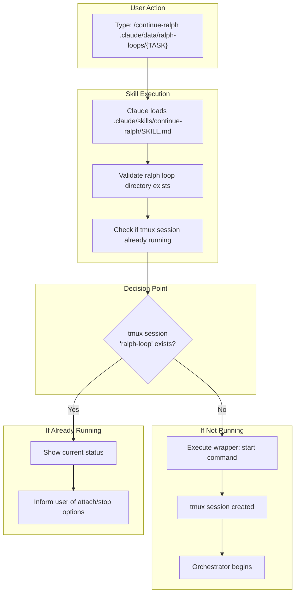
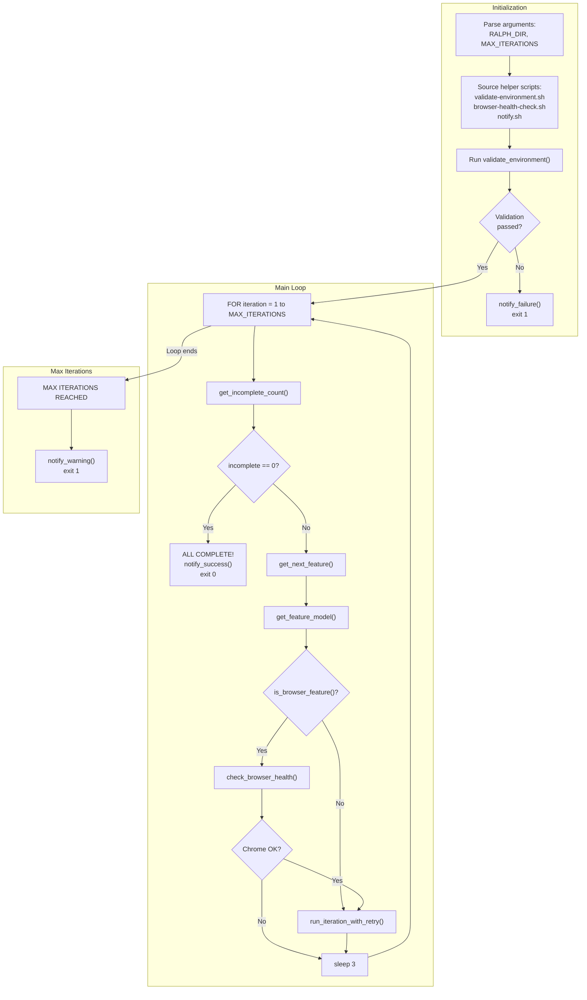
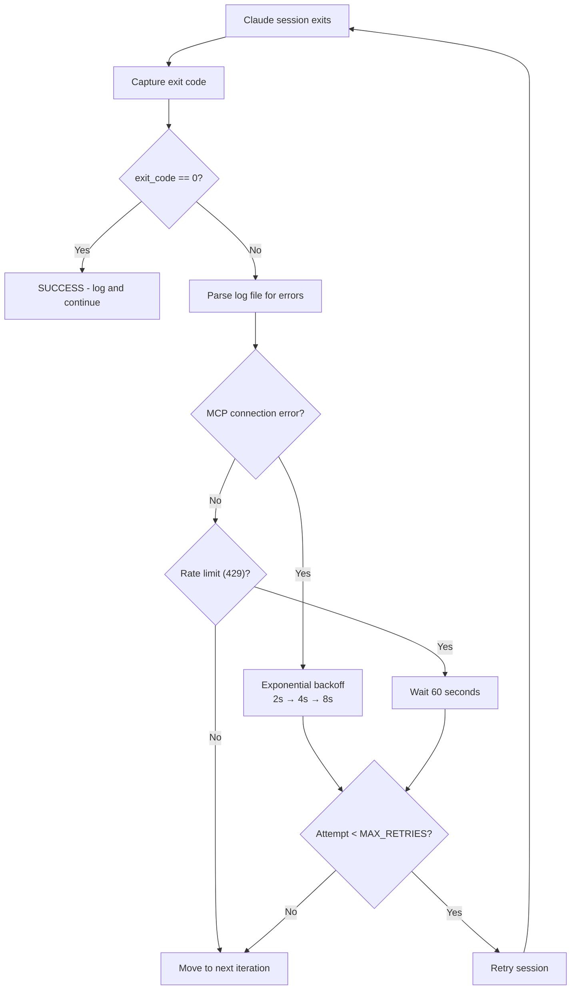
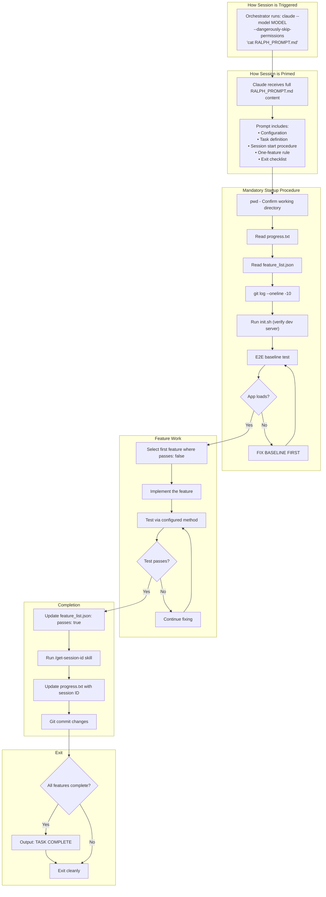
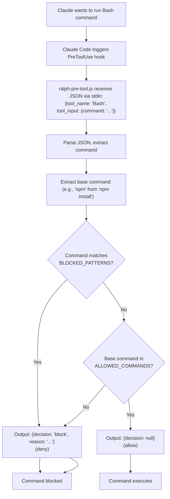

# Ralph Loop v2.0 - Execution Phase Documentation

**Created:** 2025-01-17
**Purpose:** Detailed documentation of the execution phase including deep dive into the orchestration layer

---

## Table of Contents

1. [Execution Phase Overview](#1-execution-phase-overview)
2. [Starting the Ralph Loop](#2-starting-the-ralph-loop)
3. [Orchestration Layer Deep Dive](#3-orchestration-layer-deep-dive)
4. [Individual Iteration Sessions](#4-individual-iteration-sessions)
5. [Security Features](#5-security-features)
6. [tmux Session Management](#6-tmux-session-management)
7. [User Intervention](#7-user-intervention)
8. [Model Selection](#8-model-selection)
9. [Exit Conditions](#9-exit-conditions)

---

## 1. Execution Phase Overview

The execution phase runs autonomously, spawning fresh Claude sessions for each feature until all features pass or the max iteration limit is reached.

```
┌──────────────────────────────────────────────────────────────────────────────────────────┐
│                              EXECUTION PHASE ARCHITECTURE                                │
├──────────────────────────────────────────────────────────────────────────────────────────┤
│                                                                                          │
│   USER ACTION                                                                            │
│   ───────────                                                                            │
│   • Run /continue-ralph .claude/data/ralph-loops/{TASK}                                  │
│   • OR: ./ralph-loop-wrapper.sh start .claude/data/ralph-loops/{TASK} 20                 │
│                                                                                          │
│         │                                                                                │
│         ▼                                                                                │
│   ┌────────────────────────────────────────────────────────────────────────────────────┐ │
│   │                          LAYER 1: TERMINAL MANAGEMENT                              │ │
│   │                                ralph-loop-wrapper.sh                               │ │
│   │                                                                                    │ │
│   │   • Creates tmux session named "ralph-loop"                                        │ │
│   │   • Runs orchestrator inside tmux (detachable)                                     │ │
│   │   • Provides: start, attach, status, stop, logs commands                           │ │
│   └────────────────────────────────────────────────────────────────────────────────────┘ │
│                                         │                                                │
│                                         ▼                                                │
│   ┌────────────────────────────────────────────────────────────────────────────────────┐ │
│   │                          LAYER 0: PRE-LOOP VALIDATION                              │ │
│   │                              validate-environment.sh                               │ │
│   │                                                                                    │ │
│   │   Checks:                                                                          │ │
│   │   • jq installed                                                                   │ │
│   │   • feature_list.json exists and valid                                             │ │
│   │   • RALPH_PROMPT.md exists                                                         │ │
│   │   • progress.txt exists                                                            │ │
│   │   • Claude CLI authenticated                                                       │ │
│   │   • Chrome running (warning only)                                                  │ │
│   └────────────────────────────────────────────────────────────────────────────────────┘ │
│                                         │                                                │
│                                         ▼                                                │
│   ┌────────────────────────────────────────────────────────────────────────────────────┐ │
│   │                          LAYER 2: ORCHESTRATION                                    │ │
│   │                              ralph-orchestrator.sh                                 │ │
│   │                                                                                    │ │
│   │   FOR EACH ITERATION (1 to MAX_ITERATIONS):                                        │ │
│   │   ┌──────────────────────────────────────────────────────────────────────────────┐ │ │
│   │   │                                                                              │ │ │
│   │   │  1. Check feature_list.json → All complete? → Exit SUCCESS                   │ │ │
│   │   │                                                                              │ │ │
│   │   │  2. Get next feature (first where passes != true)                            │ │ │
│   │   │                                                                              │ │ │
│   │   │  3. Determine model (feature.model OR category-based)                        │ │ │
│   │   │                                                                              │ │ │
│   │   │  4. If UI feature → browser-health-check.sh                                  │ │ │
│   │   │                                                                              │ │ │
│   │   │  5. Spawn Claude session:                                                    │ │ │
│   │   │     claude --model {MODEL} --dangerously-skip-permissions "$(cat PROMPT)"    │ │ │
│   │   │                                                                              │ │ │
│   │   │  6. On error → Retry logic (MCP: exponential backoff, Rate limit: 60s)       │ │ │
│   │   │                                                                              │ │ │
│   │   │  7. Log results to logs/iteration-N-attempt-M.log                            │ │ │
│   │   │                                                                              │ │ │
│   │   │  8. Update progress.txt                                                      │ │ │
│   │   │                                                                              │ │ │
│   │   │  9. Sleep 3s, continue to next iteration                                     │ │ │
│   │   │                                                                              │ │ │
│   │   └──────────────────────────────────────────────────────────────────────────────┘ │ │
│   └────────────────────────────────────────────────────────────────────────────────────┘ │
│                                         │                                                │
│                    FOR EACH SPAWNED SESSION                                              │
│                                         ▼                                                │
│   ┌────────────────────────────────────────────────────────────────────────────────────┐ │
│   │                          LAYER 3: SECURITY                                         │ │
│   │                              ralph-pre-tool.js                                     │ │
│   │                                                                                    │ │
│   │   PreToolUse hook validates every Bash command:                                    │ │
│   │   • Check ALLOWED_COMMANDS whitelist                                               │ │
│   │   • Check BLOCKED_PATTERNS deny list                                               │ │
│   │   • Block dangerous operations                                                     │ │
│   │   • Allow safe operations without prompting                                        │ │
│   └────────────────────────────────────────────────────────────────────────────────────┘ │
│                                         │                                                │
│                                         ▼                                                │
│   ┌────────────────────────────────────────────────────────────────────────────────────┐ │
│   │                          CLAUDE ITERATION SESSION                                  │ │
│   │                                                                                    │ │
│   │   1. Session Start Procedure (MANDATORY)                                           │ │
│   │      • pwd → Confirm working directory                                             │ │
│   │      • Read progress.txt → Current state                                           │ │
│   │      • Read feature_list.json → All features                                       │ │
│   │      • git log --oneline -10 → Recent work                                         │ │
│   │      • Run init.sh → Verify dev server                                             │ │
│   │      • E2E baseline test → App loads correctly                                     │ │
│   │                                                                                    │ │
│   │   2. Implement ONE Feature                                                         │ │
│   │      • Select highest-priority feature where passes: false                         │ │
│   │      • Make code changes                                                           │ │
│   │      • Test via configured method                                                  │ │
│   │                                                                                    │ │
│   │   3. Update State                                                                  │ │
│   │      • Update feature_list.json: passes: true                                      │ │
│   │      • Run /get-session-id → Capture session ID                                    │ │
│   │      • Update progress.txt with results                                            │ │
│   │      • Git commit changes                                                          │ │
│   │                                                                                    │ │
│   │   4. Clean Exit                                                                    │ │
│   │      • No half-implemented code                                                    │ │
│   │      • All changes committed                                                       │ │
│   │      • Session ends → Orchestrator spawns next                                     │ │
│   └────────────────────────────────────────────────────────────────────────────────────┘ │
│                                         │                                                │
│                                         ▼                                                │
│   ┌────────────────────────────────────────────────────────────────────────────────────┐ │
│   │                          LAYER 4: OBSERVABILITY                                    │ │
│   │                              notify.sh                                             │ │
│   │                                                                                    │ │
│   │   • macOS notification on success: "All features passed!"                          │ │
│   │   • macOS notification on failure: "Pre-flight validation failed"                  │ │
│   │   • macOS notification on limit: "Max iterations reached"                          │ │
│   │   • Per-iteration log files                                                        │ │
│   │   • progress.txt session history table                                             │ │
│   └────────────────────────────────────────────────────────────────────────────────────┘ │
│                                                                                          │
└──────────────────────────────────────────────────────────────────────────────────────────┘
```

---

## 2. Starting the Ralph Loop

### 2.1 Via Skill: /continue-ralph



### 2.2 Via Script Directly

```bash
# Start the Ralph Loop
.claude/scripts/ralph-loop/ralph-loop-wrapper.sh start .claude/data/ralph-loops/{TASK} 20

# The wrapper does:
# 1. Check if tmux session "ralph-loop" already exists
# 2. If not, create new tmux session running:
#    ralph-orchestrator.sh "{RALPH_DIR}" {MAX_ITER}
# 3. Report status to user
```

---

## 3. Orchestration Layer Deep Dive

### 3.1 ralph-loop-wrapper.sh - Entry Point

**Location:** `.claude/scripts/ralph-loop/ralph-loop-wrapper.sh`

**Purpose:** Manage the Ralph Loop as a detachable background process using tmux.

#### Command Reference

| Command | Syntax | Description |
|---------|--------|-------------|
| `start` | `./wrapper.sh start <dir> [max-iter]` | Create tmux session, run orchestrator |
| `attach` | `./wrapper.sh attach` | Attach terminal to running session |
| `status` | `./wrapper.sh status <dir>` | Check if running, show progress |
| `stop` | `./wrapper.sh stop` | Kill tmux session |
| `logs` | `./wrapper.sh logs <dir>` | Show recent log files |

#### How `start` Works

```bash
# 1. Check if already running
if tmux has-session -t "ralph-loop" 2>/dev/null; then
    echo "❌ Ralph Loop already running"
    exit 1
fi

# 2. Create new tmux session in detached mode
# The -d flag means "detached" - session runs in background
tmux new-session -d -s "ralph-loop" \
    "$SCRIPT_DIR/ralph-orchestrator.sh \"$RALPH_DIR\" $MAX_ITER"

# 3. Report to user
echo "✅ Ralph Loop started"
echo "   Use './wrapper.sh attach' to observe"
```

---

### 3.2 ralph-orchestrator.sh - Main Loop

**Location:** `.claude/scripts/ralph-loop/ralph-orchestrator.sh`

**Purpose:** The core logic that drives the Ralph Loop iterations.

#### Execution Flow



#### Key Functions Explained

**1. get_incomplete_count()**

```bash
get_incomplete_count() {
    # Reads feature_list.json
    # Counts features where passes != true
    jq '[.features[] | select(.passes != true)] | length' "$FEATURE_LIST"
}
```

**2. get_next_feature()**

```bash
get_next_feature() {
    # Returns the FIRST feature where passes != true
    # Features are processed in order (by id)
    jq -c '[.features[] | select(.passes != true)][0]' "$FEATURE_LIST"
}
```

**3. get_feature_model()**

```bash
get_feature_model() {
    local feature_json="$1"

    # Priority 1: Explicit model in feature
    local model=$(echo "$feature_json" | jq -r '.model // empty')

    if [ -z "$model" ]; then
        # Priority 2: Category-based routing
        local category=$(echo "$feature_json" | jq -r '.category // "functional"')
        case "$category" in
            setup|functional)   model="opus" ;;
            ui|verification)    model="sonnet" ;;
            testing)            model="sonnet" ;;
            documentation)      model="haiku" ;;
            *)                  model="opus" ;;
        esac
    fi

    echo "$model"
}
```

**4. run_iteration_with_retry()**

```bash
run_iteration_with_retry() {
    local iteration="$1"
    local model="$2"
    local feature_json="$3"
    local attempt=0

    while [ $attempt -lt $MAX_RETRIES ]; do  # MAX_RETRIES = 3
        attempt=$((attempt + 1))

        # Create log file
        local logfile="$LOG_DIR/iteration-$iteration-attempt-$attempt.log"

        # SPAWN CLAUDE SESSION
        # --model: Use the determined model
        # --dangerously-skip-permissions: No permission prompts
        # "$(cat "$PROMPT_FILE")": Pass full RALPH_PROMPT.md as initial message
        claude --model "$model" \
               --dangerously-skip-permissions \
               "$(cat "$PROMPT_FILE")" 2>&1 | tee -a "$logfile" || exit_code=$?

        if [ $exit_code -eq 0 ]; then
            log_session "$iteration" "$attempt" "success"
            return 0
        fi

        # Check for retryable errors in log
        if grep -qi "MCP.*connection.*lost\|MCP.*error" "$logfile"; then
            # MCP error: Exponential backoff (2s, 4s, 8s)
            delay=$((BASE_DELAY * (2 ** (attempt - 1))))
            sleep $delay
            continue
        fi

        if grep -qi "rate.*limit\|429" "$logfile"; then
            # Rate limit: Fixed 60s wait
            sleep $RATE_LIMIT_DELAY
            continue
        fi

        # Unknown error: Don't retry, move to next iteration
        return 1
    done
}
```

---

### 3.3 How the Orchestrator Knows When to Start Next Session

The orchestrator uses a **synchronous execution model**:

```
┌──────────────────────────────────────────────────────────────────────────────┐
│                         SESSION LIFECYCLE                                    │
├──────────────────────────────────────────────────────────────────────────────┤
│                                                                              │
│   Orchestrator (ralph-orchestrator.sh)                                       │
│   │                                                                          │
│   │  1. Call: claude --model opus --dangerously-skip-permissions "..."       │
│   │     │                                                                    │
│   │     │  ┌─────────────────────────────────────────────────────────────┐   │
│   │     │  │            CLAUDE SESSION (Iteration N)                     │   │
│   │     │  │                                                             │   │
│   │     │  │  • Receives RALPH_PROMPT.md as initial message              │   │
│   │     │  │  • Follows session start procedure                          │   │
│   │     │  │  • Implements one feature                                   │   │
│   │     │  │  • Updates feature_list.json (passes: true)                 │   │
│   │     │  │  • Updates progress.txt                                     │   │
│   │     │  │  • Git commits                                              │   │
│   │     │  │  • Exits naturally (no more work to do)                     │   │
│   │     │  │                                                             │   │
│   │     │  └─────────────────────────────────────────────────────────────┘   │
│   │     │                                                                    │
│   │     └──► Process exits with code 0 (or error code)                       │
│   │                                                                          │
│   │  2. Bash receives exit code                                              │
│   │                                                                          │
│   │  3. Check feature_list.json: Any features with passes != true?           │
│   │     │                                                                    │
│   │     ├──► Yes: Continue for loop, spawn next iteration                    │
│   │     │                                                                    │
│   │     └──► No: All complete! Exit orchestrator                             │
│   │                                                                          │
│   │  4. Sleep 3 seconds                                                      │
│   │                                                                          │
│   │  5. Loop continues...                                                    │
│   │                                                                          │
└──────────────────────────────────────────────────────────────────────────────┘
```

**Key insight:** The orchestrator doesn't "signal" Claude to exit. Claude exits naturally when it's done with its iteration. The orchestrator simply:
1. Runs `claude ...` (blocking call - waits for process to exit)
2. When `claude` exits, bash continues to next line
3. Checks if more work exists
4. Either exits or spawns next iteration

---

### 3.4 Error Detection and Retry Logic



**Error Patterns Detected:**

| Pattern | Detection Regex | Action |
|---------|-----------------|--------|
| MCP Connection Lost | `MCP.*connection.*lost\|MCP.*error\|connection.*dropped` | Retry with exponential backoff |
| Rate Limit | `rate.*limit\|too.*many.*requests\|429` | Wait 60 seconds, retry |
| Unknown Error | Any other non-zero exit | Don't retry, continue to next iteration |

---

## 4. Individual Iteration Sessions

### 4.1 Session Flow Diagram



### 4.2 Skills Used in Each Iteration

| Skill | Purpose | When Used |
|-------|---------|-----------|
| `/get-session-id` | Capture session ID for tracking | After completing feature, before updating progress.txt |

### 4.3 Tools Used in Each Iteration

| Tool | Purpose |
|------|---------|
| `Read` | Read progress.txt, feature_list.json |
| `Bash` | Run init.sh, git commands |
| `Edit`, `Write` | Implement feature code |
| `mcp__claude-in-chrome__*` | Browser testing (for UI features) |
| `Bash(git)` | Commit changes |

### 4.4 Data Flow in Each Iteration

| Data | Source | Access Method | Modified? |
|------|--------|---------------|-----------|
| RALPH_PROMPT.md | File | Passed as initial prompt | No |
| progress.txt | File | `Read` tool | Yes - session ID, iteration results |
| feature_list.json | File | `Read` tool | Yes - mark feature as passes: true |
| init.sh | File | `Bash` execution | No |
| Git history | Repository | `Bash(git log)` | Yes - new commits added |
| Source code | Files | `Read`, `Edit`, `Write` | Yes - feature implementation |

---

## 5. Security Features

### 5.1 Security Hook: ralph-pre-tool.js

**Location:** `.claude/hooks/ralph-pre-tool.js`

**Scope:** All Claude sessions in this project (not just Ralph Loop sessions)

**Configuration:** `.claude/settings.local.json`

```json
{
  "hooks": {
    "PreToolUse": [
      {
        "matcher": "Bash",
        "hooks": [
          {
            "type": "command",
            "command": "node .claude/hooks/ralph-pre-tool.js"
          }
        ]
      }
    ]
  }
}
```

### 5.2 How the Hook Works



### 5.3 Allowed Commands (Whitelist)

```javascript
const ALLOWED_COMMANDS = new Set([
    // Package managers
    'npm', 'npx', 'yarn', 'pnpm', 'bun',
    // Languages
    'node', 'python', 'python3', 'pip', 'pip3',
    // Git
    'git',
    // File operations (safe)
    'ls', 'cat', 'head', 'tail', 'wc', 'find', 'grep', 'mkdir', 'touch', 'cp', 'mv',
    // Text processing
    'jq', 'sed', 'awk', 'sort', 'uniq', 'tr', 'cut',
    // Network (read-only)
    'curl', 'wget',
    // System info
    'pwd', 'whoami', 'date', 'echo', 'printf', 'which', 'type',
    // Claude
    'claude',
    // Build tools
    'make', 'cargo', 'go',
    // Process management
    'pgrep', 'ps', 'sleep', 'timeout',
    // tmux
    'tmux',
    // Shell execution
    'bash', 'sh', 'source', '.',
    // And more...
]);
```

### 5.4 Blocked Patterns (Deny List)

```javascript
const BLOCKED_PATTERNS = [
    /^rm\s+(-rf?|--recursive)?\s*\/(?!Users)/i,  // rm -rf / (allow /Users)
    /^sudo\s/i,                                    // Any sudo command
    /^chmod\s+777/i,                               // chmod 777
    /^chown\s+root/i,                              // chown to root
    />\s*\/etc\//i,                                // Write to /etc
    />\s*\/usr\//i,                                // Write to /usr
    /\|\s*sh\s*$/i,                                // Pipe to sh
    /\|\s*bash\s*$/i,                              // Pipe to bash
    /eval\s*\(/i,                                  // eval()
    /mkfs\./i,                                     // Format filesystems
    /dd\s+if=.*of=\/dev/i,                        // dd to devices
    /:\(\)\s*\{\s*:\|:&\s*\}\s*;/,                // Fork bomb
];
```

### 5.5 Fail-Open Design

If the hook crashes or can't parse input, it **allows** the command:

```javascript
} catch (e) {
    // If we can't parse input, allow the operation (fail-open)
    console.log(JSON.stringify({ decision: null }));
    return;
}
```

**Rationale:** The `--dangerously-skip-permissions` flag already indicates a trusted environment. The hook is a safety net, not a security boundary.

---

## 6. tmux Session Management

### 6.1 What is tmux?

tmux (terminal multiplexer) allows running processes in detached sessions that persist even when your terminal is closed.

### 6.2 Session Lifecycle

```
┌──────────────────────────────────────────────────────────────────────────────┐
│                          tmux SESSION LIFECYCLE                              │
├──────────────────────────────────────────────────────────────────────────────┤
│                                                                              │
│   1. START                                                                   │
│   ─────────                                                                  │
│   $ ./ralph-loop-wrapper.sh start .claude/data/ralph-loops/task 20           │
│                                                                              │
│   Creates:                                                                   │
│   ┌──────────────────────────────────────────────────────────────────────┐   │
│   │ tmux session "ralph-loop" (detached)                                 │   │
│   │                                                                      │   │
│   │ Running: ralph-orchestrator.sh ".claude/data/ralph-loops/task" 20    │   │
│   └──────────────────────────────────────────────────────────────────────┘   │
│                                                                              │
│   Your terminal is FREE - you can do other work!                             │
│                                                                              │
│   2. ATTACH                                                                  │
│   ──────────                                                                 │
│   $ ./ralph-loop-wrapper.sh attach                                           │
│                                                                              │
│   Your terminal "enters" the tmux session:                                   │
│   ┌──────────────────────────────────────────────────────────────────────┐   │
│   │ ╔═══════════════════════════════════════════════════════════════╗    │   │
│   │ ║                     RALPH LOOP v2.0                           ║    │   │
│   │ ╚═══════════════════════════════════════════════════════════════╝    │   │
│   │                                                                      │   │
│   │ Iteration 5/20                                                       │   │
│   │ Feature #3: Implement pending leads preview                          │   │
│   │                                                                      │   │
│   │ [Live Claude output streaming...]                                    │   │
│   └──────────────────────────────────────────────────────────────────────┘   │
│                                                                              │
│   You can WATCH but NOT interact (Claude sessions are non-interactive)       │
│                                                                              │
│   3. DETACH                                                                  │
│   ─────────                                                                  │
│   Press: Ctrl+B, then D                                                      │
│                                                                              │
│   Your terminal exits the tmux session.                                      │
│   The Ralph Loop keeps running in the background!                            │
│                                                                              │
│   4. CHECK STATUS                                                            │
│   ───────────────                                                            │
│   $ ./ralph-loop-wrapper.sh status .claude/data/ralph-loops/task             │
│                                                                              │
│   ✅ Ralph Loop is RUNNING                                                   │
│                                                                              │
│   Progress:                                                                  │
│   - Iteration: 5 / 20                                                        │
│   - Status: IN_PROGRESS (2025-01-17 10:45:23)                                │
│                                                                              │
│   5. STOP                                                                    │
│   ───────                                                                    │
│   $ ./ralph-loop-wrapper.sh stop                                             │
│                                                                              │
│   Kills the tmux session. Current Claude session is interrupted.             │
│   progress.txt updated to "PAUSED".                                          │
│                                                                              │
└──────────────────────────────────────────────────────────────────────────────┘
```

### 6.3 Watching Sessions Live

**Yes, you can watch sessions run live!**

1. Run `./ralph-loop-wrapper.sh attach`
2. You'll see the current Claude session's output streaming
3. Press `Ctrl+B`, then `D` to detach and return to your terminal
4. The loop continues running

**What you'll see:**
- Orchestrator status messages (iteration number, model, feature)
- Full Claude session output (tool calls, responses, etc.)
- Errors and retry messages
- Completion notifications

### 6.4 Can Each Session Be Stopped?

**Not individually.** The orchestrator spawns sessions synchronously. You can:
- Stop the entire loop: `./ralph-loop-wrapper.sh stop`
- Wait for current session to finish naturally

When you stop the loop:
1. Current Claude session is terminated mid-execution
2. progress.txt is updated to "PAUSED"
3. You can resume later with `start` (will restart from current feature)

---

## 7. User Intervention

### 7.1 Monitoring Options

| Action | Command | Description |
|--------|---------|-------------|
| Watch live | `./wrapper.sh attach` | See real-time output |
| Check status | `./wrapper.sh status <dir>` | Quick progress check |
| View logs | `./wrapper.sh logs <dir>` | See recent log files |
| Read progress | `cat .../progress.txt` | Detailed state info |

### 7.2 Control Options

| Action | Command | Description |
|--------|---------|-------------|
| Pause (Ctrl+C) | In attached session | Sets status to PAUSED |
| Stop | `./wrapper.sh stop` | Kills loop immediately |
| Resume | `./wrapper.sh start <dir>` | Continues from current feature |

### 7.3 Modifying During Execution

If you need to change something:

1. **Stop the loop:** `./ralph-loop-wrapper.sh stop`
2. **Edit files as needed:**
   - `RALPH_PROMPT.md` - Change instructions
   - `feature_list.json` - Modify features, models, or priorities
   - `progress.txt` - Reset status if needed
3. **Resume:** `./ralph-loop-wrapper.sh start <dir>`

### 7.4 Can You Interact with Running Sessions?

**No.** The Claude sessions are non-interactive:
- They receive RALPH_PROMPT.md as their only input
- They cannot ask questions
- They cannot wait for user input
- They run to completion or error

This is by design - the sessions must be autonomous for the loop to work.

---

## 8. Model Selection

### 8.1 Selection Priority

1. **Explicit model** in feature's `model` field
2. **Category-based routing** from `model_routing` in feature_list.json
3. **Default model** (opus)

### 8.2 Category-to-Model Mapping

| Category | Model | Rationale |
|----------|-------|-----------|
| `setup` | opus | Complex configuration needs deep reasoning |
| `functional` | opus | Core logic needs deep understanding |
| `ui` | sonnet | Browser interaction, pattern matching |
| `verification` | sonnet | Testing, less complex reasoning |
| `testing` | sonnet | Running tests, checking results |
| `documentation` | haiku | Simple text generation |

### 8.3 Overriding Model Selection

Edit `feature_list.json`:

```json
{
  "features": [
    {
      "id": 1,
      "category": "ui",
      "model": "opus",  // Override: use opus instead of sonnet
      "description": "Complex UI feature that needs opus",
      "passes": false
    }
  ]
}
```

---

## 9. Exit Conditions

### 9.1 Success Exit

All features have `passes: true`:

```
╔═══════════════════════════════════════════════════════════════════╗
║                    ✅ ALL FEATURES COMPLETE                       ║
╚═══════════════════════════════════════════════════════════════════╝
```

- progress.txt status: `COMPLETE`
- macOS notification: "All features passed!"
- Exit code: 0

### 9.2 Max Iterations Exit

Loop reached MAX_ITERATIONS:

```
╔═══════════════════════════════════════════════════════════════════╗
║              ⚠️  MAX ITERATIONS REACHED (20)                      ║
╚═══════════════════════════════════════════════════════════════════╝
Remaining features: 3
```

- progress.txt status: `REACHED_LIMIT`
- macOS notification: "Max iterations reached. 3 features remaining."
- Exit code: 1

### 9.3 User Interrupt Exit

User pressed Ctrl+C or ran `stop`:

```
⚠️  Interrupted by user (Ctrl+C)
```

- progress.txt status: `PAUSED`
- macOS notification: "Paused by user"
- Exit code: 130

### 9.4 Validation Failure Exit

Pre-flight validation failed:

```
❌ VALIDATION FAILED: 2 error(s), 1 warning(s)
   Fix the errors above before starting Ralph Loop.
```

- macOS notification: "Pre-flight validation failed"
- Exit code: 1

---

## Appendix A: File Reference

| File | Purpose |
|------|---------|
| `.claude/scripts/ralph-loop/ralph-loop-wrapper.sh` | tmux session management |
| `.claude/scripts/ralph-loop/ralph-orchestrator.sh` | Main loop logic |
| `.claude/scripts/ralph-loop/validate-environment.sh` | Pre-flight validation |
| `.claude/scripts/ralph-loop/browser-health-check.sh` | Chrome connection check |
| `.claude/scripts/ralph-loop/notify.sh` | macOS notifications |
| `.claude/hooks/ralph-pre-tool.js` | Security hook |
| `.claude/settings.local.json` | Hook configuration |
| `{RALPH_DIR}/RALPH_PROMPT.md` | Iteration prompt |
| `{RALPH_DIR}/feature_list.json` | Feature tracking |
| `{RALPH_DIR}/progress.txt` | State tracking |
| `{RALPH_DIR}/init.sh` | Environment verification |
| `{RALPH_DIR}/logs/*.log` | Iteration logs |

---

## Appendix B: Quick Reference

```bash
# Start Ralph Loop
./ralph-loop-wrapper.sh start .claude/data/ralph-loops/{TASK} 20

# Watch live
./ralph-loop-wrapper.sh attach
# Press Ctrl+B, D to detach

# Check progress
./ralph-loop-wrapper.sh status .claude/data/ralph-loops/{TASK}

# View logs
./ralph-loop-wrapper.sh logs .claude/data/ralph-loops/{TASK}

# Stop
./ralph-loop-wrapper.sh stop

# Resume after stop
./ralph-loop-wrapper.sh start .claude/data/ralph-loops/{TASK}
```
