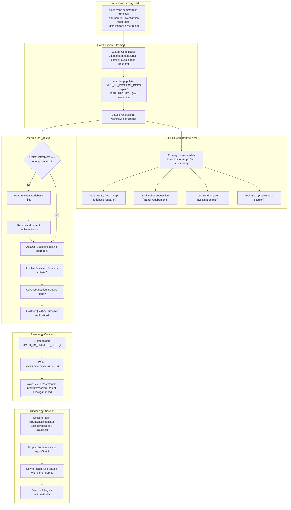
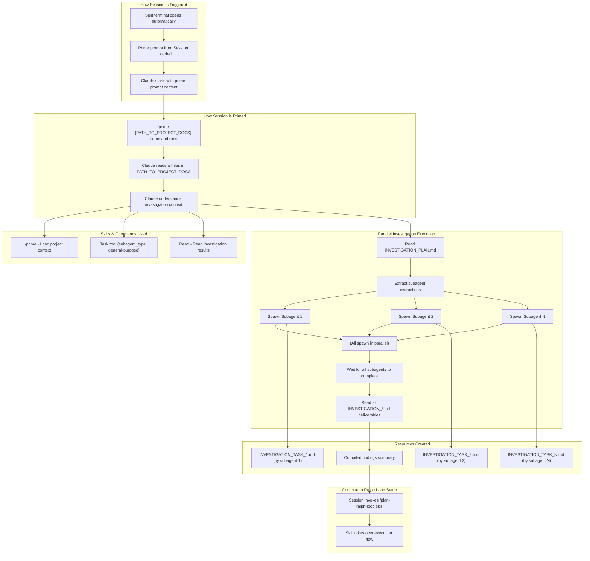
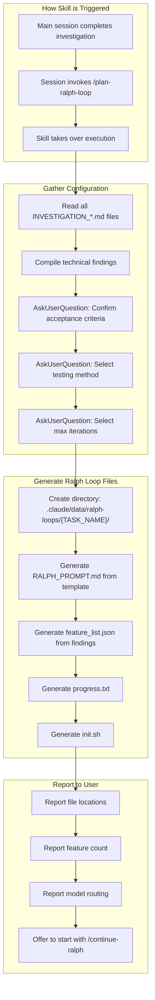

# Ralph Loop v2.0 - Planning Phase Documentation

**Created:** 2025-01-17
**Purpose:** Detailed documentation of the planning phase sessions that prepare a Ralph Loop for execution

---

## Table of Contents

1. [Planning Phase Overview](#1-planning-phase-overview)
2. [Session 1: Investigation Planning](#2-session-1-investigation-planning)
3. [Session 2: Parallel Investigation Execution](#3-session-2-parallel-investigation-execution)
4. [Session 2 (continued): Ralph Loop Setup](#4-session-2-continued-ralph-loop-setup)
5. [Output Files Summary](#5-output-files-summary)

---

## 1. Planning Phase Overview

The planning phase transforms a user's feature request into a fully-configured Ralph Loop ready for autonomous execution.

```
┌─────────────────────────────────────────────────────────────────────────────────────────┐
│                              PLANNING PHASE ARCHITECTURE                                │
├─────────────────────────────────────────────────────────────────────────────────────────┤
│                                                                                         │
│   USER INPUT                                                                            │
│   ─────────                                                                             │
│   • Feature request description                                                         │
│   • Path for investigation docs                                                         │
│   • Answers to clarifying questions                                                     │
│                                                                                         │
│         │                                                                               │
│         ▼                                                                               │
│   ┌───────────────────────────────────────────────────────────────────────────────────┐ │
│   │                              SESSION 1                                            │ │
│   │                     Investigation Planning Session                                │ │
│   │                                                                                   │ │
│   │   Skill: /plan-parallel-investigation-ralph                                       │ │
│   │                                                                                   │ │
│   │   ┌─────────────┐   ┌─────────────┐   ┌─────────────┐   ┌─────────────┐           │ │
│   │   │   Parse     │──►│   Initial   │──►│    Ask      │──►│   Create    │           │ │
│   │   │   User      │   │   Codebase  │   │   User      │   │   INVEST-   │           │ │
│   │   │   Input     │   │   Research  │   │   Questions │   │   IGATION_  │           │ │
│   │   │             │   │  (if needed)│   │             │   │   PLAN.md   │           │ │
│   │   └─────────────┘   └─────────────┘   └─────────────┘   └───────┬─────┘           │ │
│   │                                                                 │                 │ │
│   │                                                                 ▼                 │ │
│   │                                                          ┌─────────────┐          │ │
│   │                                                          │  Generate   │          │ │
│   │                                                          │  Prime      │          │ │
│   │                                                          │  Prompt     │          │ │
│   │                                                          └──────┬──────┘          │ │
│   │                                                                 │                 │ │
│   │                                                                 ▼                 │ │
│   │                                                          ┌─────────────┐          │ │
│   │                                                          │  Execute    │          │ │
│   │                                                          │  split      │          │ │
│   │                                                          │  terminal   │          │ │
│   │                                                          │  script     │          │ │
│   │                                                          └─────────────┘          │ │
│   └───────────────────────────────────────────────────────────────────────────────────┘ │
│                                                                                         │
│         │ (Automatic: new terminal opens with prime prompt)                             │
│         ▼                                                                               │
│   ┌───────────────────────────────────────────────────────────────────────────────────┐ │
│   │                              SESSION 2                                            │ │
│   │                    Parallel Investigation + Ralph Loop Setup                      │ │
│   │                                                                                   │ │
│   │   Skills: /prime, Task tool (subagents), /plan-ralph-loop                         │ │
│   │                                                                                   │ │
│   │   PART A: Parallel Investigation                                                  │ │
│   │   ┌─────────────┐   ┌─────────────┐   ┌─────────────┐   ┌─────────────┐           │ │
│   │   │   Read      │──►│   Spawn N   │──►│   Wait for  │──►│   Compile   │           │ │
│   │   │   INVEST-   │   │   Subagents │   │   Subagent  │   │   Findings  │           │ │
│   │   │   IGATION_  │   │   in        │   │   Completion│   │             │           │ │
│   │   │   PLAN.md   │   │   Parallel  │   │             │   │             │           │ │
│   │   └─────────────┘   └─────────────┘   └─────────────┘   └──────┬──────┘           │ │
│   │                                                                │                  │ │
│   │                                                                ▼                  │ │
│   │   PART B: Ralph Loop Setup (/plan-ralph-loop)                                     │ │
│   │   ┌─────────────┐   ┌─────────────┐   ┌─────────────┐   ┌─────────────┐           │ │
│   │   │   Read All  │──►│   Ask User  │──►│   Generate  │──►│   Report    │           │ │
│   │   │   INVEST-   │   │   Questions │   │   Ralph     │   │   to User   │           │ │
│   │   │   IGATION_  │   │   (criteria,│   │   Loop      │   │   & Offer   │           │ │
│   │   │   *.md      │   │    testing) │   │   Files     │   │   Start     │           │ │
│   │   └─────────────┘   └─────────────┘   └─────────────┘   └─────────────┘           │ │
│   └───────────────────────────────────────────────────────────────────────────────────┘ │
│                                                                                         │
│   OUTPUT FILES                                                                          │
│   ────────────                                                                          │
│   Planning Docs:                                                                        │
│   • {PATH}/INVESTIGATION_PLAN.md                                                        │
│   • {PATH}/INVESTIGATION_*.md (per subagent)                                            │
│   • .claude/data/prime-prompts/session-{name}-investigation.md                          │
│   │                                                                                     │
│   Ralph Loop Config:                                                                    │
│   • .claude/data/ralph-loops/{TASK}/RALPH_PROMPT.md                                     │
│   • .claude/data/ralph-loops/{TASK}/feature_list.json                                   │
│   • .claude/data/ralph-loops/{TASK}/progress.txt                                        │
│   • .claude/data/ralph-loops/{TASK}/init.sh                                             │
│                                                                                         │
└─────────────────────────────────────────────────────────────────────────────────────────┘
```

---

## 2. Session 1: Investigation Planning

### 2.1 Session Flow Diagram



### 2.2 Data Sources and Outputs

#### Input Data

| Data | Source | How Accessed |
|------|--------|--------------|
| `PATH_TO_PROJECT_DOCS` | User input (command argument) | Parsed from `$ARGUMENTS` |
| `USER_PROMPT` | User input (command argument) | Parsed from `$ARGUMENTS` |
| Codebase context | Existing files | `Read`, `Glob`, `Grep` tools |
| Testing approach | User | `AskUserQuestion` tool |
| Success criteria | User | `AskUserQuestion` tool |
| Feature flag requirements | User | `AskUserQuestion` tool |
| Browser verification needs | User | `AskUserQuestion` tool |

#### Output Data Created

| File | Location | Purpose |
|------|----------|---------|
| `INVESTIGATION_PLAN.md` | `{PATH_TO_PROJECT_DOCS}/` | Complete plan for parallel investigation |
| Prime prompt | `.claude/data/prime-prompts/session-{name}-investigation.md` | Instructions for Session 2 |

### 2.3 INVESTIGATION_PLAN.md Structure

The investigation plan document follows this structure:

```markdown
# Investigation Plan Overview
Details of the purpose of the current investigation

## Known Information
- Information from USER_PROMPT
- Findings from initial codebase research
- User answers to clarifying questions

## Testing & Validation Requirements
- **Testing Method:** Browser verification / Playwright / API / Database / Combined
- **Browser Verification Steps:** (if applicable)
- **Feature Flag Testing:** (if applicable)

## Success Criteria
- [ ] Build passes (no TypeScript/lint errors)
- [ ] {Specific UI element renders correctly}
- [ ] {Specific behavior works end-to-end}
- [ ] {Additional criteria from user}

## Feature Categories
### Functional Features
- Core logic changes

### UI Features
- Visual/layout changes

### Integration Features
- API/data flow changes

## Instructions
Detailed instructions for Session 2 to:
1. Spin up N general-purpose subagents in parallel
2. Have each subagent investigate ONE area
3. Create investigation document deliverables
4. Compile findings
5. Run /plan-ralph-loop to generate Ralph Loop configuration

## subagent_1_instructions
- Context: What this subagent needs to know
- Instructions: What to investigate
- Deliverable: INVESTIGATION_TASK_1.md
- Report: What to summarize

## subagent_2_instructions
...

## subagent_N_instructions
...
```

### 2.4 Session Spawning Mechanism

Session 1 ends by executing the split terminal script:

```bash
bash .claude/skills/continue-t/scripts/open-split-claude.sh "session-{name}-investigation.md"
```

**How the script works:**

The script uses AppleScript to:
1. Activate Cursor IDE
2. Send `Cmd+\` to split the terminal
3. Type the claude command with the prime prompt file content
4. Press Enter to start the new session

---

## 3. Session 2: Parallel Investigation Execution

### 3.1 Session Flow Diagram



### 3.2 Subagent Execution Detail

Each subagent is spawned using the Task tool with these parameters:

| Parameter | Value |
|-----------|-------|
| `subagent_type` | `general-purpose` |
| `description` | Brief description of investigation area |
| `prompt` | Full context and instructions from INVESTIGATION_PLAN.md |

**Important:** The subagent type MUST be `general-purpose` because:
- `Explore` subagent lacks Write tool access (cannot create deliverables)
- `Plan` subagent lacks Write tool access (cannot create deliverables)
- `general-purpose` has full tool access including Write

**Subagent prompt structure:**

```
## Context
{context from the relevant subagent_N_instructions section}

## Instructions
{instructions from the relevant subagent_N_instructions section}

## Deliverable
Create a file at `{PATH_TO_PROJECT_DOCS}/INVESTIGATION_{AREA}.md` with:
- Findings summary
- Relevant file references
- Technical details discovered
- Potential blockers or concerns

## Important
- Only investigate, do NOT modify code
- Create the investigation document as your deliverable
- Report key findings back to the main agent
```

### 3.3 Data Flow

| Data | Source | Description |
|------|--------|-------------|
| INVESTIGATION_PLAN.md | Session 1 (file) | What to investigate |
| Subagent instructions | Parsed from INVESTIGATION_PLAN.md | Per-subagent context |
| INVESTIGATION_*.md | **Created by subagents** | Investigation findings |
| Compiled findings | **Created by main session** | Summary for /plan-ralph-loop |

---

## 4. Session 2 (continued): Ralph Loop Setup

After the parallel investigation completes, Session 2 invokes the `/plan-ralph-loop` skill.

### 4.1 Skill Flow Diagram



### 4.2 User Questions

The /plan-ralph-loop skill asks the user three sets of questions:

**Question 1: Acceptance Criteria Confirmation**
- What specific behaviors must work?
- What UI elements must render correctly?
- What error conditions must be handled?

**Question 2: Testing Method Selection**

| Method | When to Use |
|--------|-------------|
| Claude in Chrome | Frontend/UI verification, visual checks |
| Playwright scripting | Automated UI testing, regression tests |
| API testing | Backend endpoints, data operations |
| Database verification | Data layer changes, migrations |
| Combined | Full-stack features |

**Question 3: Max Iterations Selection**

| Type of Tasks | Typical Multiplier |
|---------------|--------------------|
| Frontend only | 2-3x feature count |
| Backend only | 2-4x feature count |
| Frontend + Backend | 3-5x feature count |
| Database only | 2-3x feature count |
| Database + Backend + Frontend | 5-10x feature count |

### 4.3 Generated Files

#### RALPH_PROMPT.md

Generated from template at `.claude/skills/plan-ralph-loop/templates/RALPH_PROMPT.md.template`

Contains:
- Configuration table (ports, directories, max iterations)
- Key files to read first
- Task definition from investigation
- Technical context from investigation
- Implementation steps
- Testing & verification instructions
- Mandatory session start procedure
- One-feature-per-iteration rule
- Clean state exit checklist
- Iteration workflow

#### feature_list.json

Generated from template at `.claude/skills/plan-ralph-loop/templates/feature_list.json.template`

Structure:
```json
{
  "task_name": "{TASK_NAME}",
  "created": "{TIMESTAMP}",
  "total_features": N,
  "completed_features": 0,
  "default_model": "opus",
  "model_routing": {
    "setup": "opus",
    "functional": "opus",
    "ui": "sonnet",
    "verification": "sonnet",
    "testing": "sonnet",
    "documentation": "haiku"
  },
  "features": [
    {
      "id": 1,
      "category": "functional",
      "priority": "high",
      "model": "opus",
      "description": "Feature description",
      "steps": ["Step 1", "Step 2"],
      "passes": false,
      "completed_iteration": null,
      "notes": ""
    }
    // ... more features
  ]
}
```

#### progress.txt

Generated from template at `.claude/skills/plan-ralph-loop/templates/progress.txt.template`

Contains:
- Configuration summary
- Current state (iteration, status)
- Completion criteria
- Completed/Remaining tracking
- Current blocker notes
- Last verification result
- Next session instructions
- Session history table
- Iteration history table

#### init.sh

Generated from template at `.claude/skills/plan-ralph-loop/templates/init.sh.template`

Contains:
- Environment verification script
- Frontend server check
- Backend server check (if applicable)
- Build verification

---

## 5. Output Files Summary

### 5.1 Planning Phase Outputs

| Phase | File | Location |
|-------|------|----------|
| Session 1 | INVESTIGATION_PLAN.md | `{PATH_TO_PROJECT_DOCS}/` |
| Session 1 | Prime prompt | `.claude/data/prime-prompts/session-{name}-investigation.md` |
| Session 2 | INVESTIGATION_*.md | `{PATH_TO_PROJECT_DOCS}/` (one per subagent) |
| Session 2 | RALPH_PROMPT.md | `.claude/data/ralph-loops/{TASK_NAME}/` |
| Session 2 | feature_list.json | `.claude/data/ralph-loops/{TASK_NAME}/` |
| Session 2 | progress.txt | `.claude/data/ralph-loops/{TASK_NAME}/` |
| Session 2 | init.sh | `.claude/data/ralph-loops/{TASK_NAME}/` |

### 5.2 File Purposes

| File | Purpose | Read by |
|------|---------|---------|
| INVESTIGATION_PLAN.md | Guide parallel investigation | Session 2 |
| Prime prompt | Bootstrap Session 2 | open-split-claude.sh |
| INVESTIGATION_*.md | Capture investigation findings | /plan-ralph-loop |
| RALPH_PROMPT.md | Full prompt for each iteration | ralph-orchestrator.sh |
| feature_list.json | Track feature completion | ralph-orchestrator.sh, each iteration |
| progress.txt | Human-readable state tracking | User, each iteration |
| init.sh | Verify environment before iteration | Each iteration |

### 5.3 Ready for Execution

At the end of the planning phase, the user has:
1. A complete investigation record
2. A fully-configured Ralph Loop
3. Instructions to start with `/continue-ralph` or the wrapper script directly

The user can now proceed to the [Execution Phase](./RALPH_LOOP_EXECUTION_PHASE.md).
