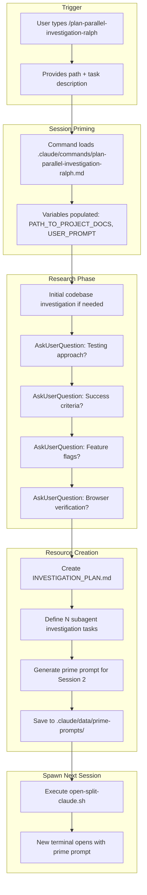
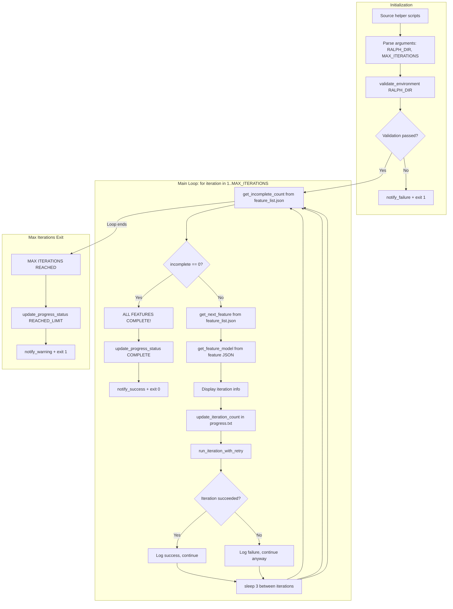

# Ralph Loop v2.0 - Unified Workflow Documentation

**Created:** 2025-01-17
**Purpose:** Human-centric documentation of the complete Ralph Loop workflow from planning to execution

---

## Table of Contents

1. [Architecture Overview](#1-architecture-overview)
2. [Phase Overview](#2-phase-overview)
3. [Planning Phase Sessions](#3-planning-phase-sessions)
4. [Execution Phase Sessions](#4-execution-phase-sessions)
5. [Orchestration Layer Deep Dive](#5-orchestration-layer-deep-dive)
6. [Security Features](#6-security-features)
7. [User Intervention Points](#7-user-intervention-points)
8. [Model Selection](#8-model-selection)

---

## 1. Architecture Overview

The Ralph Loop system operates across two distinct phases with multiple Claude sessions, orchestrated by bash scripts running in tmux.

```
┌─────────────────────────────────────────────────────────────────────────────────────────┐
│                           RALPH LOOP v2.0 COMPLETE WORKFLOW                             │
├─────────────────────────────────────────────────────────────────────────────────────────┤
│                                                                                         │
│  ┌─────────────────────────────────────────────────────────────────────────────────────┐│
│  │                          PLANNING PHASE (Human-Driven)                              ││
│  │                                                                                     ││
│  │      ┌───────────────┐          ┌───────────────┐            ┌───────────────┐      ││
│  │      │   Session 1   │─────────►│   Session 2   │───────────►│   Session 3   │      ││
│  │      │ Investigation │          │   Parallel    │            │  Ralph Loop   │      ││
│  │      │    Planning   │          │ Investigation │            │    Setup      │      ││
│  │      └───────────────┘          └───────────────┘            └───────────────┘      ││
│  │              │                          │                            │              ││
│  │              ▼                          ▼                            ▼              ││
│  │            Creates:                  Creates:                     Creates:          ││
│  │   • INVESTIGATION_PLAN.md    • INVESTIGATION_{TASK_N}.md     • RALPH_PROMPT.md      ││
│  │   • Prime prompt                  (per subagent)             • feature_list.json    ││
│  │                              • Findings summary              • progress.txt         ││
│  │                                                              • init.sh              ││
│  │                                                                                     ││
│  └─────────────────────────────────────────────────────────────────────────────────────┘│
│                                         │                                               │
│                                         ▼                                               │
│  ┌─────────────────────────────────────────────────────────────────────────────────────┐│
│  │                           EXECUTION PHASE (Script-Driven)                           ││
│  │                                                                                     ││
│  │  ┌─────────────────────────────────────────────────────────────────────────────────┐││
│  │  │                          BASH ORCHESTRATION LAYER                               │││
│  │  │    ┌─────────────────┐    ┌─────────────────┐    ┌─────────────────┐            │││
│  │  │    │ ralph-loop-     │───►│ ralph-          │───►│ validate-       │            │││
│  │  │    │ wrapper.sh      │    │ orchestrator.sh │    │ environment.sh  │            │││
│  │  │    │ (tmux mgmt)     │    │ (main loop)     │    │ (pre-flight)    │            │││
│  │  │    └─────────────────┘    └────────┬────────┘    └─────────────────┘            │││
│  │  │                                    │                                            │││
│  │  │                      ┌─────────────┴─────────────┐                              │││
│  │  │                      ▼                           ▼                              │││
│  │  │             ┌─────────────────┐        ┌─────────────────┐                      │││
│  │  │             │ browser-health- │        │ notify.sh       │                      │││
│  │  │             │ check.sh        │        │ (macOS alerts)  │                      │││
│  │  │             └─────────────────┘        └─────────────────┘                      │││
│  │  └─────────────────────────────────────────────────────────────────────────────────┘││
│  │                                        │                                            ││
│  │                   FOR EACH ITERATION   │                                            ││
│  │                                        ▼                                            ││
│  │  ┌─────────────────────────────────────────────────────────────────────────────────┐││
│  │  │                          CLAUDE SESSION (Iteration N)                           │││
│  │  │                                                                                 │││
│  │  │  Spawned by: claude --model {MODEL} --dangerously-skip-permissions              │││
│  │  │  Primed with: RALPH_PROMPT.md                                                   │││
│  │  │                                                                                 │││
│  │  │  Actions:                                                                       │││
│  │  │  1. Read progress.txt & feature_list.json                                       │││
│  │  │  2. Run init.sh (verify dev server)                                             │││
│  │  │  3. Run E2E baseline test                                                       │││
│  │  │  4. Implement ONE feature                                                       │││
│  │  │  5. Verify feature works                                                        │││
│  │  │  6. Update feature_list.json (passes: true)                                     │││
│  │  │  7. Update progress.txt                                                         │││
│  │  │  8. Git commit                                                                  │││
│  │  │  9. Exit (orchestrator spawns next)                                             │││
│  │  └─────────────────────────────────────────────────────────────────────────────────┘││
│  │                                                                                     ││
│  └─────────────────────────────────────────────────────────────────────────────────────┘│
│                                                                                         │
└─────────────────────────────────────────────────────────────────────────────────────────┘
```

---

## 2. Phase Overview

### 2.1 Planning Phase (Human-Driven)

| Aspect | Description |
|--------|-------------|
| **Trigger** | User manually starts with `/plan-parallel-investigation-ralph` |
| **Sessions** | 2-3 interactive Claude sessions |
| **User Involvement** | High - answering questions, reviewing plans |
| **Output** | Ralph Loop configuration files ready for execution |

### 2.2 Execution Phase (Script-Driven)

| Aspect | Description |
|--------|-------------|
| **Trigger** | User runs `/continue-ralph` or wrapper script directly |
| **Sessions** | N autonomous Claude sessions (one per iteration) |
| **User Involvement** | Low - can observe but no interaction required |
| **Output** | Implemented features, git commits, progress tracking |

---

## 3. Planning Phase Sessions

### 3.1 Session 1: Investigation Planning



#### Data Flow - Session 1

| Data Type | Source | Description |
|-----------|--------|-------------|
| `PATH_TO_PROJECT_DOCS` | User input | Directory for investigation docs |
| `USER_PROMPT` | User input | Task description and requirements |
| Testing method | AskUserQuestion | Browser/Playwright/API/Database/Combined |
| Success criteria | AskUserQuestion | Build passes, UI renders, behaviors work |
| Feature flags | AskUserQuestion | What flags need testing |
| INVESTIGATION_PLAN.md | **Created** | Complete investigation plan |
| Prime prompt | **Created** | Instructions for Session 2 |

#### Skills & Tools Used - Session 1

| Tool/Skill | Purpose |
|------------|---------|
| `/plan-parallel-investigation-ralph` | Main command (skill) |
| `AskUserQuestion` | Gather requirements from user |
| `Read`, `Glob`, `Grep` | Initial codebase investigation |
| `Write` | Create investigation plan and prime prompt |
| `Bash` | Execute split terminal script |

---

### 3.2 Session 2: Parallel Investigation Execution

```mermaid
flowchart TD
    subgraph Trigger["Trigger"]
        A[Split terminal opens automatically]
        B[Prime prompt loaded as first message]
    end

    subgraph Prime["Session Priming"]
        C[/prime command reads PATH_TO_PROJECT_DOCS]
        D[Session understands investigation context]
    end

    subgraph Research["Parallel Investigation"]
        E[Read INVESTIGATION_PLAN.md]
        F[Spawn N general-purpose subagents via Task tool]
        G["Subagent 1: Investigate area 1"]
        H["Subagent 2: Investigate area 2"]
        I["Subagent N: Investigate area N"]
        J[Wait for all subagents to complete]
        K[Read all INVESTIGATION_*.md documents]
    end

    subgraph Create["Compile Findings"]
        L[Summarize key findings]
        M[Identify blockers or questions]
    end

    subgraph Continue["Trigger /plan-ralph-loop"]
        N[Execute /plan-ralph-loop skill]
        O[Skill takes over session]
    end

    A --> B --> C --> D --> E --> F
    F --> G & H & I
    G & H & I --> J --> K --> L --> M --> N --> O
```

#### Data Flow - Session 2

| Data Type | Source | Description |
|-----------|--------|-------------|
| Prime prompt | Session 1 (file) | Instructions for this session |
| INVESTIGATION_PLAN.md | Session 1 (file) | What to investigate |
| INVESTIGATION_*.md | **Created by subagents** | Individual investigation findings |
| Compiled findings | **Created** | Summary of all investigations |

#### Skills & Tools Used - Session 2

| Tool/Skill | Purpose |
|------------|---------|
| `/prime` | Load context from project docs |
| `Task` (general-purpose) | Spawn parallel investigation subagents |
| `Read` | Read investigation plan and results |
| `/plan-ralph-loop` | Continue to Ralph Loop setup |

---

### 3.3 Session 2 (continued): Ralph Loop Setup via /plan-ralph-loop

```mermaid
flowchart TD
    subgraph Trigger["Trigger"]
        A[/plan-ralph-loop invoked within Session 2]
    end

    subgraph Research["Gather Configuration"]
        B[Read all INVESTIGATION_*.md files]
        C[Compile technical findings]
        D[AskUserQuestion: Confirm acceptance criteria]
        E[AskUserQuestion: Select testing method]
        F[AskUserQuestion: Select max iterations]
    end

    subgraph Create["Generate Ralph Loop Files"]
        G["Create .claude/data/ralph-loops/{TASK_NAME}/"]
        H[Generate RALPH_PROMPT.md from template]
        I[Generate feature_list.json with all features]
        J[Generate progress.txt]
        K[Generate init.sh]
    end

    subgraph Report["Report to User"]
        L[Report file locations]
        M[Report feature count and model routing]
        N[Offer to start with /continue-ralph]
    end

    A --> B --> C --> D --> E --> F --> G --> H --> I --> J --> K --> L --> M --> N
```

#### Data Flow - /plan-ralph-loop

| Data Type | Source | Description |
|-----------|--------|-------------|
| Investigation findings | INVESTIGATION_*.md files | Technical context |
| Acceptance criteria | AskUserQuestion | User-confirmed success criteria |
| Testing method | AskUserQuestion | How to verify features |
| Max iterations | AskUserQuestion | Iteration limit |
| RALPH_PROMPT.md | **Created** | Full prompt for each iteration |
| feature_list.json | **Created** | All features with model assignments |
| progress.txt | **Created** | Iteration tracking state |
| init.sh | **Created** | Environment verification script |

---

## 4. Execution Phase Sessions

### 4.1 Starting the Ralph Loop

The user has two options to start the Ralph Loop:

**Option 1: Via Skill**
```
/continue-ralph .claude/data/ralph-loops/{TASK_NAME}
```

**Option 2: Via Script Directly**
```bash
.claude/scripts/ralph-loop/ralph-loop-wrapper.sh start .claude/data/ralph-loops/{TASK_NAME} 20
```

Both methods ultimately call the same orchestration layer.

---

### 4.2 Individual Iteration Session

Each iteration is a fresh Claude session spawned by the orchestrator.

```mermaid
flowchart TD
    subgraph Trigger["Trigger"]
        A[Orchestrator runs: claude --model MODEL --dangerously-skip-permissions]
        B[RALPH_PROMPT.md content passed as initial prompt]
    end

    subgraph Prime["Session Priming"]
        C[Claude reads the full RALPH_PROMPT.md instructions]
        D[Understands task, testing method, constraints]
    end

    subgraph Startup["Mandatory Startup Procedure"]
        E[pwd - Confirm working directory]
        F[Read progress.txt - Current state]
        G[Read feature_list.json - All features]
        H[git log --oneline -10 - Recent work]
        I["Run init.sh - Verify dev server"]
        J["E2E baseline test - App loads correctly"]
    end

    subgraph Work["Feature Implementation"]
        K[Select highest-priority feature where passes: false]
        L[Implement the feature]
        M[Test the feature via configured method]
    end

    subgraph Complete["Feature Completion"]
        N["Update feature_list.json: passes: true"]
        O[Run /get-session-id skill]
        P[Update progress.txt with session ID]
        Q[Git commit with descriptive message]
    end

    subgraph Exit["Clean Exit"]
        R{All features complete?}
        S["Output: <promise>TASK COMPLETE</promise>"]
        T[Exit cleanly - orchestrator spawns next]
    end

    A --> B --> C --> D --> E --> F --> G --> H --> I --> J --> K --> L --> M --> N --> O --> P --> Q --> R
    R -->|Yes| S --> T
    R -->|No| T
```



#### Data Flow - Each Iteration

| Data Type | Source | Description |
|-----------|--------|-------------|
| RALPH_PROMPT.md | File (deterministic) | Full instructions |
| progress.txt | File (deterministic) | Current iteration state |
| feature_list.json | File (deterministic) | Feature status |
| Git history | Bash command | Recent commits |
| Session ID | /get-session-id skill | Session tracking |
| Feature changes | **Created** | Code implementation |
| Updated feature_list.json | **Edited** | Mark feature as passed |
| Updated progress.txt | **Edited** | Log iteration results |
| Git commit | **Created** | Commit feature changes |

#### Skills & Tools Used - Each Iteration

| Tool/Skill | Purpose |
|------------|---------|
| `Read` | Read state files |
| `Bash` | Run init.sh, git commands |
| `Edit`, `Write` | Implement features |
| `mcp__claude-in-chrome__*` | Browser testing (if UI feature) |
| `/get-session-id` | Capture session ID for logging |
| `Bash(git commit)` | Commit changes |

---

## 5. Orchestration Layer Deep Dive

### 5.1 Script Overview

```
.claude/scripts/ralph-loop/
├── ralph-loop-wrapper.sh      # Entry point - tmux session management
├── ralph-orchestrator.sh      # Main loop - spawns Claude sessions
├── validate-environment.sh    # Pre-flight checks
├── browser-health-check.sh    # Chrome connection verification
└── notify.sh                  # macOS notifications
```

### 5.2 ralph-loop-wrapper.sh - tmux Session Manager

**Purpose:** Provides a user-friendly interface for managing the Ralph Loop as a detachable background process.

**Commands:**

| Command | What It Does |
|---------|--------------|
| `start <dir> [max-iter]` | Creates a new tmux session named "ralph-loop" and runs the orchestrator inside it |
| `attach` | Attaches your terminal to the running tmux session so you can watch live |
| `status <dir>` | Checks if tmux session exists and shows progress.txt summary |
| `stop` | Kills the tmux session, stopping the loop immediately |
| `logs <dir>` | Shows recent log files and tails the latest one |

**How tmux Works:**

```
┌─────────────────────────────────────────────────────────────────────────────┐
│  YOUR TERMINAL                                                               │
│  ┌────────────────────────────────────────────────────────────────────────┐ │
│  │ $ ./ralph-loop-wrapper.sh start .claude/data/ralph-loops/task 20       │ │
│  │ ✅ Ralph Loop started                                                   │ │
│  │    Use './ralph-loop-wrapper.sh attach' to observe                      │ │
│  │ $                                                                       │ │
│  │                                                                         │ │
│  │ (You can now close this terminal - loop keeps running!)                 │ │
│  └────────────────────────────────────────────────────────────────────────┘ │
└─────────────────────────────────────────────────────────────────────────────┘

┌─────────────────────────────────────────────────────────────────────────────┐
│  TMUX SESSION "ralph-loop" (running in background)                          │
│  ┌────────────────────────────────────────────────────────────────────────┐ │
│  │ ╔═══════════════════════════════════════════════════════════════════╗  │ │
│  │ ║                     RALPH LOOP v2.0                               ║  │ │
│  │ ╚═══════════════════════════════════════════════════════════════════╝  │ │
│  │                                                                         │ │
│  │ Iteration 3/20                                                          │ │
│  │ Feature #5: Add pending leads preview component                         │ │
│  │ Model: sonnet                                                           │ │
│  │ Remaining: 7 features                                                   │ │
│  │                                                                         │ │
│  │ [Claude session output streaming...]                                    │ │
│  └────────────────────────────────────────────────────────────────────────┘ │
└─────────────────────────────────────────────────────────────────────────────┘
```

**Attach/Detach Flow:**

1. **Attach:** `./ralph-loop-wrapper.sh attach`
   - Your terminal "enters" the tmux session
   - You see live output from the current Claude session
   - You're watching, not interacting (Claude sessions are non-interactive)

2. **Detach:** Press `Ctrl+B`, then `D`
   - Your terminal "leaves" the tmux session
   - Loop continues running in background
   - You return to your normal terminal

3. **Stop:** `./ralph-loop-wrapper.sh stop`
   - Kills the tmux session entirely
   - Current Claude session is interrupted
   - progress.txt updated to "PAUSED"

---

### 5.3 ralph-orchestrator.sh - Main Loop Logic

**Purpose:** The brain of the Ralph Loop. Manages iterations, spawns Claude sessions, handles errors, and tracks progress.

**Execution Flow:**



**Key Functions Explained:**

```bash
# How the orchestrator selects the next feature:
get_next_feature() {
    # Reads feature_list.json
    # Filters for features where passes != true
    # Returns the FIRST one (highest priority)
    jq -c '[.features[] | select(.passes != true)][0]' "$FEATURE_LIST"
}

# How the orchestrator determines the model:
get_feature_model() {
    local feature_json="$1"

    # First, check if feature has explicit model
    local model=$(echo "$feature_json" | jq -r '.model // empty')

    if [ -z "$model" ]; then
        # Fallback to category-based routing
        local category=$(echo "$feature_json" | jq -r '.category')
        case "$category" in
            setup|functional)   model="opus" ;;    # Complex work
            ui|verification)    model="sonnet" ;;  # Browser work
            documentation)      model="haiku" ;;   # Simple docs
        esac
    fi

    echo "$model"
}
```

**How the Orchestrator Knows When to Start Next Session:**

The orchestrator uses a **simple exit code + loop** pattern:

```bash
# Inside run_iteration_with_retry:
claude --model "$model" \
       --dangerously-skip-permissions \
       "$(cat "$PROMPT_FILE")" 2>&1 | tee -a "$logfile" || exit_code=$?

# After Claude exits (for any reason):
if [ $exit_code -eq 0 ]; then
    # Success! Claude finished its work cleanly
    return 0
fi

# If exit_code != 0, check for retryable errors...
```

**The loop continues because:**
1. Claude session completes (exits with code 0 or error)
2. Orchestrator's `for` loop continues to next iteration
3. Orchestrator checks `feature_list.json` - if features remain, spawn new session
4. Repeat until all features pass OR max iterations reached

---

### 5.4 Retry Logic Deep Dive

```bash
run_iteration_with_retry() {
    local iteration="$1"
    local model="$2"
    local feature_json="$3"
    local attempt=0

    while [ $attempt -lt $MAX_RETRIES ]; do  # MAX_RETRIES = 3
        attempt=$((attempt + 1))

        # Spawn Claude session...
        claude --model "$model" --dangerously-skip-permissions "$(cat "$PROMPT_FILE")"
        exit_code=$?

        if [ $exit_code -eq 0 ]; then
            return 0  # Success!
        fi

        # Parse log for specific error patterns:

        # MCP Connection Error (Claude in Chrome dropped)
        if grep -qi "MCP.*connection.*lost" "$logfile"; then
            delay=$((2 ** attempt))  # Exponential: 2s, 4s, 8s
            sleep $delay
            continue  # Retry
        fi

        # Rate Limit (429 Too Many Requests)
        if grep -qi "rate.*limit\|429" "$logfile"; then
            sleep 60  # Wait 60 seconds
            continue  # Retry
        fi

        # Unknown error - don't retry, move to next iteration
        return 1
    done
}
```

---

### 5.5 Log File Organization

Each iteration creates a log file:

```
.claude/data/ralph-loops/{TASK_NAME}/logs/
├── iteration-1-attempt-1.log    # First iteration, first attempt
├── iteration-2-attempt-1.log    # Second iteration, first attempt
├── iteration-2-attempt-2.log    # Second iteration, retry (MCP error)
├── iteration-3-attempt-1.log
└── ...
```

**Log contents:**
```
=== Iteration 3, Attempt 1 started at Thu Jan 16 18:45:23 2025 ===
[Full Claude session output here...]
=== Completed at Thu Jan 16 18:52:41 2025 with exit code 0 ===
```

---

## 6. Security Features

### 6.1 Security Hook: ralph-pre-tool.js

**Location:** `.claude/hooks/ralph-pre-tool.js`

**Scope:** Applied to ALL Claude sessions in this project (configured in `settings.local.json`)

**How it works:**

```
┌─────────────────────────────────────────────────────────────────────────────┐
│  CLAUDE SESSION                                                              │
│                                                                              │
│  Claude wants to run: Bash("npm install lodash")                            │
│                              │                                               │
│                              ▼                                               │
│  ┌────────────────────────────────────────────────────────────────────────┐ │
│  │  PreToolUse Hook (ralph-pre-tool.js)                                   │ │
│  │                                                                         │ │
│  │  1. Receive JSON: {"tool_name": "Bash", "tool_input": {"command": ...}}│ │
│  │  2. Extract base command: "npm"                                         │ │
│  │  3. Check ALLOWED_COMMANDS set: npm ✓                                  │ │
│  │  4. Check BLOCKED_PATTERNS: no match ✓                                 │ │
│  │  5. Return: {"decision": null} (allow)                                  │ │
│  └────────────────────────────────────────────────────────────────────────┘ │
│                              │                                               │
│                              ▼                                               │
│  Command executes: npm install lodash                                        │
└─────────────────────────────────────────────────────────────────────────────┘
```

**Allowed Commands (whitelist):**
```javascript
const ALLOWED_COMMANDS = new Set([
    // Package managers
    'npm', 'npx', 'yarn', 'pnpm', 'bun',
    // Languages
    'node', 'python', 'python3',
    // Git
    'git',
    // File operations
    'ls', 'cat', 'head', 'tail', 'mkdir', 'touch', 'cp', 'mv',
    // Text processing
    'jq', 'sed', 'awk', 'grep',
    // Build tools
    'make', 'cargo', 'go',
    // Claude itself
    'claude',
    // And more...
]);
```

**Blocked Patterns (deny list):**
```javascript
const BLOCKED_PATTERNS = [
    /^rm\s+-rf\s*\/(?!Users)/i,  // rm -rf / (allow /Users paths)
    /^sudo\s/i,                    // Any sudo command
    /^chmod\s+777/i,               // chmod 777
    /mkfs\./i,                     // Format filesystems
    // ... and more dangerous patterns
];
```

**Fail-Open Design:** If the hook crashes or can't parse input, it allows the command (for usability). The `--dangerously-skip-permissions` flag already means we trust this environment.

---

### 6.2 Permission Configuration

**Location:** `.claude/settings.local.json`

```json
{
  "hooks": {
    "PreToolUse": [
      {
        "matcher": "Bash",
        "hooks": [
          {
            "type": "command",
            "command": "node .claude/hooks/ralph-pre-tool.js"
          }
        ]
      }
    ]
  }
}
```

The hook only runs for `Bash` tool calls. Other tools (Read, Write, Edit, etc.) are not validated by this hook and rely on the permission allow/deny rules in settings.local.json.

---

## 7. User Intervention Points

### 7.1 During Planning Phase

| Point | How to Intervene |
|-------|------------------|
| Session 1: Requirements gathering | Answer AskUserQuestion prompts |
| Session 2: Investigation | Answer follow-up questions if subagents find blockers |
| /plan-ralph-loop: Configuration | Answer AskUserQuestion prompts for criteria, testing, iterations |

### 7.2 During Execution Phase

| Point | How to Intervene |
|-------|------------------|
| Watch live | `./ralph-loop-wrapper.sh attach` |
| Check progress | `./ralph-loop-wrapper.sh status <dir>` |
| View logs | `./ralph-loop-wrapper.sh logs <dir>` |
| Pause loop | Press `Ctrl+C` in attached session OR `./ralph-loop-wrapper.sh stop` |
| Resume loop | `./ralph-loop-wrapper.sh start <dir>` (will continue from where it left off) |

### 7.3 Can You Interact with Running Sessions?

**No.** The Claude sessions during execution are non-interactive. They:
- Receive the full RALPH_PROMPT.md as their only input
- Cannot ask the user questions
- Cannot wait for user input
- Run to completion or error

If you need to change something:
1. Stop the loop: `./ralph-loop-wrapper.sh stop`
2. Edit the relevant files (RALPH_PROMPT.md, feature_list.json, etc.)
3. Restart: `./ralph-loop-wrapper.sh start <dir>`

---

## 8. Model Selection

### 8.1 How Models Are Assigned

**Priority order:**
1. Explicit `model` field in feature_list.json feature
2. Category-based routing (from `model_routing` in feature_list.json)
3. Default model (opus)

### 8.2 Category-to-Model Mapping

| Category | Default Model | Rationale |
|----------|---------------|-----------|
| `setup` | opus | Complex configuration, needs reasoning |
| `functional` | opus | Core logic, needs deep understanding |
| `ui` | sonnet | Browser interaction, pattern matching |
| `verification` | sonnet | Testing, less complex reasoning |
| `testing` | sonnet | Running tests, checking results |
| `documentation` | haiku | Simple text generation |

### 8.3 Example feature_list.json

```json
{
  "features": [
    {
      "id": 1,
      "category": "functional",
      "model": "opus",           // ← Explicit model
      "description": "Implement pending leads query",
      "passes": false
    },
    {
      "id": 2,
      "category": "ui",          // ← Will use sonnet (category default)
      "description": "Verify leads preview renders correctly",
      "passes": false
    }
  ]
}
```

### 8.4 Overriding Model Selection

To change a feature's model:
1. Stop the loop if running
2. Edit `feature_list.json`
3. Add or change the `model` field for the specific feature
4. Restart the loop

---

## Appendix A: File Reference

| File | Purpose | Created By |
|------|---------|------------|
| `.claude/commands/plan-parallel-investigation-ralph.md` | Planning phase entry point | Pre-existing |
| `.claude/skills/plan-ralph-loop/SKILL.md` | Ralph Loop setup skill | Pre-existing |
| `.claude/skills/continue-ralph/SKILL.md` | Execution trigger skill | Pre-existing |
| `.claude/scripts/ralph-loop/*.sh` | Orchestration scripts | Implementation |
| `.claude/hooks/ralph-pre-tool.js` | Security hook | Implementation |
| `.claude/data/ralph-loops/{TASK}/RALPH_PROMPT.md` | Iteration prompt | /plan-ralph-loop |
| `.claude/data/ralph-loops/{TASK}/feature_list.json` | Feature tracking | /plan-ralph-loop |
| `.claude/data/ralph-loops/{TASK}/progress.txt` | Iteration state | /plan-ralph-loop |
| `.claude/data/ralph-loops/{TASK}/init.sh` | Environment check | /plan-ralph-loop |
| `.claude/data/ralph-loops/{TASK}/logs/*.log` | Iteration logs | Orchestrator |

---

## Appendix B: Quick Reference Commands

```bash
# Planning Phase
/plan-parallel-investigation-ralph <path> <task description>

# Start Ralph Loop
/continue-ralph .claude/data/ralph-loops/{TASK_NAME}
# OR
.claude/scripts/ralph-loop/ralph-loop-wrapper.sh start .claude/data/ralph-loops/{TASK_NAME} 20

# Monitor
.claude/scripts/ralph-loop/ralph-loop-wrapper.sh attach
.claude/scripts/ralph-loop/ralph-loop-wrapper.sh status .claude/data/ralph-loops/{TASK_NAME}
.claude/scripts/ralph-loop/ralph-loop-wrapper.sh logs .claude/data/ralph-loops/{TASK_NAME}

# Control
.claude/scripts/ralph-loop/ralph-loop-wrapper.sh stop
# Then edit files if needed, then:
.claude/scripts/ralph-loop/ralph-loop-wrapper.sh start .claude/data/ralph-loops/{TASK_NAME}
```
