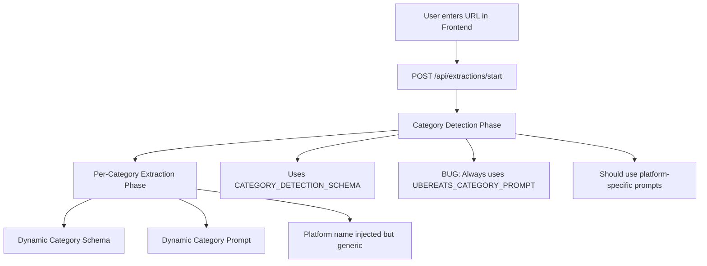

# Menu Extraction Prompts and Schemas Analysis

## Executive Summary

The system exclusively uses batch extraction method for menu extraction. There are two separate workflows that must be maintained: an agent workflow for automated extraction and a UI workflow for human users. The single-scrape method and its associated code are completely unused and can be safely removed. This document provides a comprehensive mapping of active vs dead code to guide cleanup without impacting either workflow.

## Two Separate Workflows (Must Be Preserved)

### 1. UI Workflow (Human Users)
**Entry Point:** Frontend → `/api/extractions/start`
- Used by: Human users via web interface
- Method: Always batch extraction
- Issue: Currently uses wrong category detection prompt (always UberEats)

### 2. Agent Workflow (Automated Extraction)
**Entry Point:** Direct API → `/api/scan-categories` + other endpoints
- Used by: Internal automation agents
- Method: Modular approach with separate endpoints
- Status: Has correct platform detection logic

### Current UI Workflow Implementation



## Decision Tree: Current Implementation

```
┌─────────────────────────────────────────────────────────────────┐
│                     USER STARTS EXTRACTION                       │
└─────────────────────────────────────────────────────────────────┘
                                │
                                ▼
                    ┌───────────────────────┐
                    │   Platform Detection   │
                    │  (Not used for prompts)│
                    └───────────────────────┘
                                │
                                ▼
            ┌─────────────────────────────────────────┐
            │        CATEGORY DETECTION PHASE         │
            │                                         │
            │  Schema: CATEGORY_DETECTION_SCHEMA     │
            │  Prompt: UBEREATS_CATEGORY_PROMPT      │
            │         ⚠️ ALWAYS! Even for DoorDash  │
            └─────────────────────────────────────────┘
                                │
                                ▼
                    ┌───────────────────────┐
                    │   Categories Found?    │
                    └───────────────────────┘
                          │            │
                         Yes           No
                          │            │
                          ▼            ▼
            ┌──────────────────┐  ┌──────────────────┐
            │ For Each Category │  │ Empty Categories │
            └──────────────────┘  └──────────────────┘
                          │
                          ▼
        ┌──────────────────────────────────────────────┐
        │         PER-CATEGORY EXTRACTION              │
        │                                              │
        │  Schema: Dynamic (hardcoded in function)     │
        │  Prompt: Dynamic with category name          │
        │         Platform name mentioned but generic │
        └──────────────────────────────────────────────┘
```

## Actual Prompts & Schemas Used in Production

### Phase 1: Category Detection (ALL Platforms)

**Schema Used:** `CATEGORY_DETECTION_SCHEMA`
```javascript
{
  categories: [{
    name: "string",        // Category name
    position: integer,     // Vertical position
    selector: "string"     // CSS selector
  }]
}
```

**Prompt Used:** `UBEREATS_CATEGORY_PROMPT` (⚠️ BUG: Hardcoded for all platforms!)
- Always uses UberEats-specific instructions
- Mentions "UberEats restaurant page" even for DoorDash, OrderMeal, etc.
- References UI elements specific to UberEats

### Phase 2: Per-Category Extraction (ALL Platforms)

**Schema Used:** Dynamically generated in `startBackgroundExtraction()`
```javascript
{
  categoryName: "string",
  menuItems: [{
    dishName: "string",
    dishPrice: number,
    dishDescription: "string",
    imageURL: "string",
    tags: ["string"]
  }]
}
```

**Prompt Used:** Dynamically generated template
```
Focus ONLY on extracting menu items from the category "${category.name}" on this ${platformName} page.
1. Navigate to the section for category "${category.name}"
2. Look for elements matching the selector "${category.selector}"
3. Extract ONLY the menu items within this specific category
...
```

## Unused Prompts & Schemas (Dead Code)

### Completely Unused Prompts

1. **`DEFAULT_PROMPT`** 
   - Generic extraction prompt
   - Could be used for new platforms
   - Never referenced in batch extraction

2. **`DOORDASH_IMAGES_PROMPT`**
   - Specialized for DoorDash image extraction
   - Never used anywhere

3. **`UBEREATS_MENU_ITEMS_URL_PROMPT`**
   - For extracting item URLs
   - Part of abandoned option sets feature

4. **`UBEREATS_OPTION_SETS_PROMPT`**
   - For extracting customization options
   - Option sets extraction endpoint exists but likely unused

### Unused or Misused Schemas

1. **`UBEREATS_SCHEMA`** ❌
   - Exists but NEVER used!
   - Bug: Server uses DEFAULT_SCHEMA for UberEats instead

2. **`DOORDASH_SCHEMA`** ✅
   - Actually used correctly in single-scrape mode
   - NOT used in batch extraction (which is the default)

3. **`DEFAULT_SCHEMA`** ⚠️
   - Used for UberEats (should use UBEREATS_SCHEMA)
   - Used as fallback for unknown platforms
   - Different structure than batch extraction schema

4. **`IMAGES_SCHEMA`**
   - For image-only extraction
   - Never referenced

5. **`MENU_ITEMS_URL_SCHEMA`**
   - For URL extraction
   - Part of abandoned feature

6. **`OPTION_SETS_SCHEMA`**
   - For customization options
   - Endpoint exists but unclear if used

### Platform-Specific Prompts Not Being Used

**`DOORDASH_CATEGORY_PROMPT`** exists but is never used! Instead, all platforms use `UBEREATS_CATEGORY_PROMPT` for category detection.

## Critical Issues Found (NOW FIXED ✅)

### 1. Two Separate Category Detection Implementations (BY DESIGN)

**The system intentionally has TWO different category detection implementations for different workflows:**

#### A. Agent Workflow Implementation (CORRECT)
**Location:** `/api/scan-categories` endpoint (lines 1425-1597)
```javascript
// CORRECT: Properly detects platform and uses appropriate prompt
if (platformInfo.name === 'UberEats') {
  categoryPrompt = UBEREATS_CATEGORY_PROMPT;
} else if (platformInfo.name === 'DoorDash') {
  categoryPrompt = DOORDASH_CATEGORY_PROMPT;  // ✅ Correct!
}
```
**Status:** Used by internal agents - MUST BE PRESERVED
**Purpose:** Provides modular category scanning for automated workflows

#### B. UI Workflow Implementation (FIXED ✅)
**Location:** `/api/extractions/start` endpoint (lines 3907-3922)
```javascript
// FIXED: Now properly detects platform and uses appropriate prompt
const platformInfo = detectPlatform(url);
if (platformInfo.name === 'UberEats') {
  categoryPrompt = UBEREATS_CATEGORY_PROMPT;
} else if (platformInfo.name === 'DoorDash') {
  categoryPrompt = DOORDASH_CATEGORY_PROMPT;  // ✅ Now working!
} else {
  categoryPrompt = UBEREATS_CATEGORY_PROMPT;  // Fallback for unknown platforms
}
```
**Status:** Used by frontend UI - NOW WORKING CORRECTLY
**Purpose:** All-in-one extraction for human users

### 2. Wrong Schema for UberEats (DEAD CODE)
**Location:** `/api/scrape` endpoint (line 826)
```javascript
// BUG: Should use UBEREATS_SCHEMA
extractionSchema = schema || require('./src/services/firecrawl-service').DEFAULT_SCHEMA;
```
**Status:** DEAD CODE - `/api/scrape` endpoint is never used
**Impact:** None - this endpoint is not part of either workflow

### 3. Platform Detector Not Integrated
The `getExtractionConfig()` function in platform-detector.js returns appropriate prompts and schemas but is never called by either workflow

### 4. Schema Structure Clarification
**IMPORTANT: Only one schema structure is actually used:**
- **Batch extraction (ACTIVE):** Uses dynamically generated schemas specific to each phase
  - Category detection: `CATEGORY_DETECTION_SCHEMA` (same for all platforms)
  - Per-category extraction: Dynamic schema with `categoryName` and `menuItems`
- **Single-scrape (DEAD CODE):** Would use platform-specific schemas if it were active
  - These schemas (`DEFAULT_SCHEMA`, `UBEREATS_SCHEMA`, `DOORDASH_SCHEMA`) are never used

## Recommendations

### Immediate Fixes (Preserve Both Workflows)

1. **Fix UI Workflow Category Detection in `/api/extractions/start`**
```javascript
// Line 3910 - Replace hardcoded prompt with platform detection
const platformInfo = detectPlatform(url);
let categoryPrompt;
if (platformInfo.name === 'DoorDash') {
  categoryPrompt = DOORDASH_CATEGORY_PROMPT;
} else {
  categoryPrompt = UBEREATS_CATEGORY_PROMPT;
}

// Then use in scanPayload:
formats: [{
  type: 'json',
  schema: CATEGORY_DETECTION_SCHEMA,
  prompt: categoryPrompt  // Use detected prompt instead of hardcoded
}]
```
**Note:** Do NOT make UI workflow call agent endpoint - keep workflows separate

2. **Leave Agent Workflow Unchanged**
- `/api/scan-categories` already works correctly
- Keep it separate for agent modularity

### Dead Code Cleanup Plan

**TO BE REMOVED:**
1. **Single-scrape endpoints:**
   - `/api/scrape` endpoint (entire function) ❌
   - `/api/extract-images` endpoint ❌
   
2. **Unused schemas in firecrawl-service.js:**
   - `UBEREATS_SCHEMA` (never used) ❌
   - `DOORDASH_SCHEMA` (only for single-scrape) ❌
   - `IMAGES_SCHEMA` (for extract-images endpoint) ❌
   - `MENU_ITEMS_URL_SCHEMA` (abandoned feature) ❌

3. **Unused prompts in firecrawl-service.js:**
   - `UBEREATS_PROMPT` (only for single-scrape) ❌
   - `DOORDASH_PROMPT` (only for single-scrape) ❌
   - `DOORDASH_IMAGES_PROMPT` (never used) ❌
   - `UBEREATS_MENU_ITEMS_URL_PROMPT` (abandoned) ❌

4. **UI Elements:**
   - Remove "Download menu images" checkbox ❌
   - Remove "Generate CSV export" checkbox ❌
   - Remove options from extraction state management ❌

**TO BE PRESERVED:**
1. **UI Workflow endpoints:**
   - `/api/extractions/start` ✅
   - `/api/extractions/:jobId` ✅
   - `/api/menus` endpoints ✅
   
2. **Agent Workflow endpoints:**
   - `/api/scan-categories` ✅
   - `/api/extract-option-sets` ✅ (for future implementation)

3. **Schemas to keep:**
   - `CATEGORY_DETECTION_SCHEMA` ✅ (actively used)
   - `DEFAULT_SCHEMA` ✅ (template for new platforms)
   - `OPTION_SETS_SCHEMA` ✅ (future implementation)
   - Dynamic schemas generated in code ✅

4. **Prompts to keep:**
   - `UBEREATS_CATEGORY_PROMPT` ✅ (actively used)
   - `DOORDASH_CATEGORY_PROMPT` ✅ (actively used)
   - `DEFAULT_PROMPT` ✅ (template for new platforms)
   - `UBEREATS_OPTION_SETS_PROMPT` ✅ (future implementation)
   - Dynamic prompts generated in code ✅

## Appendix: Prompts & Schemas After Cleanup

### Prompts Remaining (6 total)
- ✅ Active: `UBEREATS_CATEGORY_PROMPT` (category detection)
- ✅ Active: `DOORDASH_CATEGORY_PROMPT` (category detection)
- ✅ Template: `DEFAULT_PROMPT` (template for new platforms)
- ✅ Future: `UBEREATS_OPTION_SETS_PROMPT` (for option sets feature)
- ✅ Active: Dynamic category extraction prompt (generated in code)
- ✅ Active: Dynamic per-category prompt (generated in code)

### Schemas Remaining (4 total)
- ✅ Active: `CATEGORY_DETECTION_SCHEMA` (category detection)
- ✅ Template: `DEFAULT_SCHEMA` (template for new platforms)
- ✅ Future: `OPTION_SETS_SCHEMA` (for option sets feature)
- ✅ Active: Dynamic category schema (generated in code)

### Removed Prompts (8 total)
- ❌ `UBEREATS_PROMPT` (single-scrape)
- ❌ `DOORDASH_PROMPT` (single-scrape)
- ❌ `DOORDASH_IMAGES_PROMPT` (never used)
- ❌ `UBEREATS_MENU_ITEMS_URL_PROMPT` (abandoned)

### Removed Schemas (4 total)
- ❌ `UBEREATS_SCHEMA` (never used)
- ❌ `DOORDASH_SCHEMA` (single-scrape)
- ❌ `IMAGES_SCHEMA` (extract-images)
- ❌ `MENU_ITEMS_URL_SCHEMA` (abandoned)

## Advanced Options Analysis: Dead UI Controls

### Investigation of "Download menu images" and "Generate CSV export" Checkboxes

**Finding: These UI options are completely non-functional and should be removed.**

#### Evidence Trail:

1. **Frontend (NewExtraction.jsx)**
   - Default values: Both set to `true`
   - Passed to backend in options object:
   ```javascript
   options: {
     includeImages: includeImages,  // checkbox value
     generateCSV: generateCSV        // checkbox value
   }
   ```

2. **Backend Reception (server.js)**
   - Options received and stored in job configuration:
   ```javascript
   config: { 
     includeImages: options.includeImages !== false,
     generateCSV: options.generateCSV !== false
   }
   ```

3. **Actual Usage: NONE**
   - The options are stored but **NEVER USED** during extraction
   - No code checks `job.options.includeImages` or `job.options.generateCSV`
   - Images are ALWAYS extracted from Firecrawl regardless of setting
   - CSV generation is ALWAYS available as a post-extraction action

4. **What Actually Happens:**
   - **Image URLs:** Always extracted from websites and saved to database
   - **CSV Generation:** Always available as manual download after extraction
   - **Download Buttons:** Always shown for completed extractions
   - No conditional logic based on these options anywhere

#### Why This is Misleading:

1. **"Download menu images" checkbox implies:**
   - Unchecked = Don't extract image URLs
   - Checked = Extract image URLs
   - **Reality:** Image URLs always extracted and saved

2. **"Generate CSV export" checkbox implies:**
   - Unchecked = No CSV will be available
   - Checked = CSV will be generated
   - **Reality:** CSV is always available on-demand after extraction

3. **User Experience Issues:**
   - Users might uncheck "Download menu images" thinking it speeds up extraction
   - Users might check "Generate CSV" thinking it auto-generates a file
   - Neither option changes anything about the extraction process

#### The Only Place Options Matter:

The `includeImages` option is ONLY used in the **manual CSV export endpoint** (`/api/menus/:id/export`) to determine column inclusion:
- With images: Includes imageURL column
- Without images: Excludes imageURL column
- But this is controlled by a parameter at export time, NOT the original extraction option

### Recommendation:

**Remove these checkboxes entirely** from the UI because:
1. They don't affect the extraction process
2. They mislead users about system behavior
3. They add unnecessary complexity
4. The actual choice (include images in CSV or not) is made at download time

## Multi-Platform Support Strategy

### Current Platform Support
The system can technically accept any URL (platform restrictions removed), but only has specific prompts for:
- UberEats (full support)
- DoorDash (category prompt exists, but not used in UI workflow)

### Adding New Platforms (NZ focus)
To add support for OrderMeal, NextOrder, FoodHub, Mobi2Go, Bopple, etc.:

1. **Create platform-specific category prompts** in firecrawl-service.js:
   ```javascript
   const ORDERMEAL_CATEGORY_PROMPT = `...`;
   const NEXTORDER_CATEGORY_PROMPT = `...`;
   ```

2. **Update platform detection logic** in both workflows:
   - UI: `/api/extractions/start` 
   - Agent: `/api/scan-categories`

3. **Consider generic fallback** for unknown platforms:
   - Use a generic category detection prompt
   - Rely on dynamic per-category extraction

### Adding PDF Support
For PDF menu extraction:

1. **New endpoint needed:** `/api/extract-pdf`
   - Cannot use Firecrawl (web scraper)
   - Need PDF parsing library (pdf-parse, pdfjs)
   
2. **Different extraction approach:**
   - OCR for scanned menus
   - Text extraction for digital PDFs
   - LLM-based structuring of extracted text

3. **Integration points:**
   - Add PDF upload to UI
   - Store results in same database structure
   - Reuse CSV export functionality

## Cleanup Summary

### What Was Fixed ✅
1. **Platform Detection:** UI workflow now correctly uses platform-specific prompts
2. **Category Detection:** Both UberEats and DoorDash prompts working correctly

### What Will Be Removed 🗑️
1. **Dead Endpoints:** `/api/scrape`, `/api/extract-images`
2. **Unused Prompts:** Single-scrape and image-specific prompts (8 total)
3. **Unused Schemas:** Platform-specific and feature-specific schemas (4 total)
4. **UI Clutter:** Non-functional Advanced Options checkboxes

### What Will Be Preserved ✅
1. **Both Workflows:** UI and Agent endpoints remain separate
2. **Active Code:** All batch extraction logic
3. **Templates:** DEFAULT_PROMPT and DEFAULT_SCHEMA for new platforms
4. **Future Features:** Option sets prompts/schemas for later implementation

### System After Cleanup
- **Cleaner codebase** with only active extraction methods
- **Clear separation** between UI and Agent workflows
- **Ready for expansion** with templates for new platforms
- **Prepared for features** like option sets extraction
- **No misleading UI elements** that don't affect functionality