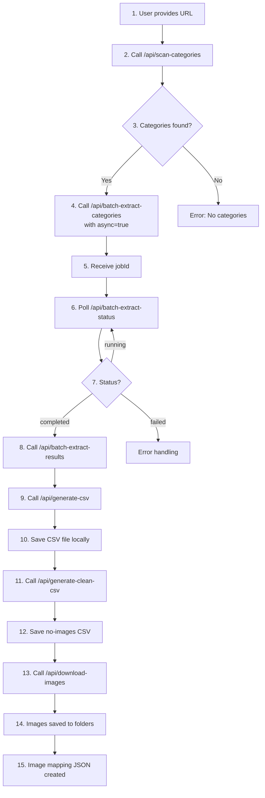
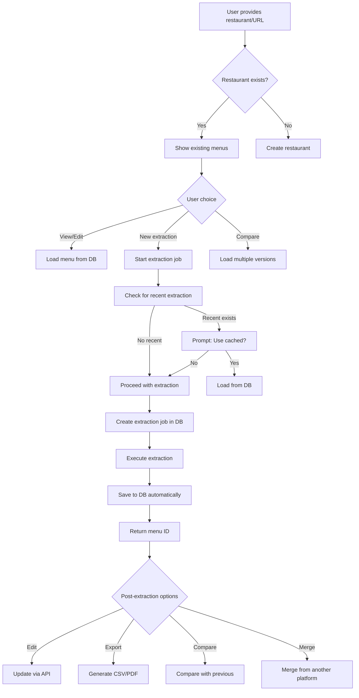

# Product Requirements Document: Menu Extraction System with Database Integration

## Executive Summary
This document outlines the complete architecture of the UberEats/DoorDash menu extraction system, its recent database integration, and the roadmap for transforming it into a multi-tenant cloud-based SaaS platform.

---

## 1. CURRENT ARCHITECTURE

### 1.1 System Overview
The application is a Node.js/Express server that scrapes restaurant menus from delivery platforms using the Firecrawl v2 API, with data persistence to Supabase PostgreSQL database.

### 1.2 Technology Stack
- **Backend**: Node.js + Express.js
- **Scraping**: Firecrawl v2 API
- **Database**: Supabase (PostgreSQL 17.4.1)
- **Frontend**: Webpack + React (development UI)
- **Storage**: In-memory Map + Supabase tables
- **File System**: Local image downloads

### 1.3 API Endpoints Configuration

#### 1.3.1 Core Extraction Endpoints

```javascript
POST /api/scan-categories
├── Input: { url: string }
├── Process: Firecrawl v2 scrapes page for category detection
├── Output: { categories: Array<{name, position, selector}> }
└── Database: None (stateless operation)

POST /api/batch-extract-categories
├── Input: { url, categories, async?: boolean, restaurantName?: string }
├── Process: 
│   ├── Sync Mode: Direct extraction with immediate response
│   └── Async Mode: Background job with job ID return
├── Output: 
│   ├── Sync: { menuItems: Array, categories: Object }
│   └── Async: { jobId, statusUrl, resultsUrl }
└── Database: 
    ├── Creates/updates restaurant record
    ├── Creates extraction_job record
    ├── On completion: Creates menu, categories, items, images

GET /api/batch-extract-status/:jobId
├── Input: jobId in URL parameter
├── Process: Retrieves job from in-memory store
├── Output: { status, progress, timing }
└── Database: Updates job progress (if available)

GET /api/batch-extract-results/:jobId
├── Input: jobId in URL parameter
├── Process: Retrieves completed job data
├── Output: { menuItems: Array, stats: Object }
└── Database: Already saved during extraction
```

#### 1.3.2 Utility Endpoints

```javascript
POST /api/generate-csv
├── Input: { data: { menuItems: Array } }
├── Process: Converts JSON to CSV format
├── Output: CSV string with headers
└── Database: None (operates on provided data)

POST /api/generate-clean-csv
├── Input: { csvData: string }
├── Process: Removes image URLs from CSV
├── Output: Cleaned CSV string
└── Database: None

POST /api/download-images
├── Input: { data: { menuItems }, options: { outputPath, groupByCategory } }
├── Process: Downloads images to local filesystem
├── Output: { mappingFile: path, stats: Object }
└── Database: Could update item_images.is_downloaded flag

POST /api/scrape
├── Input: { url, schema?, prompt? }
├── Process: Direct Firecrawl v2 scraping
├── Output: Extracted JSON data
└── Database: None (direct pass-through)
```

### 1.4 Sequential Workflow for CSV Generation

#### Current Agent Workflow (menu-extractor-batch):



#### Detailed Step Execution:

1. **Category Scanning** (Steps 1-3)
   - Firecrawl loads the restaurant page
   - Executes JavaScript to find menu sections
   - Returns category names and CSS selectors

2. **Batch Extraction** (Steps 4-8)
   - Creates background job in memory
   - For each category:
     - Firecrawl navigates to category section
     - Extracts items using JSON schema
     - Aggregates results
   - Updates job progress in memory

3. **Data Processing** (Steps 9-12)
   - Transforms JSON to CSV format
   - Creates two versions:
     - Full CSV with image URLs
     - Clean CSV without images (for import)

4. **Image Handling** (Steps 13-15)
   - Downloads images by category
   - Creates folder structure:
     ```
     /downloads/restaurant-name/
     ├── Entrees/
     │   ├── spring-rolls.jpg
     │   └── chicken-satay.jpg
     ├── Soups/
     │   └── tom-yum.jpg
     └── image-mapping.json
     ```

### 1.5 Data Storage Mechanisms

#### 1.5.1 In-Memory Storage (Original)

```javascript
// Job Store - server.js line 44
const jobStore = new Map();

// Structure:
jobStore.set(jobId, {
  jobId: string,
  state: 'pending' | 'running' | 'completed' | 'failed',
  url: string,
  totalCategories: number,
  completedCategories: number,
  currentCategory: string,
  startTime: timestamp,
  endTime: timestamp,
  data: {
    menuItems: Array<{
      dishName: string,
      dishPrice: number,
      dishDescription: string,
      imageURL: string,
      categoryName: string,
      tags: Array<string>
    }>
  },
  stats: {
    totalItems: number,
    successfulCategories: number,
    failedCategories: number,
    processingTime: number
  },
  error: string | null
});

// Cleanup: Removes jobs older than 1 hour every 30 minutes
```

#### 1.5.2 Database Storage (New Integration)

```sql
-- Data Flow through Tables:
extraction_jobs (job tracking)
    ↓
restaurants + restaurant_platforms (entity management)
    ↓
menus (version control)
    ↓
categories (menu structure)
    ↓
menu_items (dish details)
    ↓
item_images (media assets)
```

**Database Write Sequence:**

1. **Job Start** (`startBackgroundExtraction`):
   ```javascript
   // Line 150-180 in server.js
   - upsertRestaurant() → restaurants + restaurant_platforms
   - createExtractionJob() → extraction_jobs
   - updateExtractionJob(status: 'running')
   ```

2. **Job Completion** (`saveExtractionResults`):
   ```javascript
   // Line 345-362 in server.js
   - createMenu() → menus (new version)
   - createCategories() → categories
   - createMenuItems() → menu_items
   - createItemImages() → item_images
   - updateExtractionJob(status: 'completed')
   ```

3. **Parallel Storage**:
   - In-memory: Immediate access for API responses
   - Database: Persistent storage for history/analytics
   - Both systems operate independently (fallback design)

---

## 2. IDEAL WORKFLOW IMPLEMENTATION

### 2.1 Required New API Endpoints

#### 2.1.1 Restaurant Management APIs

```javascript
GET /api/restaurants
├── Purpose: List all restaurants with latest menu info
├── Query params: ?platform=ubereats&search=ruby&limit=20&offset=0
├── Response: Paginated restaurant list with menu counts
└── Database: Query restaurants + menus join

GET /api/restaurants/:id
├── Purpose: Get restaurant details with all menus
├── Response: Restaurant + all menu versions + platforms
└── Database: Complex join with menus, platforms

POST /api/restaurants
├── Purpose: Create restaurant without extraction
├── Input: { name, address, phone, email, website }
├── Response: Created restaurant object
└── Database: Insert to restaurants table

PATCH /api/restaurants/:id
├── Purpose: Update restaurant metadata
├── Input: Partial restaurant object
└── Database: Update restaurants table
```

#### 2.1.2 Menu Management APIs

```javascript
GET /api/restaurants/:restaurantId/menus
├── Purpose: List all menu versions for restaurant
├── Query params: ?platform=ubereats&active=true
├── Response: Array of menu versions with metadata
└── Database: Query menus table

GET /api/menus/:menuId
├── Purpose: Get complete menu with all items
├── Response: Full menu structure with categories and items
└── Database: Use v_active_menu_items view

POST /api/menus/:menuId/duplicate
├── Purpose: Create new version from existing menu
├── Response: New menu with incremented version
└── Database: Deep copy menu + categories + items

DELETE /api/menus/:menuId
├── Purpose: Soft delete menu (set inactive)
└── Database: Update is_active = false
```

#### 2.1.3 Menu Item Operations

```javascript
PATCH /api/menu-items/:itemId
├── Purpose: Edit individual menu item
├── Input: { name?, price?, description?, tags? }
├── Response: Updated item
└── Database: Update menu_items, track in price_history

POST /api/menu-items/bulk-update
├── Purpose: Update multiple items at once
├── Input: Array of item updates
└── Database: Transaction for bulk updates

POST /api/categories/:categoryId/items
├── Purpose: Add new item to category
├── Input: Full item object
└── Database: Insert to menu_items
```

#### 2.1.4 Extraction Management APIs

```javascript
POST /api/extractions/start
├── Purpose: Start new extraction with options
├── Input: { 
│   restaurantId?: string,
│   url: string,
│   extractionType: 'full' | 'prices' | 'images' | 'options',
│   config: { categories?, skipImages?, cacheMaxAge? }
│ }
├── Response: { jobId, estimatedTime }
└── Database: Creates extraction_job

GET /api/extractions
├── Purpose: List all extraction jobs
├── Query params: ?status=completed&restaurantId=xxx
├── Response: Paginated job list
└── Database: Query extraction_jobs with joins

POST /api/extractions/:jobId/retry
├── Purpose: Retry failed extraction
└── Database: Create new job copying config
```

#### 2.1.5 Comparison & Analytics APIs

```javascript
GET /api/menus/compare
├── Purpose: Compare two menu versions
├── Query params: ?menu1=xxx&menu2=yyy
├── Response: { added: [], removed: [], changed: [], priceChanges: [] }
└── Database: Use compare_menu_versions() function

GET /api/restaurants/:id/price-history
├── Purpose: Get price change history
├── Query params: ?itemId=xxx&startDate=2024-01-01
├── Response: Timeline of price changes
└── Database: Query price_history table

GET /api/analytics/extraction-stats
├── Purpose: Get extraction performance metrics
├── Response: { avgDuration, successRate, itemsPerMenu }
└── Database: Aggregate extraction_jobs + menus
```

#### 2.1.6 Export APIs

```javascript
POST /api/exports/csv
├── Purpose: Generate CSV from database
├── Input: { menuId, format: 'full' | 'clean' | 'changes' }
├── Response: CSV file download
└── Database: Query menu data and transform

POST /api/exports/pdf
├── Purpose: Generate PDF menu
├── Input: { menuId, template: 'default' | 'compact' }
└── Database: Query + PDF generation

GET /api/exports/history
├── Purpose: List previous exports
└── Database: Track in new exports table
```

### 2.2 Impact on Agent Workflow

#### 2.2.1 Current Agent Limitations
- **Stateless**: Agent restarts lose context
- **Sequential**: Must complete all steps in order
- **Single-source**: Extracts from one URL at a time
- **No history**: Can't compare previous extractions
- **File-based**: Results saved to local files only

#### 2.2.2 Enhanced Agent Workflow with Database



#### 2.2.3 New Agent Capabilities

1. **Persistent Context**
   ```javascript
   // Agent can now:
   - Resume incomplete extractions
   - Reference previous extractions by ID
   - Track extraction history per restaurant
   - Compare prices over time
   ```

2. **Multi-Platform Workflows**
   ```javascript
   // New workflow: Compare prices across platforms
   1. Extract from UberEats → menuId_1
   2. Extract from DoorDash → menuId_2
   3. GET /api/menus/compare?menu1=menuId_1&menu2=menuId_2
   4. Generate comparison report
   ```

3. **Incremental Updates**
   ```javascript
   // Price-only update workflow
   1. GET /api/restaurants/:id/menus?active=true
   2. POST /api/extractions/start 
      { extractionType: 'prices', menuId: existing_menu_id }
   3. System extracts only prices, updates existing items
   4. Price changes tracked in price_history
   ```

4. **Batch Operations**
   ```javascript
   // Multi-restaurant extraction
   restaurants.forEach(async (restaurant) => {
     await POST /api/extractions/start {
       restaurantId: restaurant.id,
       url: restaurant.platforms[0].url,
       config: { scheduleFor: '2am' }
     }
   });
   ```

---

## 3. FEATURE ADDITIONS - WEB UI IMPLEMENTATION

### 3.1 Multi-Restaurant Dashboard

#### 3.1.1 Restaurant List View

```typescript
interface RestaurantListView {
  layout: 'grid' | 'table';
  
  components: {
    SearchBar: {
      placeholder: "Search restaurants...";
      filters: ['name', 'platform', 'lastUpdated'];
    };
    
    RestaurantCard: {
      display: {
        logo: string;
        name: string;
        platforms: PlatformBadge[];
        lastExtraction: RelativeTime;
        menuVersions: number;
        totalItems: number;
        status: 'up-to-date' | 'needs-update' | 'extracting';
      };
      
      quickActions: [
        'View Menu',
        'Run Extraction',
        'Export CSV',
        'Compare Versions'
      ];
    };
    
    BulkActions: {
      selectAll: boolean;
      actions: ['Export Selected', 'Bulk Extract', 'Archive'];
    };
  };
  
  features: {
    sorting: ['name', 'lastUpdated', 'itemCount'];
    pagination: { pageSize: 20 };
    viewToggle: ['card', 'table', 'compact'];
  };
}
```

#### 3.1.2 Restaurant Detail View

```typescript
interface RestaurantDetailView {
  sections: {
    Header: {
      restaurantInfo: {
        name: string;
        logo: string;
        address: string;
        phone: string;
        platforms: Array<{
          name: string;
          url: string;
          lastScraped: Date;
        }>;
      };
      
      actions: [
        'Edit Info',
        'New Extraction',
        'View History',
        'Settings'
      ];
    };
    
    MenuTabs: {
      tabs: Array<{
        platform: string;
        version: number;
        date: Date;
        itemCount: number;
        isActive: boolean;
      }>;
      
      defaultTab: 'latest';
    };
    
    MenuContent: {
      view: 'categories' | 'flat' | 'search';
      
      CategoryView: {
        collapsible: true;
        showItemCount: true;
        editInline: true;
      };
      
      ItemCard: {
        fields: {
          name: { editable: true };
          price: { editable: true, showHistory: true };
          description: { editable: true, markdown: true };
          image: { preview: true, replaceable: true };
          tags: { editable: true, suggestions: true };
        };
        
        actions: [
          'Edit',
          'Duplicate',
          'Move to Category',
          'Delete',
          'View History'
        ];
      };
    };
    
    Sidebar: {
      ExtractionHistory: {
        timeline: Array<{
          date: Date;
          status: string;
          duration: number;
          changes: number;
        }>;
      };
      
      QuickStats: {
        totalItems: number;
        categories: number;
        avgPrice: number;
        lastUpdate: Date;
        priceChanges: {
          increased: number;
          decreased: number;
        };
      };
    };
  };
}
```

### 3.2 Menu Editor Interface

#### 3.2.1 Inline Editing

```typescript
interface InlineEditor {
  triggers: {
    doubleClick: boolean;
    editButton: boolean;
    keyboard: 'F2';
  };
  
  fieldTypes: {
    text: {
      component: 'ContentEditable';
      validation: 'required|max:255';
      autoSave: true;
    };
    
    price: {
      component: 'NumericInput';
      format: 'currency';
      validation: 'required|numeric|min:0';
      showComparison: true; // Shows platform prices
    };
    
    description: {
      component: 'TextArea';
      markdown: true;
      maxLength: 500;
      suggestions: true;
    };
    
    tags: {
      component: 'TagInput';
      autocomplete: true;
      suggestions: ['Vegetarian', 'Gluten-Free', 'Spicy'];
    };
  };
  
  saveStrategy: {
    mode: 'auto' | 'manual' | 'batch';
    debounceMs: 1000;
    showIndicator: true;
    optimisticUpdate: true;
    conflictResolution: 'last-write-wins';
  };
}
```

#### 3.2.2 Bulk Operations

```typescript
interface BulkOperations {
  selection: {
    mode: 'checkbox' | 'shift-click' | 'ctrl-click';
    selectAll: {
      scope: 'category' | 'menu' | 'search-results';
    };
  };
  
  operations: {
    priceAdjustment: {
      type: 'percentage' | 'fixed';
      value: number;
      round: 'up' | 'down' | 'nearest';
    };
    
    categoryMove: {
      target: CategoryId;
      position: 'start' | 'end';
    };
    
    tagOperations: {
      add: string[];
      remove: string[];
      replace: Map<string, string>;
    };
    
    availability: {
      setAvailable: boolean;
      schedule?: {
        days: DayOfWeek[];
        hours: TimeRange;
      };
    };
  };
  
  preview: {
    showChanges: true;
    confirmDialog: true;
    undoable: true;
  };
}
```

### 3.3 Extraction Management UI

#### 3.3.1 Extraction Configuration

```typescript
interface ExtractionConfig {
  basic: {
    url: {
      input: 'text';
      validation: 'required|url';
      platformDetection: true;
    };
    
    restaurantName: {
      input: 'text';
      autocomplete: true;
      createNew: true;
    };
  };
  
  advanced: {
    extractionType: {
      options: [
        { value: 'full', label: 'Complete Menu', time: '2-5 min' },
        { value: 'prices', label: 'Prices Only', time: '30 sec' },
        { value: 'images', label: 'Update Images', time: '1-2 min' },
        { value: 'options', label: 'Modifiers/Options', time: '3-5 min' }
      ];
    };
    
    categorySelection: {
      mode: 'all' | 'specific';
      picker: CategoryMultiSelect;
    };
    
    caching: {
      useCache: boolean;
      maxAge: number; // hours
      forceRefresh: boolean;
    };
    
    scheduling: {
      runNow: boolean;
      scheduleFor: DateTime;
      recurring: {
        enabled: boolean;
        frequency: 'daily' | 'weekly' | 'monthly';
        time: Time;
      };
    };
  };
  
  comparison: {
    compareWith: {
      enabled: boolean;
      baseline: 'previous' | 'specific' | 'date';
      menuId?: string;
      date?: Date;
    };
    
    notifications: {
      priceChanges: boolean;
      newItems: boolean;
      removedItems: boolean;
      threshold: number; // percentage
    };
  };
}
```

#### 3.3.2 Extraction Progress View

```typescript
interface ExtractionProgress {
  display: {
    mode: 'modal' | 'sidebar' | 'fullscreen';
    
    header: {
      restaurant: string;
      platform: string;
      startTime: DateTime;
      estimatedTime: Duration;
    };
    
    progress: {
      overall: {
        percentage: number;
        phase: 'initializing' | 'scanning' | 'extracting' | 'processing' | 'saving';
      };
      
      categories: Array<{
        name: string;
        status: 'pending' | 'processing' | 'completed' | 'failed';
        itemCount?: number;
        error?: string;
      }>;
      
      liveLog: {
        messages: Array<{
          timestamp: Date;
          level: 'info' | 'warning' | 'error';
          message: string;
        }>;
        autoScroll: true;
        filter: LogLevel[];
      };
    };
    
    actions: {
      cancel: boolean;
      pause: boolean;
      retry: boolean;
      background: boolean;
    };
  };
  
  completion: {
    summary: {
      duration: Duration;
      itemsExtracted: number;
      categoriesProcessed: number;
      failures: number;
      changes: {
        new: number;
        updated: number;
        removed: number;
        priceChanges: number;
      };
    };
    
    actions: [
      'View Menu',
      'Compare Changes',
      'Export CSV',
      'Run Another'
    ];
  };
}
```

### 3.4 Comparison & Analytics Views

#### 3.4.1 Version Comparison

```typescript
interface VersionComparison {
  layout: 'side-by-side' | 'unified' | 'timeline';
  
  selectors: {
    version1: MenuVersionPicker;
    version2: MenuVersionPicker;
    
    quickSelects: [
      'Latest vs Previous',
      'Today vs Last Week',
      'UberEats vs DoorDash'
    ];
  };
  
  display: {
    differences: {
      highlight: {
        added: 'green';
        removed: 'red';
        changed: 'yellow';
        unchanged: 'gray';
      };
      
      filters: {
        showUnchanged: boolean;
        priceChangesOnly: boolean;
        minPriceChange: number;
      };
      
      stats: {
        summary: {
          totalChanges: number;
          priceIncreases: number;
          priceDecreases: number;
          newItems: number;
          removedItems: number;
        };
        
        breakdown: {
          byCategory: Map<string, ChangeStats>;
          byPriceRange: Map<Range, ChangeStats>;
        };
      };
    };
    
    export: {
      formats: ['PDF', 'Excel', 'CSV'];
      options: {
        includeHighlights: boolean;
        includeStats: boolean;
        includeTimeline: boolean;
      };
    };
  };
}
```

#### 3.4.2 Analytics Dashboard

```typescript
interface AnalyticsDashboard {
  widgets: {
    PriceHistory: {
      type: 'line-chart';
      data: {
        items: MenuItemId[];
        period: DateRange;
        aggregation: 'daily' | 'weekly' | 'monthly';
      };
      interactions: {
        zoom: true;
        hover: ItemDetails;
        click: 'view-item';
      };
    };
    
    ExtractionPerformance: {
      type: 'bar-chart';
      metrics: ['duration', 'success-rate', 'items-extracted'];
      groupBy: 'day' | 'platform' | 'restaurant';
    };
    
    MenuComposition: {
      type: 'treemap';
      hierarchy: ['category', 'price-range'];
      metric: 'item-count' | 'revenue-potential';
    };
    
    PlatformComparison: {
      type: 'scatter-plot';
      axes: {
        x: 'ubereats-price';
        y: 'doordash-price';
      };
      points: MenuItem[];
      insights: ['overpriced', 'underpriced', 'missing'];
    };
    
    ChangeTimeline: {
      type: 'timeline';
      events: Array<{
        date: Date;
        type: 'extraction' | 'edit' | 'price-change';
        details: any;
      }>;
      filters: EventType[];
    };
  };
  
  customization: {
    layout: 'grid' | 'dashboard';
    widgetArrangement: DragAndDrop;
    dateRange: DateRangePicker;
    autoRefresh: {
      enabled: boolean;
      interval: number;
    };
  };
}
```

### 3.5 Workflow Automation UI

#### 3.5.1 Automation Rules

```typescript
interface AutomationRules {
  triggers: {
    scheduled: {
      type: 'cron';
      expression: string;
      timezone: string;
    };
    
    webhook: {
      type: 'incoming-webhook';
      url: string;
      secret: string;
    };
    
    change: {
      type: 'data-change';
      conditions: [
        'price-increase > 10%',
        'new-items > 5',
        'menu-not-updated > 7 days'
      ];
    };
  };
  
  actions: {
    extraction: {
      type: 'run-extraction';
      config: ExtractionConfig;
    };
    
    notification: {
      type: 'send-notification';
      channels: ['email', 'slack', 'webhook'];
      template: string;
      recipients: string[];
    };
    
    export: {
      type: 'generate-export';
      format: 'csv' | 'pdf';
      destination: 's3' | 'email' | 'ftp';
    };
    
    integration: {
      type: 'sync-to-system';
      system: 'pos' | 'inventory' | 'accounting';
      mapping: FieldMapping;
    };
  };
  
  management: {
    list: AutomationRule[];
    create: RuleBuilder;
    test: RuleTester;
    logs: ExecutionHistory;
    status: 'active' | 'paused' | 'error';
  };
}
```

### 3.6 Technical Implementation Requirements

#### 3.6.1 Frontend Architecture

```typescript
interface FrontendArchitecture {
  framework: 'React 18+';
  stateManagement: 'Redux Toolkit' | 'Zustand';
  routing: 'React Router v6';
  
  uiLibrary: {
    components: 'Ant Design' | 'Material-UI' | 'Chakra UI';
    styling: 'Tailwind CSS' | 'styled-components';
    forms: 'React Hook Form';
    tables: 'TanStack Table';
    charts: 'Recharts' | 'Victory';
  };
  
  dataFetching: {
    client: 'TanStack Query (React Query)';
    realtime: 'Supabase Realtime' | 'Socket.io';
    caching: 'React Query Cache';
    optimisticUpdates: true;
  };
  
  authentication: {
    provider: 'Supabase Auth';
    methods: ['email', 'oauth', 'magic-link'];
    rbac: {
      roles: ['owner', 'admin', 'editor', 'viewer'];
      permissions: PermissionMatrix;
    };
  };
}
```

#### 3.6.2 API Gateway Requirements

```typescript
interface APIGateway {
  architecture: {
    pattern: 'REST' | 'GraphQL';
    versioning: '/api/v1';
    documentation: 'OpenAPI 3.0';
  };
  
  middleware: {
    authentication: 'JWT';
    rateLimit: {
      requests: 100;
      window: '1 minute';
    };
    cors: CORSConfig;
    compression: true;
    logging: 'Morgan';
  };
  
  optimization: {
    pagination: {
      default: 20;
      max: 100;
      cursor: true;
    };
    
    filtering: {
      operators: ['eq', 'ne', 'gt', 'lt', 'in', 'like'];
      fields: string[];
    };
    
    sorting: {
      fields: string[];
      multi: true;
    };
    
    includes: {
      relations: string[];
      fields: string[];
    };
  };
  
  caching: {
    strategy: 'Redis';
    ttl: {
      list: 60; // seconds
      detail: 300;
      static: 3600;
    };
    invalidation: 'tag-based';
  };
}
```

---

## 4. MIGRATION PATH & DEPLOYMENT STRATEGY

### 4.1 Phase 1: MVP Web UI (Week 1-2)
- Basic restaurant list view
- Menu detail view with categories
- Simple inline editing
- CSV export from database

### 4.2 Phase 2: Advanced Features (Week 3-4)
- Version comparison
- Price history tracking
- Bulk operations
- Multi-platform support

### 4.3 Phase 3: Automation (Week 5-6)
- Scheduled extractions
- Webhook integrations
- Notification system
- Analytics dashboard

### 4.4 Phase 4: Scale & Polish (Week 7-8)
- Performance optimization
- Advanced caching
- Real-time updates
- Mobile responsive design

---

## 5. SUCCESS METRICS

### 5.1 Technical Metrics
- Extraction success rate > 95%
- Average extraction time < 60 seconds
- Database query response < 100ms
- UI load time < 2 seconds

### 5.2 Business Metrics
- User can manage 50+ restaurants
- 80% reduction in manual CSV editing
- Price change detection accuracy > 99%
- Multi-platform comparison in < 5 clicks

### 5.3 User Experience Metrics
- Time to first extraction < 3 minutes
- Inline edit to save < 1 second
- Export generation < 5 seconds
- Zero data loss on connection failure

---

## APPENDIX A: Database Schema Summary

```sql
Core Tables:
- restaurants (id, name, slug, metadata)
- platforms (id, name, base_url)
- restaurant_platforms (restaurant_id, platform_id, url)
- extraction_jobs (id, job_id, status, config)
- menus (id, restaurant_id, version, is_active)
- categories (id, menu_id, name, position)
- menu_items (id, category_id, name, price, description)
- item_images (id, menu_item_id, url, type)
- option_sets (id, menu_item_id, name, type)
- options (id, option_set_id, name, price_adjustment)
- price_history (id, menu_item_id, old_price, new_price)
- extraction_logs (id, job_id, level, message)

Key Features:
- UUID primary keys for distributed systems
- JSONB fields for flexible metadata
- Version control for menus
- Automatic timestamp tracking
- Row Level Security enabled
- Comprehensive indexing
```

## APPENDIX B: API Response Formats

```javascript
// Standard success response
{
  "success": true,
  "data": { ... },
  "meta": {
    "timestamp": "2024-01-21T10:30:00Z",
    "version": "1.0.0",
    "pagination": {
      "page": 1,
      "pageSize": 20,
      "total": 145,
      "hasNext": true
    }
  }
}

// Standard error response
{
  "success": false,
  "error": {
    "code": "EXTRACTION_FAILED",
    "message": "Failed to extract menu from provided URL",
    "details": { ... },
    "timestamp": "2024-01-21T10:30:00Z"
  }
}

// Real-time update format (WebSocket/SSE)
{
  "event": "extraction.progress",
  "data": {
    "jobId": "batch_123",
    "progress": 45,
    "currentCategory": "Entrees",
    "message": "Extracting items from Entrees category"
  },
  "timestamp": "2024-01-21T10:30:00Z"
}
```

---

*Document Version: 1.0.0*  
*Last Updated: 2025-08-21*  
*Status: Complete*