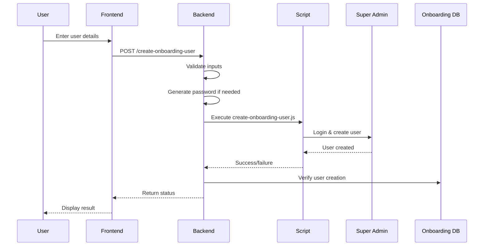
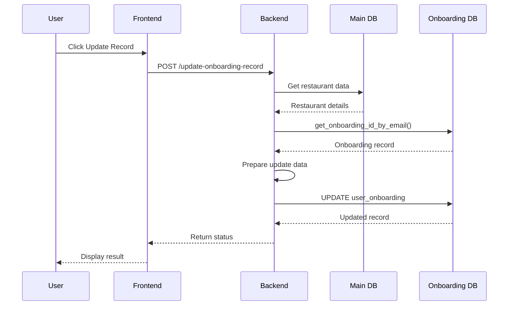

# Detailed Onboarding Implementation Plan

## Executive Summary

This document provides the detailed technical implementation plan for integrating onboarding user management into the Pumpd Registration system. The solution uses a dual-database architecture connecting to both the main application database and the separate onboarding database.

## Table of Contents

1. [System Architecture](#system-architecture)
2. [Technical Specifications](#technical-specifications)
3. [Data Flow Diagrams](#data-flow-diagrams)
4. [Implementation Phases](#implementation-phases)
5. [API Specifications](#api-specifications)
6. [Database Schemas](#database-schemas)
7. [Security Implementation](#security-implementation)
8. [Error Handling Strategy](#error-handling-strategy)
9. [Testing Requirements](#testing-requirements)
10. [Deployment Strategy](#deployment-strategy)

---

## System Architecture

### Component Overview

```
┌─────────────────────────────────────────────────────────────┐
│                     Frontend (React)                         │
│  ┌─────────────────────────────────────────────────────┐   │
│  │         RestaurantDetail.jsx Component              │   │
│  │  ┌──────────────────┐  ┌─────────────────────┐    │   │
│  │  │ Create User Form │  │ Update Record Form  │    │   │
│  │  └──────────────────┘  └─────────────────────┘    │   │
│  └─────────────────────────────────────────────────────┘   │
└─────────────────────────────────────────────────────────────┘
                              │
                              ▼
┌─────────────────────────────────────────────────────────────┐
│                   Backend (Express.js)                       │
│  ┌─────────────────────────────────────────────────────┐   │
│  │           registration-routes.js                     │   │
│  │  ┌──────────────────┐  ┌─────────────────────┐    │   │
│  │  │ /create-user API │  │ /update-record API  │    │   │
│  │  └──────────────────┘  └─────────────────────┘    │   │
│  └─────────────────────────────────────────────────────┘   │
│                                                             │
│  ┌─────────────────────────────────────────────────────┐   │
│  │             Service Layer                            │   │
│  │  ┌──────────────────┐  ┌─────────────────────┐    │   │
│  │  │ database-service │  │ onboarding-service  │    │   │
│  │  └──────────────────┘  └─────────────────────┘    │   │
│  └─────────────────────────────────────────────────────┘   │
└─────────────────────────────────────────────────────────────┘
                    │                     │
                    ▼                     ▼
        ┌──────────────────┐   ┌──────────────────┐
        │   Main Database  │   │Onboarding Database│
        │  (qgabsyggzlkc..)│   │ (lqcgatpunhuiw..) │
        └──────────────────┘   └──────────────────┘
                                          │
                                          ▼
                              ┌──────────────────┐
                              │ manage.pumpd.co.nz│
                              │  (Super Admin)    │
                              └──────────────────┘
```

### Database Connections

| Database | Project ID | Purpose | Access Method |
|----------|------------|---------|---------------|
| Main App | qgabsyggzlkcstjzugdh | Restaurant data, accounts | Existing supabase client |
| Onboarding | lqcgatpunhuiwcyqesap | User onboarding records | New onboardingSupabase client |

---

## Technical Specifications

### Technology Stack

- **Frontend**: React 18.x with TypeScript
- **UI Components**: Shadcn/ui
- **Backend**: Express.js 4.x
- **Database Client**: Supabase JS Client 2.x
- **Browser Automation**: Playwright 1.x
- **Process Management**: Node.js child_process
- **Authentication**: Supabase Auth + Custom middleware

### System Requirements

- Node.js >= 18.0.0
- NPM >= 9.0.0
- Playwright dependencies installed
- Supabase service keys for both projects

---

## Data Flow Diagrams

### Flow 1: Create Onboarding User



### Flow 2: Update Onboarding Record



---

## Implementation Phases

### Phase 1: Backend Infrastructure (Priority: High)

#### 1.1 Environment Configuration

**File**: `/UberEats-Image-Extractor/.env`

```env
# Existing configuration
SUPABASE_URL=https://qgabsyggzlkcstjzugdh.supabase.co
SUPABASE_SERVICE_ROLE_KEY=existing_key_here

# New onboarding database configuration
ONBOARDING_SUPABASE_URL=https://lqcgatpunhuiwcyqesap.supabase.co
ONBOARDING_SUPABASE_SERVICE_KEY=onboarding_service_key_here

# Super Admin credentials for script execution
MANAGE_EMAIL=claude.agent@gmail.com
MANAGE_PASSWORD=super_admin_password_here
```

#### 1.2 Onboarding Service Creation

**File**: `/UberEats-Image-Extractor/src/services/onboarding-service.js`

```javascript
/**
 * Onboarding Service Module
 * Handles all operations related to the onboarding database
 */

const { createClient } = require('@supabase/supabase-js');

// Validate environment variables
const validateConfig = () => {
  const required = [
    'ONBOARDING_SUPABASE_URL',
    'ONBOARDING_SUPABASE_SERVICE_KEY'
  ];
  
  const missing = required.filter(key => !process.env[key]);
  if (missing.length > 0) {
    throw new Error(`Missing required environment variables: ${missing.join(', ')}`);
  }
};

// Initialize onboarding database client
let onboardingSupabase = null;

const initializeOnboardingDatabase = () => {
  try {
    validateConfig();
    
    onboardingSupabase = createClient(
      process.env.ONBOARDING_SUPABASE_URL,
      process.env.ONBOARDING_SUPABASE_SERVICE_KEY,
      {
        auth: {
          autoRefreshToken: false,
          persistSession: false
        }
      }
    );
    
    console.log('[Onboarding Service] Database client initialized');
    return true;
  } catch (error) {
    console.error('[Onboarding Service] Initialization failed:', error);
    return false;
  }
};

/**
 * Get onboarding record by email using database function
 * @param {string} email - User email address
 * @returns {Object|null} Onboarding record or null
 */
async function getOnboardingIdByEmail(email) {
  if (!onboardingSupabase) {
    throw new Error('Onboarding database not initialized');
  }
  
  try {
    const { data, error } = await onboardingSupabase
      .rpc('get_onboarding_id_by_email', { 
        user_email: email 
      });
    
    if (error) {
      console.error('[Onboarding Service] RPC error:', error);
      throw error;
    }
    
    return data?.[0] || null;
  } catch (error) {
    console.error('[Onboarding Service] Failed to get onboarding ID:', error);
    throw error;
  }
}

/**
 * Update onboarding record with collected data
 * @param {string} onboardingId - UUID of onboarding record
 * @param {Object} updates - Fields to update
 * @returns {Object} Updated record
 */
async function updateOnboardingRecord(onboardingId, updates) {
  if (!onboardingSupabase) {
    throw new Error('Onboarding database not initialized');
  }
  
  try {
    // Ensure venue_operating_hours is properly formatted
    if (updates.venue_operating_hours && typeof updates.venue_operating_hours === 'object') {
      updates.venue_operating_hours = JSON.stringify(updates.venue_operating_hours);
    }
    
    const { data, error } = await onboardingSupabase
      .from('user_onboarding')
      .update({
        ...updates,
        updated_at: new Date().toISOString()
      })
      .eq('id', onboardingId)
      .select()
      .single();
    
    if (error) {
      console.error('[Onboarding Service] Update error:', error);
      throw error;
    }
    
    return data;
  } catch (error) {
    console.error('[Onboarding Service] Failed to update record:', error);
    throw error;
  }
}

/**
 * Check if user exists in onboarding system
 * @param {string} email - User email address
 * @returns {boolean} True if user exists
 */
async function checkUserExists(email) {
  try {
    const record = await getOnboardingIdByEmail(email);
    return record !== null;
  } catch (error) {
    console.error('[Onboarding Service] Error checking user existence:', error);
    return false;
  }
}

// Initialize on module load
initializeOnboardingDatabase();

module.exports = {
  initializeOnboardingDatabase,
  getOnboardingIdByEmail,
  updateOnboardingRecord,
  checkUserExists
};
```

### Phase 2: Script Modifications

#### 2.1 Update create-onboarding-user.js

**Key Changes**:
- Add parameter support for admin credentials
- Add export for programmatic use
- Improve error handling and output parsing

```javascript
// Add at the beginning after imports
const getArg = (name) => {
  const arg = args.find(a => a.startsWith(`--${name}=`));
  return arg ? arg.split('=')[1] : null;
};

// Parse all parameters
const userName = getArg('name');
const userEmail = getArg('userEmail');
const userPassword = getArg('userPassword');

// Admin credentials for login (different from user being created)
const adminEmail = getArg('email') || process.env.MANAGE_EMAIL || 'claude.agent@gmail.com';
const adminPassword = getArg('password') || process.env.MANAGE_PASSWORD;

// Update validation
if (!userName || !userEmail || !userPassword) {
  console.error('❌ Error: Missing required user parameters');
  console.error('Required: --name="Name" --userEmail="user@email" --userPassword="Pass123!"');
  process.exit(1);
}

// Export function for programmatic use
export { createOnboardingUser };

// Add success output format for parsing
if (success) {
  console.log('===RESULT_START===');
  console.log(JSON.stringify({
    success: true,
    userName,
    userEmail,
    message: 'User created successfully'
  }));
  console.log('===RESULT_END===');
}
```

### Phase 3: API Implementation

#### 3.1 Route Handlers

**File**: `/UberEats-Image-Extractor/src/routes/registration-routes.js`

Add the following routes:

```javascript
const onboardingService = require('../services/onboarding-service');

/**
 * Create onboarding user in Super Admin system
 */
router.post('/create-onboarding-user', async (req, res) => {
  const { 
    userName, 
    userEmail, 
    userPassword,
    restaurantId 
  } = req.body;
  
  const organisationId = req.user?.organisationId;
  
  if (!organisationId) {
    return res.status(401).json({ 
      success: false, 
      error: 'Organisation context required' 
    });
  }
  
  // Validate required fields
  if (!userName || !userEmail) {
    return res.status(400).json({
      success: false,
      error: 'User name and email are required'
    });
  }
  
  try {
    const { supabase } = require('../services/database-service');
    
    // Get restaurant details for password generation
    let generatedPassword = userPassword;
    
    if (!generatedPassword && restaurantId) {
      const { data: restaurant } = await supabase
        .from('restaurants')
        .select('name')
        .eq('id', restaurantId)
        .eq('organisation_id', organisationId)
        .single();
      
      if (restaurant) {
        // Generate password: RestaurantName789!
        const cleanName = restaurant.name.replace(/[^a-zA-Z0-9]/g, '');
        generatedPassword = `${cleanName.charAt(0).toUpperCase()}${cleanName.slice(1).toLowerCase()}789!`;
      }
    }
    
    if (!generatedPassword) {
      generatedPassword = `TempPassword789!`; // Fallback
    }
    
    // Check if user already exists in onboarding system
    const existingUser = await onboardingService.checkUserExists(userEmail);
    if (existingUser) {
      return res.status(400).json({
        success: false,
        error: 'User already exists in onboarding system'
      });
    }
    
    // Execute script
    const scriptPath = path.join(__dirname, '../../../scripts/create-onboarding-user.js');
    
    const command = [
      'node',
      scriptPath,
      `--name="${userName.replace(/"/g, '\\"')}"`,
      `--userEmail="${userEmail}"`,
      `--userPassword="${generatedPassword}"`,
      `--email="${process.env.MANAGE_EMAIL}"`,
      `--password="${process.env.MANAGE_PASSWORD}"`
    ].join(' ');
    
    console.log('[Onboarding] Creating user:', userEmail);
    
    const { stdout, stderr } = await execAsync(command, {
      env: { ...process.env, DEBUG_MODE: 'false' },
      timeout: 120000 // 2 minute timeout
    });
    
    // Parse result from stdout
    let result = { success: false };
    const resultMatch = stdout.match(/===RESULT_START===([\s\S]*?)===RESULT_END===/);
    if (resultMatch) {
      try {
        result = JSON.parse(resultMatch[1].trim());
      } catch (parseError) {
        console.error('[Onboarding] Failed to parse result:', parseError);
      }
    }
    
    // Check for success indicators
    const success = result.success || 
                   stdout.includes('✅') ||
                   stdout.includes('User created successfully');
    
    if (success) {
      console.log('[Onboarding] User created successfully');
      
      // Log the creation
      await supabase
        .from('registration_logs')
        .insert({
          organisation_id: organisationId,
          restaurant_id: restaurantId,
          action: 'onboarding_user_creation',
          status: 'success',
          response_data: {
            userName,
            userEmail,
            passwordGenerated: !userPassword
          },
          initiated_by: req.user?.email || 'system'
        });
      
      res.json({
        success: true,
        userName,
        userEmail,
        passwordGenerated: !userPassword,
        message: 'Onboarding user created successfully'
      });
    } else {
      throw new Error('User creation failed - check Super Admin access');
    }
    
  } catch (error) {
    console.error('[Onboarding] Create user error:', error);
    
    // Log the failure
    if (restaurantId) {
      await supabase
        .from('registration_logs')
        .insert({
          organisation_id: organisationId,
          restaurant_id: restaurantId,
          action: 'onboarding_user_creation',
          status: 'failed',
          error_message: error.message,
          initiated_by: req.user?.email || 'system'
        });
    }
    
    res.status(500).json({ 
      success: false, 
      error: error.message 
    });
  }
});

/**
 * Update onboarding record with restaurant data
 */
router.post('/update-onboarding-record', async (req, res) => {
  const { 
    userEmail,
    restaurantId,
    contactPerson,
    additionalData = {}
  } = req.body;
  
  const organisationId = req.user?.organisationId;
  
  if (!organisationId) {
    return res.status(401).json({ 
      success: false, 
      error: 'Organisation context required' 
    });
  }
  
  if (!userEmail || !restaurantId) {
    return res.status(400).json({
      success: false,
      error: 'User email and restaurant ID are required'
    });
  }
  
  try {
    const { supabase } = require('../services/database-service');
    
    // Get restaurant details
    const { data: restaurant, error: restaurantError } = await supabase
      .from('restaurants')
      .select(`
        name,
        slug,
        address,
        phone,
        email,
        opening_hours,
        primary_color,
        secondary_color,
        facebook_url,
        instagram_url,
        stripe_connect_url,
        hosted_logo_url,
        cuisine,
        metadata
      `)
      .eq('id', restaurantId)
      .eq('organisation_id', organisationId)
      .single();
    
    if (restaurantError || !restaurant) {
      throw new Error('Restaurant not found');
    }
    
    console.log('[Onboarding] Getting onboarding record for:', userEmail);
    
    // Get onboarding record
    const onboarding = await onboardingService.getOnboardingIdByEmail(userEmail);
    
    if (!onboarding) {
      return res.status(404).json({
        success: false,
        error: 'Onboarding record not found. Please ensure user was created first.'
      });
    }
    
    console.log('[Onboarding] Found record:', onboarding.onboarding_id);
    
    // Get organisation name from pumpd_accounts if available
    const { data: account } = await supabase
      .from('pumpd_accounts')
      .select('organisation_id')
      .eq('restaurant_id', restaurantId)
      .eq('organisation_id', organisationId)
      .single();
    
    // Get organisation details
    const { data: organisation } = await supabase
      .from('organisations')
      .select('name')
      .eq('id', organisationId)
      .single();
    
    // Format operating hours for storage
    let formattedHours = '';
    if (restaurant.opening_hours && Array.isArray(restaurant.opening_hours)) {
      // Convert array format to descriptive string
      const daysWithHours = restaurant.opening_hours
        .filter(day => day.hours && (day.hours.open || day.hours.close))
        .map(day => {
          if (!day.hours.open && !day.hours.close) {
            return `${day.day}: Closed`;
          }
          return `${day.day}: ${day.hours.open || 'Closed'} - ${day.hours.close || 'Closed'}`;
        });
      
      formattedHours = daysWithHours.join('. ');
    }
    
    // Prepare update data
    const updateData = {
      restaurant_name: restaurant.name,
      organisation_name: organisation?.name || additionalData.organisationName || restaurant.name,
      address: restaurant.address || additionalData.address || '',
      email: restaurant.email || userEmail,
      phone: restaurant.phone || additionalData.phone || '',
      contact_person: contactPerson || additionalData.contactPerson || '',
      venue_operating_hours: formattedHours || additionalData.operatingHours || 'Hours not set',
      primary_color: restaurant.primary_color || '#3f92ff',
      secondary_color: restaurant.secondary_color || null,
      facebook_url: restaurant.facebook_url || null,
      instagram_url: restaurant.instagram_url || null,
      stripe_connect_link: restaurant.stripe_connect_url || null,
      logo_url: restaurant.hosted_logo_url || null,
      ...additionalData
    };
    
    console.log('[Onboarding] Updating record with data');
    
    // Update record
    const updated = await onboardingService.updateOnboardingRecord(
      onboarding.onboarding_id, 
      updateData
    );
    
    console.log('[Onboarding] Record updated successfully');
    
    // Log the update
    await supabase
      .from('registration_logs')
      .insert({
        organisation_id: organisationId,
        restaurant_id: restaurantId,
        action: 'onboarding_record_update',
        status: 'success',
        response_data: {
          onboardingId: onboarding.onboarding_id,
          fieldsUpdated: Object.keys(updateData)
        },
        initiated_by: req.user?.email || 'system'
      });
    
    res.json({
      success: true,
      onboardingId: onboarding.onboarding_id,
      message: 'Onboarding record updated successfully',
      updatedFields: Object.keys(updateData).length
    });
    
  } catch (error) {
    console.error('[Onboarding] Update record error:', error);
    
    // Log the failure
    await supabase
      .from('registration_logs')
      .insert({
        organisation_id: organisationId,
        restaurant_id: restaurantId,
        action: 'onboarding_record_update',
        status: 'failed',
        error_message: error.message,
        initiated_by: req.user?.email || 'system'
      });
    
    res.status(500).json({ 
      success: false, 
      error: error.message 
    });
  }
});
```

### Phase 4: Frontend Implementation

#### 4.1 Component State and UI

**File**: `/UberEats-Image-Extractor/src/pages/RestaurantDetail.jsx`

Add after the Payment & Services Configuration section:

```jsx
// Add to imports
import { UserPlus, Database } from 'lucide-react';

// Add to state declarations (around line 150)
const [isCreatingOnboardingUser, setIsCreatingOnboardingUser] = useState(false);
const [onboardingUserStatus, setOnboardingUserStatus] = useState(null);
const [isUpdatingOnboarding, setIsUpdatingOnboarding] = useState(false);
const [onboardingUpdateStatus, setOnboardingUpdateStatus] = useState(null);
const [onboardingUserEmail, setOnboardingUserEmail] = useState('');
const [onboardingUserName, setOnboardingUserName] = useState('');
const [onboardingUserPassword, setOnboardingUserPassword] = useState('');
const [onboardingContactPerson, setOnboardingContactPerson] = useState('');

// Add handler functions (after other handlers, around line 750)
const handleCreateOnboardingUser = async () => {
  if (!onboardingUserName || !onboardingUserEmail) {
    toast({
      title: "Error",
      description: "Please provide user name and email",
      variant: "destructive"
    });
    return;
  }
  
  setIsCreatingOnboardingUser(true);
  setOnboardingUserStatus(null);
  
  try {
    const response = await api.post('/registration/create-onboarding-user', {
      restaurantId: id,
      userName: onboardingUserName,
      userEmail: onboardingUserEmail,
      userPassword: onboardingUserPassword // Optional
    });
    
    setOnboardingUserStatus(response.data);
    
    if (response.data.success) {
      toast({
        title: "Success",
        description: response.data.passwordGenerated 
          ? "User created with auto-generated password" 
          : "User created successfully",
      });
      
      // Clear password field after successful creation
      setOnboardingUserPassword('');
    } else {
      toast({
        title: "Error",
        description: response.data.message || "Failed to create user",
        variant: "destructive"
      });
    }
  } catch (error) {
    console.error('Create onboarding user error:', error);
    toast({
      title: "Error",
      description: error.response?.data?.error || "Failed to create onboarding user",
      variant: "destructive"
    });
    setOnboardingUserStatus({ 
      success: false, 
      error: error.response?.data?.error 
    });
  } finally {
    setIsCreatingOnboardingUser(false);
  }
};

const handleUpdateOnboardingRecord = async () => {
  if (!onboardingUserEmail) {
    toast({
      title: "Error",
      description: "Please provide the user email",
      variant: "destructive"
    });
    return;
  }
  
  setIsUpdatingOnboarding(true);
  setOnboardingUpdateStatus(null);
  
  try {
    const response = await api.post('/registration/update-onboarding-record', {
      restaurantId: id,
      userEmail: onboardingUserEmail,
      contactPerson: onboardingContactPerson || onboardingUserName,
      additionalData: {
        // Any additional fields that might not be in restaurant record
      }
    });
    
    setOnboardingUpdateStatus(response.data);
    
    if (response.data.success) {
      toast({
        title: "Success",
        description: `Updated ${response.data.updatedFields} fields in onboarding record`,
      });
    } else {
      toast({
        title: "Error",
        description: response.data.message || "Failed to update record",
        variant: "destructive"
      });
    }
  } catch (error) {
    console.error('Update onboarding record error:', error);
    toast({
      title: "Error",
      description: error.response?.data?.error || "Failed to update onboarding record",
      variant: "destructive"
    });
    setOnboardingUpdateStatus({ 
      success: false, 
      error: error.response?.data?.error 
    });
  } finally {
    setIsUpdatingOnboarding(false);
  }
};

// Add UI section (after Payment & Services Configuration section)
{/* Onboarding User Management Section */}
{registrationStatus?.account?.registration_status === 'completed' && 
 registrationStatus?.restaurant?.registration_status === 'completed' && (
  <div className="border rounded-lg p-6 space-y-4 mt-6">
    <div>
      <h3 className="text-lg font-semibold mb-2 flex items-center gap-2">
        <UserPlus className="h-5 w-5" />
        Onboarding User Management
      </h3>
      <p className="text-sm text-gray-600">
        Create users in the Super Admin system and sync their onboarding records
      </p>
    </div>
    
    {/* Prerequisites check */}
    <Alert>
      <AlertCircle className="h-4 w-4" />
      <AlertDescription>
        <strong>Prerequisites:</strong>
        <ul className="list-disc list-inside mt-1">
          <li>Restaurant must be registered on Pumpd</li>
          <li>Restaurant details must be complete (colors, logo, etc.)</li>
          <li>Stripe Connect should be configured if payment processing is needed</li>
        </ul>
      </AlertDescription>
    </Alert>
    
    {/* Input fields */}
    <div className="grid grid-cols-1 md:grid-cols-2 gap-4">
      <div>
        <label className="text-sm font-medium block mb-1">
          User Name <span className="text-red-500">*</span>
        </label>
        <Input
          value={onboardingUserName}
          onChange={(e) => setOnboardingUserName(e.target.value)}
          placeholder="Restaurant Owner Name"
          disabled={isCreatingOnboardingUser || isUpdatingOnboarding}
        />
      </div>
      
      <div>
        <label className="text-sm font-medium block mb-1">
          User Email <span className="text-red-500">*</span>
        </label>
        <Input
          type="email"
          value={onboardingUserEmail}
          onChange={(e) => setOnboardingUserEmail(e.target.value)}
          placeholder="owner@restaurant.com"
          disabled={isCreatingOnboardingUser || isUpdatingOnboarding}
        />
      </div>
      
      <div>
        <label className="text-sm font-medium block mb-1">
          Password
          <span className="text-xs text-gray-500 ml-2">
            (auto-generated if empty)
          </span>
        </label>
        <Input
          type="password"
          value={onboardingUserPassword}
          onChange={(e) => setOnboardingUserPassword(e.target.value)}
          placeholder="Leave empty for auto: RestaurantName789!"
          disabled={isCreatingOnboardingUser || isUpdatingOnboarding}
        />
      </div>
      
      <div>
        <label className="text-sm font-medium block mb-1">
          Contact Person
          <span className="text-xs text-gray-500 ml-2">
            (for record update)
          </span>
        </label>
        <Input
          value={onboardingContactPerson}
          onChange={(e) => setOnboardingContactPerson(e.target.value)}
          placeholder="Primary contact name"
          disabled={isCreatingOnboardingUser || isUpdatingOnboarding}
        />
      </div>
    </div>
    
    {/* Action buttons */}
    <div className="flex flex-col sm:flex-row gap-4">
      <Button
        onClick={handleCreateOnboardingUser}
        disabled={isCreatingOnboardingUser || !onboardingUserName || !onboardingUserEmail}
        className="flex items-center gap-2"
      >
        {isCreatingOnboardingUser ? (
          <>
            <Loader2 className="h-4 w-4 animate-spin" />
            Creating User...
          </>
        ) : (
          <>
            <UserPlus className="h-4 w-4" />
            Create Onboarding User
          </>
        )}
      </Button>
      
      <Button
        onClick={handleUpdateOnboardingRecord}
        disabled={isUpdatingOnboarding || !onboardingUserEmail}
        variant="outline"
        className="flex items-center gap-2"
      >
        {isUpdatingOnboarding ? (
          <>
            <Loader2 className="h-4 w-4 animate-spin" />
            Updating Record...
          </>
        ) : (
          <>
            <Database className="h-4 w-4" />
            Update Onboarding Record
          </>
        )}
      </Button>
    </div>
    
    {/* Status displays */}
    {onboardingUserStatus && (
      <Alert className={onboardingUserStatus.success ? 'border-green-500' : 'border-red-500'}>
        <AlertDescription>
          {onboardingUserStatus.success ? (
            <div>
              <strong>✅ User Created Successfully</strong>
              <ul className="mt-2 text-sm">
                <li>Email: {onboardingUserStatus.userEmail}</li>
                <li>Name: {onboardingUserStatus.userName}</li>
                <li>Password: {onboardingUserStatus.passwordGenerated ? 'Auto-generated' : 'Custom'}</li>
              </ul>
            </div>
          ) : (
            <div>
              <strong>❌ Creation Failed</strong>
              <p className="mt-1 text-sm">{onboardingUserStatus.error || 'Unknown error occurred'}</p>
            </div>
          )}
        </AlertDescription>
      </Alert>
    )}
    
    {onboardingUpdateStatus && (
      <Alert className={onboardingUpdateStatus.success ? 'border-green-500' : 'border-red-500'}>
        <AlertDescription>
          {onboardingUpdateStatus.success ? (
            <div>
              <strong>✅ Record Updated Successfully</strong>
              <ul className="mt-2 text-sm">
                <li>Onboarding ID: {onboardingUpdateStatus.onboardingId}</li>
                <li>Fields Updated: {onboardingUpdateStatus.updatedFields}</li>
              </ul>
            </div>
          ) : (
            <div>
              <strong>❌ Update Failed</strong>
              <p className="mt-1 text-sm">{onboardingUpdateStatus.error || 'Unknown error occurred'}</p>
            </div>
          )}
        </AlertDescription>
      </Alert>
    )}
    
    {/* Help text */}
    <div className="bg-gray-50 rounded p-3 text-sm text-gray-600">
      <strong>Workflow:</strong>
      <ol className="list-decimal list-inside mt-1 space-y-1">
        <li>Create the onboarding user first (this adds them to Super Admin)</li>
        <li>The user will receive login credentials</li>
        <li>Update the onboarding record to sync restaurant data</li>
        <li>User can then complete Stripe connection if needed</li>
      </ol>
    </div>
  </div>
)}
```

---

## API Specifications

### Endpoint: Create Onboarding User

**POST** `/api/registration/create-onboarding-user`

**Request Body**:
```json
{
  "restaurantId": "uuid",
  "userName": "string",
  "userEmail": "string",
  "userPassword": "string (optional)"
}
```

**Response Success (200)**:
```json
{
  "success": true,
  "userName": "string",
  "userEmail": "string",
  "passwordGenerated": "boolean",
  "message": "Onboarding user created successfully"
}
```

**Response Error (400/500)**:
```json
{
  "success": false,
  "error": "Error message"
}
```

### Endpoint: Update Onboarding Record

**POST** `/api/registration/update-onboarding-record`

**Request Body**:
```json
{
  "restaurantId": "uuid",
  "userEmail": "string",
  "contactPerson": "string (optional)",
  "additionalData": {
    "organisationName": "string (optional)",
    "address": "string (optional)",
    "phone": "string (optional)",
    "operatingHours": "string (optional)"
  }
}
```

**Response Success (200)**:
```json
{
  "success": true,
  "onboardingId": "uuid",
  "message": "Onboarding record updated successfully",
  "updatedFields": "number"
}
```

---

## Database Schemas

### Main Database Tables Used

#### restaurants
```sql
- id: uuid
- name: text
- slug: text
- organisation_id: uuid
- address: text
- phone: text
- email: text
- opening_hours: jsonb
- primary_color: text
- secondary_color: text
- facebook_url: text
- instagram_url: text
- stripe_connect_url: text
- hosted_logo_url: text
- cuisine: text[]
- metadata: jsonb
```

#### pumpd_accounts
```sql
- id: uuid
- organisation_id: uuid
- restaurant_id: uuid
- email: text
- user_password_hint: text
- registration_status: text
```

### Onboarding Database Tables

#### user_onboarding
```sql
- id: uuid
- user_id: uuid (references profiles)
- restaurant_name: text
- organisation_name: text
- address: text
- email: text
- phone: text
- contact_person: text
- venue_operating_hours: jsonb
- primary_color: text
- secondary_color: text
- facebook_url: text
- instagram_url: text
- stripe_connect_link: text
- logo_url: text
- onboarding_status: text
- created_at: timestamptz
- updated_at: timestamptz
```

---

## Security Implementation

### Authentication Flow

1. **Frontend**: User must be authenticated via Supabase Auth
2. **Backend**: Verify organisation context from JWT
3. **Script Execution**: Use service credentials for Super Admin
4. **Database Access**: Service keys for both databases

### Security Measures

```javascript
// Environment variable validation
const validateEnvironment = () => {
  const required = [
    'SUPABASE_URL',
    'SUPABASE_SERVICE_ROLE_KEY',
    'ONBOARDING_SUPABASE_URL',
    'ONBOARDING_SUPABASE_SERVICE_KEY',
    'MANAGE_EMAIL',
    'MANAGE_PASSWORD'
  ];
  
  const missing = required.filter(key => !process.env[key]);
  if (missing.length > 0) {
    console.error('Missing required environment variables:', missing);
    process.exit(1);
  }
};

// Input sanitization
const sanitizeInput = (input) => {
  return input.replace(/[<>'"]/g, '');
};

// Rate limiting
const rateLimiter = new Map();
const checkRateLimit = (userId, action) => {
  const key = `${userId}:${action}`;
  const now = Date.now();
  const limit = rateLimiter.get(key);
  
  if (limit && now - limit < 60000) { // 1 minute
    return false;
  }
  
  rateLimiter.set(key, now);
  return true;
};
```

---

## Error Handling Strategy

### Error Categories

| Category | Description | User Message | Log Level |
|----------|-------------|--------------|-----------|
| VALIDATION_ERROR | Invalid input data | "Please check your input" | WARN |
| AUTH_ERROR | Authentication failure | "Authentication required" | ERROR |
| DB_CONNECTION_ERROR | Database unavailable | "Service temporarily unavailable" | ERROR |
| SCRIPT_EXECUTION_ERROR | Script failed | "Operation failed, please retry" | ERROR |
| NOT_FOUND | Resource not found | "Record not found" | WARN |
| DUPLICATE_ENTRY | User already exists | "This email is already registered" | WARN |

### Error Response Format

```javascript
class ApiError extends Error {
  constructor(statusCode, message, details = null) {
    super(message);
    this.statusCode = statusCode;
    this.details = details;
  }
}

// Error middleware
app.use((err, req, res, next) => {
  const { statusCode = 500, message, details } = err;
  
  console.error(`[API Error] ${req.method} ${req.path}:`, {
    statusCode,
    message,
    details,
    user: req.user?.email
  });
  
  res.status(statusCode).json({
    success: false,
    error: message,
    ...(process.env.NODE_ENV === 'development' && { details })
  });
});
```

---

## Testing Requirements

### Unit Tests

```javascript
// Test: Onboarding Service
describe('OnboardingService', () => {
  it('should initialize database connection', async () => {
    const result = await initializeOnboardingDatabase();
    expect(result).toBe(true);
  });
  
  it('should get onboarding record by email', async () => {
    const record = await getOnboardingIdByEmail('test@example.com');
    expect(record).toHaveProperty('onboarding_id');
  });
  
  it('should update onboarding record', async () => {
    const updated = await updateOnboardingRecord(testId, testData);
    expect(updated).toHaveProperty('updated_at');
  });
});

// Test: API Routes
describe('Registration Routes', () => {
  it('should create onboarding user', async () => {
    const response = await request(app)
      .post('/api/registration/create-onboarding-user')
      .send({
        userName: 'Test User',
        userEmail: 'test@example.com',
        restaurantId: testRestaurantId
      });
    
    expect(response.status).toBe(200);
    expect(response.body.success).toBe(true);
  });
});
```

### Integration Tests

1. **Full Flow Test**:
   - Create restaurant
   - Configure settings
   - Create onboarding user
   - Update onboarding record
   - Verify all data synced

2. **Error Handling Test**:
   - Invalid credentials
   - Duplicate user
   - Missing restaurant data
   - Database connection failure

### Manual Testing Checklist

- [ ] Create user with all fields
- [ ] Create user with minimal fields (auto-password)
- [ ] Update record with complete restaurant data
- [ ] Update record with partial data
- [ ] Handle duplicate email
- [ ] Test with missing Super Admin credentials
- [ ] Test with invalid restaurant ID
- [ ] Test rate limiting
- [ ] Test concurrent operations

---

## Deployment Strategy

### Pre-deployment Checklist

1. **Environment Setup**:
   - [ ] Add all required environment variables
   - [ ] Verify database connections
   - [ ] Test Super Admin access

2. **Code Review**:
   - [ ] Security review
   - [ ] Performance review
   - [ ] Error handling review

3. **Testing**:
   - [ ] Unit tests pass
   - [ ] Integration tests pass
   - [ ] Manual testing complete

### Deployment Steps

1. **Stage 1: Backend Deployment**
   ```bash
   # Add environment variables
   npm run env:check
   
   # Deploy backend changes
   git add .
   git commit -m "feat: Add onboarding user management"
   git push origin feature/onboarding-users
   ```

2. **Stage 2: Database Migration**
   ```sql
   -- Verify onboarding database function exists
   SELECT proname FROM pg_proc 
   WHERE proname = 'get_onboarding_id_by_email';
   ```

3. **Stage 3: Frontend Deployment**
   ```bash
   # Build and test frontend
   npm run build
   npm run test
   
   # Deploy
   npm run deploy
   ```

### Rollback Plan

1. **Immediate Rollback**:
   - Revert to previous deployment
   - Disable feature flag if implemented

2. **Data Rollback**:
   - No database changes required
   - Logs can be retained for audit

### Monitoring

1. **Metrics to Track**:
   - User creation success rate
   - Record update success rate
   - Script execution time
   - Error rates by type

2. **Alerts**:
   - High error rate (> 10%)
   - Script timeout (> 2 minutes)
   - Database connection failures

---

## Appendix

### A. Password Generation Logic

```javascript
function generateDefaultPassword(restaurantName) {
  // Remove special characters
  const clean = restaurantName.replace(/[^a-zA-Z0-9]/g, '');
  
  // Capitalize first letter, lowercase rest
  const formatted = clean.charAt(0).toUpperCase() + 
                   clean.slice(1).toLowerCase();
  
  // Add standard suffix
  return `${formatted}789!`;
}

// Examples:
// "Joe's Pizza" => "Joespizza789!"
// "THE BURGER JOINT" => "Theburgerjoint789!"
// "Café Milano" => "Cafemilano789!"
```

### B. Operating Hours Formatting

```javascript
function formatOperatingHours(hoursArray) {
  if (!Array.isArray(hoursArray)) return 'Hours not set';
  
  const formatted = hoursArray
    .map(day => {
      if (!day.hours || (!day.hours.open && !day.hours.close)) {
        return `${day.day}: Closed`;
      }
      return `${day.day}: ${day.hours.open} - ${day.hours.close}`;
    })
    .filter(Boolean)
    .join('. ');
  
  return formatted || 'Hours not set';
}

// Example output:
// "Monday: Closed. Tuesday: 11:00 - 21:00. Wednesday: 11:00 - 21:00"
```

### C. Troubleshooting Guide

| Issue | Possible Cause | Solution |
|-------|---------------|----------|
| User creation fails | Super Admin credentials invalid | Check MANAGE_EMAIL and MANAGE_PASSWORD |
| Record not found | User not created yet | Ensure user creation completed first |
| Update fails | Missing restaurant data | Verify restaurant has all required fields |
| Script timeout | Slow network or Super Admin | Increase timeout or retry |
| Duplicate user | Email already exists | Check existing users first |

---

## Document Version

- **Version**: 1.0.0
- **Date**: January 2025
- **Author**: System Architecture Team
- **Review Status**: Ready for Implementation
- **Next Review**: After Phase 1 completion