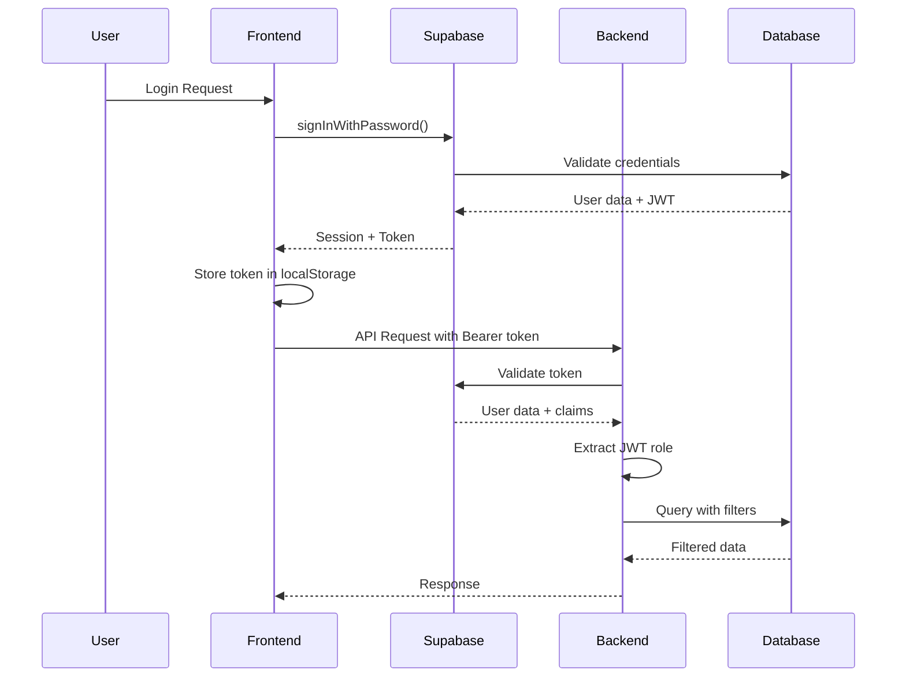
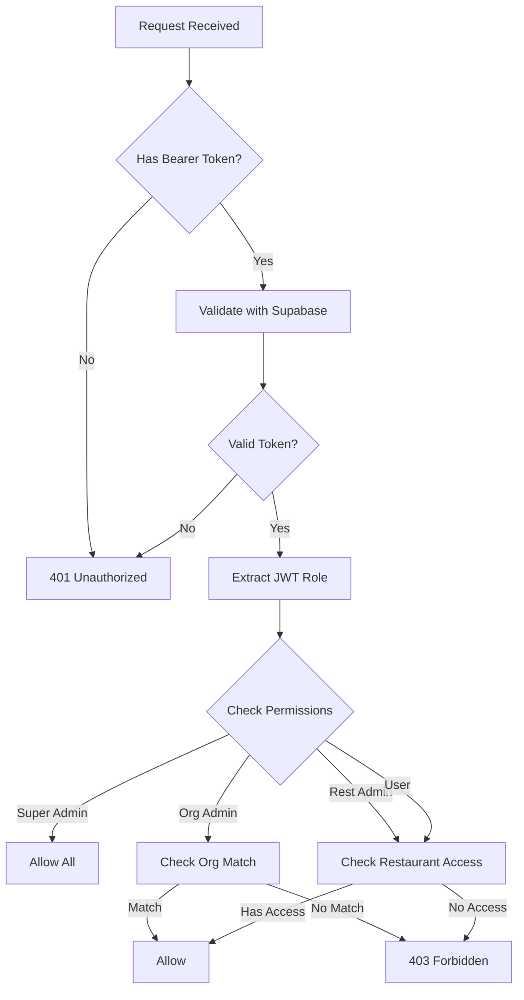

# Phase 1: Authentication Flow Investigation Findings
## UberEats Image Extractor - Multi-Tenant Authentication Implementation

### Investigation Date: 2025-08-25
### Investigator: System Analysis

---

## Executive Summary

The pumpd-webhook application implements a sophisticated multi-tenant authentication system using Supabase Auth with Google OAuth and email/password support. The system features role-based access control with JWT token validation, organization-based data isolation, and Stripe billing integration for usage tracking.

---

## 1. Authentication Architecture

### 1.1 Technology Stack
- **Frontend**: React with TypeScript
- **Backend**: Node.js/Express
- **Authentication Provider**: Supabase Auth
- **Database**: PostgreSQL (via Supabase)
- **Billing**: Stripe with usage meters
- **Token Management**: JWT with role claims

### 1.2 Authentication Methods
1. **Email/Password**: Traditional signup and login
2. **Google OAuth**: OAuth 2.0 integration via Supabase
3. **Magic Links**: Password reset via email (Supabase)

### 1.3 User Roles Hierarchy
```typescript
enum UserRole {
  SUPER_ADMIN = 'super_admin',    // Full system access (company employees)
  ORG_ADMIN = 'org_admin',        // Organisation-level administrators
  REST_ADMIN = 'rest_admin',      // Restaurant-level administrators
  USER = 'user',                  // Base-level access
  NEW_SIGN_UP = 'new_sign_up',    // Users needing onboarding
  IN_PROGRESS = 'in_progress'     // Users in onboarding process
}
```

---

## 2. Frontend Authentication Implementation

### 2.1 AuthContext Structure
```typescript
// Location: /src/context/auth/AuthProvider.tsx
export const AuthContext = createContext<AuthContextType | undefined>(undefined);

interface AuthContextType {
  user: UserProfile | null;
  loading: boolean;
  error: Error | null;
  isAuthenticated: boolean;
  dataInitialized: boolean;
  profileFailure?: boolean;
  login: (email: string, password: string) => Promise<void>;
  signup: (email: string, password: string, name: string) => Promise<void>;
  signInWithGoogle: () => Promise<void>;
  logout: () => Promise<void>;
  refreshSession: () => Promise<any | null>;
}
```

### 2.2 User Profile Structure
```typescript
interface UserProfile {
  id: string;
  email: string;
  name: string;
  role: UserRole | string;
  jwt_role?: UserRole | string;  // JWT role overrides database role
  organisationId: string;
  organisationName?: string;
  restaurants: Restaurant[];
}

interface Restaurant {
  id: string;
  name: string;
  accessLevel: string;
}
```

### 2.3 Key Features Discovered

#### Session Management
- **Persistent Sessions**: Uses localStorage for token persistence
- **Auto-refresh**: Tokens automatically refresh before expiry
- **Cross-tab Sync**: Authentication state syncs across browser tabs
- **Timeout Protection**: 15-second timeout for initialization with fallback

#### Error Recovery
- **Profile Fallback**: Creates emergency profile if database fetch fails
- **JWT Role Priority**: JWT claims take precedence over database roles
- **Retry Logic**: Exponential backoff for failed auth operations (max 3 retries)
- **Multi-attempt Recovery**: Profile loading attempts up to 3 times

#### Supabase Client Configuration
```typescript
// Location: /src/integrations/supabase/client.ts
export const supabase = createClient(supabaseUrl, supabaseAnonKey, {
  auth: {
    autoRefreshToken: true,
    persistSession: true,
    detectSessionInUrl: true,
    storageKey: 'supabase.auth.token',
    storage: localStorage
  }
});
```

---

## 3. Backend Authentication Implementation

### 3.1 Middleware Architecture

#### Auth Middleware Chain
```javascript
// Location: /server/middleware/auth.js
async function authMiddleware(req, res, next) {
  // 1. Extract Bearer token from Authorization header
  // 2. Validate token with Supabase
  // 3. Extract JWT role from token claims
  // 4. Attach user and permission helpers to request
  // 5. Continue to route handler
}
```

#### JWT Role Extraction
```javascript
// Parse JWT payload for role claims
const payload = JSON.parse(Buffer.from(token.split('.')[1], 'base64').toString());
const jwtRole = payload?.app_metadata?.role;

if (jwtRole) {
  data.user.jwt_role = jwtRole;  // Attach to user object
}
```

### 3.2 Permission System

#### Restaurant Access Control
```javascript
async function checkRestaurantPermission(user, restaurantId, action = 'read') {
  // Permission hierarchy:
  // 1. super_admin: Full access to all restaurants
  // 2. org_admin: Full access to org restaurants (except disable_sms)
  // 3. rest_admin: Read access to assigned restaurants
  // 4. user: Read access to assigned restaurants
}
```

#### Organization Access Control
```javascript
async function checkOrganisationPermission(user, organisationId, action = 'read') {
  // Permission hierarchy:
  // 1. super_admin: Full access to all organizations
  // 2. org_admin: Full access to their organization
  // 3. rest_admin/user: Read access if they have restaurant in org
}
```

### 3.3 Database Schema (Inferred)

#### Core Tables
```sql
-- Users table (managed by Supabase Auth)
auth.users (
  id UUID PRIMARY KEY,
  email TEXT,
  encrypted_password TEXT,
  email_confirmed_at TIMESTAMP,
  raw_app_meta_data JSONB,  -- Contains role claims
  raw_user_meta_data JSONB  -- Contains name, etc.
)

-- Profiles table (application-specific)
public.profiles (
  id UUID PRIMARY KEY REFERENCES auth.users(id),
  email TEXT,
  name TEXT,
  role TEXT,  -- Database role (can be overridden by JWT)
  organisation_id UUID REFERENCES organisations(id),
  created_at TIMESTAMP,
  updated_at TIMESTAMP
)

-- Organizations table
public.organisations (
  id UUID PRIMARY KEY,
  name TEXT,
  settings JSONB,
  created_at TIMESTAMP
)

-- Restaurants table
public.restaurants_master (
  restaurant_id UUID PRIMARY KEY,
  organisation_id UUID REFERENCES organisations(id),
  name TEXT,
  settings JSONB
)

-- User-Restaurant access mapping
public.user_restaurant_access (
  id UUID PRIMARY KEY,
  user_id UUID REFERENCES auth.users(id),
  restaurant_id UUID REFERENCES restaurants_master(restaurant_id),
  access_level TEXT  -- 'admin', 'manager', 'viewer'
)
```

---

## 4. Multi-Tenant Data Isolation

### 4.1 Organization-Based Filtering

All queries are filtered by organization:
```javascript
// Example from dashboard-api.js
let query = supabase
  .from('orders')
  .select('*')
  .eq('pumpd_restaurant_id', restaurant_id)  // Restaurant-level filter
  // Organization check happens in permission middleware
```

### 4.2 Row Level Security (RLS)
- Implemented at database level (Supabase policies)
- User ID and organization ID checked in policies
- Service role key bypasses RLS for admin operations

### 4.3 Cross-Tenant Protection
- Permission checks before data access
- Organization ID validation in middleware
- Restaurant access validation for each request

---

## 5. Billing Integration (Stripe Meters)

### 5.1 Meter Configuration
```javascript
// Location: /server/services/stripe/meter-management.js
const STANDARD_METERS = {
  SMS_CREDITS: {
    display_name: 'SMS Credits',
    event_name: 'sms_credits',
    aggregation_method: 'sum',
    description: 'Tracks SMS message units for billing'
  }
};
```

### 5.2 Usage Tracking Pattern
1. **Event Recording**: Usage events sent to Stripe meters
2. **Organization Attribution**: Events tagged with organization ID
3. **Aggregation**: Stripe aggregates usage by billing period
4. **Billing**: Automated billing based on meter readings

### 5.3 Stripe Client Configuration
```javascript
// Location: /server/utils/stripe-client.js
const stripe = new Stripe(process.env.STRIPE_SECRET_KEY, {
  apiVersion: '2024-04-10',  // Latest version with meter support
  maxNetworkRetries: 3,
  timeout: 15000,
  appInfo: {
    name: 'Restaurant Dashboard',
    version: '1.0.0'
  }
});
```

---

## 6. Security Features Discovered

### 6.1 Token Security
- **Storage**: Tokens stored in localStorage with specific key
- **Refresh**: Automatic token refresh before expiry
- **Validation**: Server-side validation with Supabase
- **JWT Claims**: Role embedded in JWT for performance

### 6.2 API Security
- **CORS**: Configured for specific frontend URLs
- **Rate Limiting**: Not explicitly found (may be at infrastructure level)
- **Request Validation**: Bearer token required for protected endpoints
- **Permission Checks**: Multi-level permission validation

### 6.3 Data Protection
- **Password Encryption**: Handled by Supabase (bcrypt)
- **Sensitive Data**: Emails redacted in logs
- **Audit Trail**: Structured logging with request IDs
- **Session Isolation**: Each tab has unique session ID

---

## 7. Key Implementation Patterns

### 7.1 Authentication Flow


### 7.2 Permission Check Flow


---

## 8. Critical Findings for Implementation

### 8.1 Must-Have Features
1. **JWT Role Claims**: Essential for performance and security
2. **Profile Fallback**: Prevents auth failures from blocking users
3. **Cross-Tab Sync**: Better UX for multi-tab usage
4. **Permission Helpers**: Reusable permission checking functions
5. **Structured Logging**: Request tracking with IDs

### 8.2 Environment Variables Required
```env
# Supabase
SUPABASE_URL=https://[project].supabase.co
SUPABASE_ANON_KEY=[anon_key]
SUPABASE_SERVICE_ROLE_KEY=[service_key]

# Stripe
STRIPE_SECRET_KEY=sk_[key]
STRIPE_WEBHOOK_SECRET=whsec_[secret]
STRIPE_API_VERSION=2024-04-10

# Frontend
FRONTEND_URL=https://app.domain.com
```

### 8.3 Database Tables Needed
1. **profiles**: User profiles with role and organization
2. **organisations**: Organization/tenant records
3. **restaurants_master**: Restaurant/entity records
4. **user_restaurant_access**: Access control mapping
5. **billing_meters**: Meter IDs and configuration
6. **usage_events**: Usage tracking records

---

## 9. Recommendations for UberEats Image Extractor

### 9.1 Immediate Implementation
1. Set up Supabase project with auth enabled
2. Create database schema with RLS policies
3. Implement AuthContext with same structure
4. Add auth middleware with JWT extraction
5. Set up Stripe account with meters API

### 9.2 Adaptations Needed
1. Replace "restaurants" with "extraction_projects"
2. Replace "SMS credits" with "extraction credits"
3. Add "menu_items" and "images" to access control
4. Consider API rate limiting for extraction operations
5. Add webhook endpoints for Stripe billing events

### 9.3 Additional Features to Consider
1. API key authentication for programmatic access
2. Team collaboration features
3. Audit logging for compliance
4. Data export permissions
5. Scheduled extraction permissions

---

## 10. Next Steps

### Phase 2: Multi-Tenant Architecture (Next)
- Deep dive into database schema
- Document RLS policies
- Map data access patterns
- Design extraction project isolation

### Phase 3: Billing Integration
- Analyze meter event structure
- Document webhook handling
- Map usage aggregation
- Design pricing model

### Phase 4: Role Management
- Complete permission matrix
- Document feature flags
- Map UI components to roles
- Design admin interfaces

---

## Appendix A: Code Snippets

### A.1 Login Function
```typescript
const login = async (email: string, password: string) => {
  const { data, error } = await supabase.auth.signInWithPassword({
    email,
    password
  });
  
  if (error) throw error;
  
  // Refresh token for updated claims
  await refreshTokenForRoleChanges();
  
  // Auth state change listener handles the rest
};
```

### A.2 Permission Check Helper
```javascript
req.checkRestaurantPermission = async (restaurantId, action) => {
  return await checkRestaurantPermission(req.user, restaurantId, action);
};
```

### A.3 Role Utility Functions
```typescript
export const hasAdminAccess = (role: UserRole | string): boolean => {
  return role === UserRole.SUPER_ADMIN || 
         role === UserRole.ORG_ADMIN || 
         role === UserRole.REST_ADMIN;
};
```

---

*Document Version: 1.0*
*Investigation Phase: 1 of 5*
*Status: Complete*
*Next Phase: Multi-Tenant Architecture*