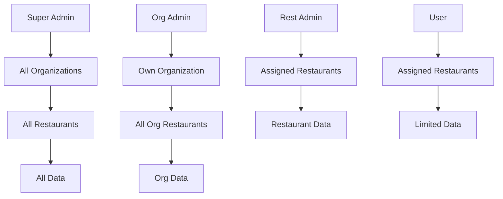

# Phase 2: Multi-Tenant Architecture Investigation Findings
## UberEats Image Extractor - Organization-Based Data Isolation

### Investigation Date: 2025-08-25
### Investigator: System Analysis

---

## Executive Summary

The investigation reveals that the current UberEats Image Extractor application uses a **simplified multi-tenant model** based on restaurants rather than organizations. The pumpd-webhook app, in contrast, implements a full organizational hierarchy with multiple restaurants per organization. The current app needs significant schema changes to implement proper multi-tenancy.

---

## 1. Current Architecture Analysis

### 1.1 Current Database Schema (UberEats Image Extractor)

#### Primary Tables
- **restaurants**: Main entity table (with RLS enabled)
- **extraction_jobs**: Job tracking (with RLS enabled)
- **menus**: Menu versions (with RLS enabled)
- **menu_items**: Individual items (with RLS enabled)
- **categories**: Menu categories (with RLS enabled)
- **platforms**: Delivery platforms (no RLS)

#### Key Observations
1. **No Organization Table**: The current schema lacks an organizations table
2. **Restaurant-Centric**: All data is organized around restaurants
3. **No User Profiles**: No profiles table for user management
4. **No Access Control**: No user_restaurant_access or similar tables
5. **RLS Enabled**: Row Level Security is enabled on key tables but policies unknown

### 1.2 Pumpd-Webhook Multi-Tenant Architecture

#### Core Tables Structure
```sql
-- Organizations (Tenants)
CREATE TABLE organisations (
  id UUID PRIMARY KEY DEFAULT uuid_generate_v4(),
  name TEXT NOT NULL,
  settings JSONB,
  stripe_customer_id TEXT,
  billing_email TEXT,
  created_at TIMESTAMP WITH TIME ZONE DEFAULT NOW()
);

-- User Profiles (linked to Auth)
CREATE TABLE profiles (
  id UUID PRIMARY KEY REFERENCES auth.users(id),
  email TEXT,
  name TEXT,
  role TEXT CHECK (role IN ('super_admin', 'org_admin', 'rest_admin', 'user')),
  organisation_id UUID REFERENCES organisations(id),
  created_at TIMESTAMP WITH TIME ZONE DEFAULT NOW()
);

-- Restaurants (Entities within Organizations)
CREATE TABLE restaurants_master (
  restaurant_id UUID PRIMARY KEY DEFAULT uuid_generate_v4(),
  organisation_id UUID REFERENCES organisations(id),
  name TEXT NOT NULL,
  settings JSONB,
  created_at TIMESTAMP WITH TIME ZONE DEFAULT NOW()
);

-- User-Restaurant Access Mapping
CREATE TABLE user_restaurant_access (
  id UUID PRIMARY KEY DEFAULT uuid_generate_v4(),
  user_id UUID REFERENCES auth.users(id),
  restaurant_id UUID REFERENCES restaurants_master(restaurant_id),
  access_level TEXT CHECK (access_level IN ('admin', 'manager', 'viewer')),
  created_at TIMESTAMP WITH TIME ZONE DEFAULT NOW()
);
```

---

## 2. Multi-Tenant Data Isolation Patterns

### 2.1 Query Filtering Pattern

#### Frontend Pattern
```typescript
// All queries include organization filtering
const { data } = await supabase
  .from('orders')
  .select('*')
  .eq('organisation_id', user.organisationId)
  .eq('restaurant_id', selectedRestaurant);
```

#### Backend Pattern
```javascript
// Permission check before data access
const permission = await checkRestaurantPermission(user, restaurantId, 'read');
if (!permission.hasPermission) {
  return res.status(403).json({ error: 'Permission denied' });
}

// Query with organization filter
const { data } = await supabase
  .from('data_table')
  .select('*')
  .eq('organisation_id', organisationId);
```

### 2.2 Row Level Security (RLS) Policies

#### Organization-Level Policy Example
```sql
-- Policy: Users can only see data from their organization
CREATE POLICY "org_isolation" ON public.restaurants_master
  FOR ALL USING (
    organisation_id IN (
      SELECT organisation_id 
      FROM profiles 
      WHERE id = auth.uid()
    )
  );
```

#### Restaurant-Level Policy Example
```sql
-- Policy: Users can only access restaurants they have permission for
CREATE POLICY "restaurant_access" ON public.orders
  FOR ALL USING (
    restaurant_id IN (
      SELECT restaurant_id 
      FROM user_restaurant_access 
      WHERE user_id = auth.uid()
    )
    OR 
    EXISTS (
      SELECT 1 FROM profiles 
      WHERE id = auth.uid() 
      AND role IN ('super_admin', 'org_admin')
    )
  );
```

### 2.3 Permission Hierarchy



---

## 3. Implementation Requirements for UberEats Image Extractor

### 3.1 Required Schema Changes

#### New Tables Needed
```sql
-- 1. Organizations table
CREATE TABLE organisations (
  id UUID PRIMARY KEY DEFAULT uuid_generate_v4(),
  name TEXT NOT NULL,
  slug TEXT UNIQUE,
  settings JSONB DEFAULT '{}',
  stripe_customer_id TEXT,
  stripe_subscription_id TEXT,
  billing_email TEXT,
  usage_limits JSONB DEFAULT '{"monthly_extractions": 100, "monthly_images": 1000}',
  created_at TIMESTAMP WITH TIME ZONE DEFAULT NOW(),
  updated_at TIMESTAMP WITH TIME ZONE DEFAULT NOW()
);

-- 2. User Profiles table
CREATE TABLE profiles (
  id UUID PRIMARY KEY REFERENCES auth.users(id),
  email TEXT NOT NULL,
  name TEXT,
  role TEXT DEFAULT 'user' CHECK (role IN ('super_admin', 'org_admin', 'rest_admin', 'user')),
  organisation_id UUID REFERENCES organisations(id),
  settings JSONB DEFAULT '{}',
  created_at TIMESTAMP WITH TIME ZONE DEFAULT NOW(),
  updated_at TIMESTAMP WITH TIME ZONE DEFAULT NOW()
);

-- 3. User-Restaurant Access table
CREATE TABLE user_restaurant_access (
  id UUID PRIMARY KEY DEFAULT uuid_generate_v4(),
  user_id UUID REFERENCES auth.users(id),
  restaurant_id UUID REFERENCES restaurants(id),
  access_level TEXT DEFAULT 'viewer' CHECK (access_level IN ('admin', 'editor', 'viewer')),
  granted_by UUID REFERENCES auth.users(id),
  granted_at TIMESTAMP WITH TIME ZONE DEFAULT NOW(),
  expires_at TIMESTAMP WITH TIME ZONE,
  UNIQUE(user_id, restaurant_id)
);

-- 4. Organization Usage Tracking
CREATE TABLE organisation_usage (
  id UUID PRIMARY KEY DEFAULT uuid_generate_v4(),
  organisation_id UUID REFERENCES organisations(id),
  period_start DATE NOT NULL,
  period_end DATE NOT NULL,
  extractions_count INTEGER DEFAULT 0,
  images_downloaded INTEGER DEFAULT 0,
  api_calls INTEGER DEFAULT 0,
  created_at TIMESTAMP WITH TIME ZONE DEFAULT NOW(),
  UNIQUE(organisation_id, period_start)
);
```

#### Modifications to Existing Tables
```sql
-- Add organisation_id to restaurants table
ALTER TABLE restaurants 
  ADD COLUMN organisation_id UUID REFERENCES organisations(id),
  ADD COLUMN created_by UUID REFERENCES auth.users(id);

-- Add organisation_id to extraction_jobs for filtering
ALTER TABLE extraction_jobs
  ADD COLUMN organisation_id UUID REFERENCES organisations(id);

-- Add audit fields to menus
ALTER TABLE menus
  ADD COLUMN created_by UUID REFERENCES auth.users(id),
  ADD COLUMN organisation_id UUID REFERENCES organisations(id);
```

### 3.2 RLS Policies Required

```sql
-- Enable RLS on new tables
ALTER TABLE organisations ENABLE ROW LEVEL SECURITY;
ALTER TABLE profiles ENABLE ROW LEVEL SECURITY;
ALTER TABLE user_restaurant_access ENABLE ROW LEVEL SECURITY;
ALTER TABLE organisation_usage ENABLE ROW LEVEL SECURITY;

-- Organization visibility policy
CREATE POLICY "org_visibility" ON organisations
  FOR SELECT USING (
    id IN (
      SELECT organisation_id FROM profiles WHERE id = auth.uid()
    )
    OR
    EXISTS (
      SELECT 1 FROM profiles 
      WHERE id = auth.uid() AND role = 'super_admin'
    )
  );

-- Profile visibility policy
CREATE POLICY "profile_visibility" ON profiles
  FOR SELECT USING (
    id = auth.uid()
    OR
    organisation_id IN (
      SELECT organisation_id FROM profiles WHERE id = auth.uid()
    )
    OR
    EXISTS (
      SELECT 1 FROM profiles 
      WHERE id = auth.uid() AND role IN ('super_admin', 'org_admin')
    )
  );

-- Restaurant access policy
CREATE POLICY "restaurant_access" ON restaurants
  FOR ALL USING (
    organisation_id IN (
      SELECT organisation_id FROM profiles WHERE id = auth.uid()
    )
    OR
    id IN (
      SELECT restaurant_id FROM user_restaurant_access WHERE user_id = auth.uid()
    )
    OR
    EXISTS (
      SELECT 1 FROM profiles 
      WHERE id = auth.uid() AND role = 'super_admin'
    )
  );

-- Extraction jobs policy
CREATE POLICY "extraction_access" ON extraction_jobs
  FOR ALL USING (
    restaurant_id IN (
      SELECT restaurant_id FROM user_restaurant_access WHERE user_id = auth.uid()
    )
    OR
    organisation_id IN (
      SELECT organisation_id FROM profiles WHERE id = auth.uid()
    )
    OR
    EXISTS (
      SELECT 1 FROM profiles 
      WHERE id = auth.uid() AND role = 'super_admin'
    )
  );
```

---

## 4. Data Access Patterns

### 4.1 Frontend Query Patterns

#### Organization-Scoped Queries
```typescript
// Get all restaurants in user's organization
const { data: restaurants } = await supabase
  .from('restaurants')
  .select('*')
  .eq('organisation_id', user.organisationId)
  .order('name');

// Get extraction jobs for organization
const { data: jobs } = await supabase
  .from('extraction_jobs')
  .select(`
    *,
    restaurant:restaurants(name, slug)
  `)
  .eq('organisation_id', user.organisationId)
  .order('created_at', { ascending: false });
```

#### Restaurant-Scoped Queries
```typescript
// Get menus for specific restaurant (with permission check)
const { data: menus } = await supabase
  .from('menus')
  .select(`
    *,
    menu_items(count)
  `)
  .eq('restaurant_id', restaurantId)
  .order('version', { ascending: false });
```

### 4.2 Backend Permission Checks

```javascript
// Middleware for organization-level operations
async function requireOrgAccess(req, res, next) {
  const { organisationId } = req.params;
  const permission = await checkOrganisationPermission(
    req.user, 
    organisationId, 
    'read'
  );
  
  if (!permission.hasPermission) {
    return res.status(403).json({ error: 'Access denied' });
  }
  
  req.organisation = permission.organisation;
  next();
}

// Middleware for restaurant-level operations
async function requireRestaurantAccess(req, res, next) {
  const { restaurantId } = req.params;
  const permission = await checkRestaurantPermission(
    req.user, 
    restaurantId, 
    req.method === 'GET' ? 'read' : 'write'
  );
  
  if (!permission.hasPermission) {
    return res.status(403).json({ error: 'Access denied' });
  }
  
  req.restaurant = permission.restaurant;
  next();
}
```

---

## 5. Migration Strategy

### 5.1 Phase 1: Schema Creation
1. Create organizations table
2. Create profiles table linked to auth.users
3. Create access control tables
4. Add organization_id to existing tables

### 5.2 Phase 2: Data Migration
```sql
-- Create default organization for existing data
INSERT INTO organisations (id, name, slug)
VALUES ('00000000-0000-0000-0000-000000000000', 'Default Organization', 'default');

-- Assign all existing restaurants to default org
UPDATE restaurants 
SET organisation_id = '00000000-0000-0000-0000-000000000000'
WHERE organisation_id IS NULL;

-- Create profiles for existing auth users
INSERT INTO profiles (id, email, name, role, organisation_id)
SELECT 
  id,
  email,
  raw_user_meta_data->>'name',
  'org_admin',
  '00000000-0000-0000-0000-000000000000'
FROM auth.users
WHERE NOT EXISTS (
  SELECT 1 FROM profiles WHERE profiles.id = users.id
);
```

### 5.3 Phase 3: RLS Implementation
1. Enable RLS on all tables
2. Create policies for each table
3. Test with different user roles
4. Monitor query performance

### 5.4 Phase 4: Application Updates
1. Update AuthContext to include organization
2. Add organization filtering to all queries
3. Implement permission checks in API
4. Update UI to show organization context

---

## 6. Security Considerations

### 6.1 Critical Security Requirements
1. **Organization Isolation**: Data must never leak between organizations
2. **Permission Validation**: Every API call must validate permissions
3. **JWT Role Claims**: Use JWT for performance but validate against DB
4. **Audit Logging**: Track all data access and modifications
5. **Service Role Protection**: Service role key only for admin operations

### 6.2 Common Vulnerabilities to Avoid
1. **Missing Organization Filter**: Always include org filter in queries
2. **Client-Side Permission Checks**: Never trust client-side validation
3. **Direct Table Access**: Always use RLS or service-level checks
4. **Role Elevation**: Validate role changes require higher permission
5. **Cross-Tenant References**: Prevent foreign keys across organizations

---

## 7. Performance Considerations

### 7.1 Indexing Strategy
```sql
-- Critical indexes for multi-tenant queries
CREATE INDEX idx_restaurants_org ON restaurants(organisation_id);
CREATE INDEX idx_extraction_jobs_org ON extraction_jobs(organisation_id);
CREATE INDEX idx_menus_restaurant ON menus(restaurant_id);
CREATE INDEX idx_user_access ON user_restaurant_access(user_id, restaurant_id);
CREATE INDEX idx_profiles_org ON profiles(organisation_id);
```

### 7.2 Query Optimization
- Always filter by organization first
- Use composite indexes for common queries
- Implement query result caching
- Consider materialized views for analytics

---

## 8. Recommendations

### 8.1 Immediate Actions
1. **Design Decision**: Decide on organization structure for the app
2. **Schema Creation**: Create new tables in development
3. **RLS Policies**: Write and test security policies
4. **Migration Script**: Prepare data migration scripts

### 8.2 Implementation Priority
1. **High Priority**:
   - Organizations table
   - Profiles table
   - Basic RLS policies
   - Organization context in auth

2. **Medium Priority**:
   - User-restaurant access control
   - Usage tracking
   - Billing integration
   - Audit logging

3. **Low Priority**:
   - Advanced permissions
   - Team collaboration features
   - Organization settings UI
   - Usage analytics

### 8.3 Testing Requirements
1. **Security Testing**:
   - Cross-organization data access attempts
   - Permission elevation attempts
   - RLS policy effectiveness
   - JWT tampering resistance

2. **Performance Testing**:
   - Query performance with organization filters
   - RLS impact on query speed
   - Index effectiveness
   - Concurrent user load

---

## 9. Next Steps

### Immediate Tasks
1. Create development branch in Supabase
2. Implement schema changes
3. Write RLS policies
4. Test with sample data

### Phase 3 Investigation
- Billing integration with Stripe meters
- Usage tracking implementation
- Webhook handling for billing events

---

## Appendix A: Sample Implementation Code

### A.1 Organization Context Hook
```typescript
export const useOrganization = () => {
  const { user } = useAuth();
  const [organization, setOrganization] = useState(null);
  
  useEffect(() => {
    if (user?.organisationId) {
      fetchOrganization(user.organisationId);
    }
  }, [user]);
  
  return { organization, isLoading, error };
};
```

### A.2 Permission Check Helper
```typescript
export const checkPermission = (
  user: UserProfile,
  resource: string,
  action: string
): boolean => {
  // Super admin can do anything
  if (user.role === 'super_admin') return true;
  
  // Org admin can manage their organization
  if (user.role === 'org_admin' && resource.startsWith('org:')) {
    return resource.includes(user.organisationId);
  }
  
  // Check specific permissions
  return user.permissions?.includes(`${resource}:${action}`);
};
```

---

*Document Version: 1.0*
*Investigation Phase: 2 of 5*
*Status: Complete*
*Next Phase: Billing Integration*