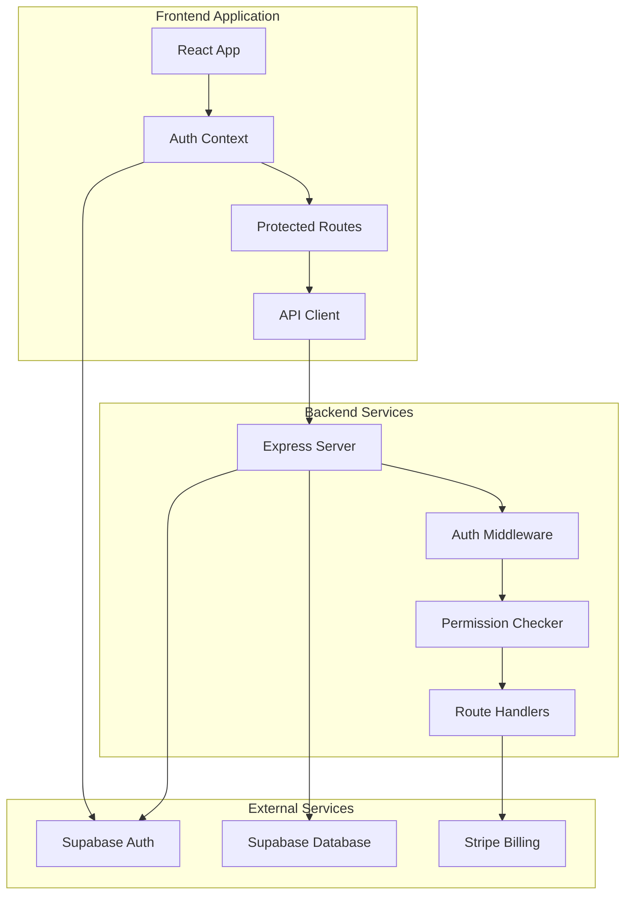

# Multi-Tenant Authentication Implementation Guide
## UberEats Image Extractor Application

### Version: 1.0
### Date: 2025-08-25
### Status: Ready for Implementation

---

## Executive Summary

This guide provides a complete implementation plan for adding multi-tenant authentication and user management to the UberEats Image Extractor application. Based on the investigation of the pumpd-webhook system, this guide outlines the necessary database changes, authentication flow, and billing integration required for a production-ready multi-tenant SaaS application.

---

## Table of Contents
1. [System Architecture Overview](#1-system-architecture-overview)
2. [Database Schema Implementation](#2-database-schema-implementation)
3. [Authentication Implementation](#3-authentication-implementation)
4. [Multi-Tenant Data Isolation](#4-multi-tenant-data-isolation)
5. [Billing Integration](#5-billing-integration)
6. [Role-Based Access Control](#6-role-based-access-control)
7. [Implementation Roadmap](#7-implementation-roadmap)
8. [Testing Strategy](#8-testing-strategy)

---

## 1. System Architecture Overview

### 1.1 Technology Stack
- **Frontend**: React with TypeScript (existing)
- **Backend**: Node.js/Express (to be added)
- **Database**: PostgreSQL via Supabase
- **Authentication**: Supabase Auth with Google OAuth
- **Billing**: Stripe with usage-based meters
- **Hosting**: TBD (Vercel/Netlify for frontend, Heroku/Railway for backend)

### 1.2 Architecture Diagram


### 1.3 User Roles
```typescript
enum UserRole {
  SUPER_ADMIN = 'super_admin',  // System administrators
  ORG_ADMIN = 'org_admin',      // Organization owners
  EDITOR = 'editor',             // Can create/edit extractions
  VIEWER = 'viewer',             // Read-only access
  TRIAL = 'trial'                // Trial users with limits
}
```

---

## 2. Database Schema Implementation

### 2.1 Complete Schema SQL
```sql
-- Enable UUID extension
CREATE EXTENSION IF NOT EXISTS "uuid-ossp";

-- 1. Organizations (Tenants)
CREATE TABLE organisations (
  id UUID PRIMARY KEY DEFAULT uuid_generate_v4(),
  name TEXT NOT NULL,
  slug TEXT UNIQUE NOT NULL,
  logo_url TEXT,
  website TEXT,
  billing_email TEXT,
  stripe_customer_id TEXT UNIQUE,
  stripe_subscription_id TEXT,
  subscription_status TEXT DEFAULT 'trialing',
  subscription_plan TEXT DEFAULT 'free',
  trial_ends_at TIMESTAMP WITH TIME ZONE DEFAULT (NOW() + INTERVAL '14 days'),
  usage_limits JSONB DEFAULT '{
    "monthly_extractions": 10,
    "monthly_images": 100,
    "api_calls_per_hour": 60
  }'::jsonb,
  settings JSONB DEFAULT '{}'::jsonb,
  created_at TIMESTAMP WITH TIME ZONE DEFAULT NOW(),
  updated_at TIMESTAMP WITH TIME ZONE DEFAULT NOW()
);

-- 2. User Profiles
CREATE TABLE profiles (
  id UUID PRIMARY KEY REFERENCES auth.users(id) ON DELETE CASCADE,
  email TEXT NOT NULL,
  full_name TEXT,
  avatar_url TEXT,
  role TEXT DEFAULT 'viewer' CHECK (
    role IN ('super_admin', 'org_admin', 'editor', 'viewer', 'trial')
  ),
  organisation_id UUID REFERENCES organisations(id) ON DELETE SET NULL,
  preferences JSONB DEFAULT '{
    "theme": "light",
    "notifications": true,
    "defaultView": "dashboard"
  }'::jsonb,
  last_seen_at TIMESTAMP WITH TIME ZONE,
  created_at TIMESTAMP WITH TIME ZONE DEFAULT NOW(),
  updated_at TIMESTAMP WITH TIME ZONE DEFAULT NOW()
);

-- 3. User Invitations
CREATE TABLE invitations (
  id UUID PRIMARY KEY DEFAULT uuid_generate_v4(),
  organisation_id UUID REFERENCES organisations(id) ON DELETE CASCADE,
  email TEXT NOT NULL,
  role TEXT NOT NULL CHECK (role IN ('org_admin', 'editor', 'viewer')),
  token TEXT UNIQUE NOT NULL DEFAULT encode(gen_random_bytes(32), 'hex'),
  invited_by UUID REFERENCES auth.users(id),
  accepted_at TIMESTAMP WITH TIME ZONE,
  expires_at TIMESTAMP WITH TIME ZONE DEFAULT (NOW() + INTERVAL '7 days'),
  created_at TIMESTAMP WITH TIME ZONE DEFAULT NOW()
);

-- 4. Update Restaurants table
ALTER TABLE restaurants 
  ADD COLUMN IF NOT EXISTS organisation_id UUID REFERENCES organisations(id),
  ADD COLUMN IF NOT EXISTS created_by UUID REFERENCES auth.users(id),
  ADD COLUMN IF NOT EXISTS is_active BOOLEAN DEFAULT true,
  ADD COLUMN IF NOT EXISTS last_extraction_at TIMESTAMP WITH TIME ZONE;

-- 5. Update Extraction Jobs table
ALTER TABLE extraction_jobs
  ADD COLUMN IF NOT EXISTS organisation_id UUID,
  ADD COLUMN IF NOT EXISTS initiated_by UUID REFERENCES auth.users(id),
  ADD COLUMN IF NOT EXISTS credits_used INTEGER DEFAULT 0;

-- 6. User Restaurant Access
CREATE TABLE user_restaurant_access (
  id UUID PRIMARY KEY DEFAULT uuid_generate_v4(),
  user_id UUID REFERENCES auth.users(id) ON DELETE CASCADE,
  restaurant_id UUID REFERENCES restaurants(id) ON DELETE CASCADE,
  access_level TEXT DEFAULT 'viewer' CHECK (
    access_level IN ('admin', 'editor', 'viewer')
  ),
  granted_by UUID REFERENCES auth.users(id),
  granted_at TIMESTAMP WITH TIME ZONE DEFAULT NOW(),
  revoked_at TIMESTAMP WITH TIME ZONE,
  UNIQUE(user_id, restaurant_id)
);

-- 7. Organisation Usage Tracking
CREATE TABLE usage_tracking (
  id UUID PRIMARY KEY DEFAULT uuid_generate_v4(),
  organisation_id UUID REFERENCES organisations(id) ON DELETE CASCADE,
  user_id UUID REFERENCES auth.users(id),
  resource_type TEXT NOT NULL CHECK (
    resource_type IN ('extraction', 'image_download', 'api_call', 'csv_export')
  ),
  resource_id UUID,
  quantity INTEGER DEFAULT 1,
  metadata JSONB DEFAULT '{}'::jsonb,
  created_at TIMESTAMP WITH TIME ZONE DEFAULT NOW(),
  INDEX idx_usage_org_date (organisation_id, created_at DESC)
);

-- 8. Billing Events
CREATE TABLE billing_events (
  id UUID PRIMARY KEY DEFAULT uuid_generate_v4(),
  organisation_id UUID REFERENCES organisations(id) ON DELETE CASCADE,
  stripe_event_id TEXT UNIQUE,
  event_type TEXT NOT NULL,
  amount_cents INTEGER,
  currency TEXT DEFAULT 'USD',
  description TEXT,
  metadata JSONB DEFAULT '{}'::jsonb,
  created_at TIMESTAMP WITH TIME ZONE DEFAULT NOW()
);

-- 9. Audit Log
CREATE TABLE audit_logs (
  id UUID PRIMARY KEY DEFAULT uuid_generate_v4(),
  organisation_id UUID REFERENCES organisations(id),
  user_id UUID REFERENCES auth.users(id),
  action TEXT NOT NULL,
  resource_type TEXT,
  resource_id UUID,
  old_values JSONB,
  new_values JSONB,
  ip_address INET,
  user_agent TEXT,
  created_at TIMESTAMP WITH TIME ZONE DEFAULT NOW(),
  INDEX idx_audit_org_user (organisation_id, user_id, created_at DESC)
);

-- Create indexes for performance
CREATE INDEX idx_profiles_org ON profiles(organisation_id);
CREATE INDEX idx_profiles_email ON profiles(email);
CREATE INDEX idx_restaurants_org ON restaurants(organisation_id);
CREATE INDEX idx_extraction_jobs_org ON extraction_jobs(organisation_id);
CREATE INDEX idx_invitations_token ON invitations(token);
CREATE INDEX idx_invitations_email ON invitations(email);
```

### 2.2 Triggers for Updated Timestamps
```sql
-- Function to update updated_at timestamp
CREATE OR REPLACE FUNCTION update_updated_at_column()
RETURNS TRIGGER AS $$
BEGIN
  NEW.updated_at = NOW();
  RETURN NEW;
END;
$$ LANGUAGE plpgsql;

-- Apply trigger to tables
CREATE TRIGGER update_organisations_updated_at 
  BEFORE UPDATE ON organisations
  FOR EACH ROW EXECUTE FUNCTION update_updated_at_column();

CREATE TRIGGER update_profiles_updated_at 
  BEFORE UPDATE ON profiles
  FOR EACH ROW EXECUTE FUNCTION update_updated_at_column();
```

### 2.3 Row Level Security Policies
```sql
-- Enable RLS on all tables
ALTER TABLE organisations ENABLE ROW LEVEL SECURITY;
ALTER TABLE profiles ENABLE ROW LEVEL SECURITY;
ALTER TABLE restaurants ENABLE ROW LEVEL SECURITY;
ALTER TABLE extraction_jobs ENABLE ROW LEVEL SECURITY;
ALTER TABLE user_restaurant_access ENABLE ROW LEVEL SECURITY;
ALTER TABLE usage_tracking ENABLE ROW LEVEL SECURITY;
ALTER TABLE audit_logs ENABLE ROW LEVEL SECURITY;

-- Organisations policies
CREATE POLICY "Users can view their own organisation"
  ON organisations FOR SELECT
  USING (
    id IN (
      SELECT organisation_id FROM profiles WHERE id = auth.uid()
    )
  );

CREATE POLICY "Org admins can update their organisation"
  ON organisations FOR UPDATE
  USING (
    id IN (
      SELECT organisation_id FROM profiles 
      WHERE id = auth.uid() AND role IN ('org_admin', 'super_admin')
    )
  );

-- Profiles policies
CREATE POLICY "Users can view profiles in their organisation"
  ON profiles FOR SELECT
  USING (
    organisation_id IN (
      SELECT organisation_id FROM profiles WHERE id = auth.uid()
    )
    OR id = auth.uid()
  );

CREATE POLICY "Users can update their own profile"
  ON profiles FOR UPDATE
  USING (id = auth.uid());

-- Restaurants policies
CREATE POLICY "Users can view restaurants in their organisation"
  ON restaurants FOR SELECT
  USING (
    organisation_id IN (
      SELECT organisation_id FROM profiles WHERE id = auth.uid()
    )
  );

CREATE POLICY "Editors can create restaurants"
  ON restaurants FOR INSERT
  WITH CHECK (
    organisation_id IN (
      SELECT organisation_id FROM profiles 
      WHERE id = auth.uid() AND role IN ('org_admin', 'editor', 'super_admin')
    )
  );

-- Extraction jobs policies
CREATE POLICY "Users can view extraction jobs in their organisation"
  ON extraction_jobs FOR SELECT
  USING (
    organisation_id IN (
      SELECT organisation_id FROM profiles WHERE id = auth.uid()
    )
  );

CREATE POLICY "Editors can create extraction jobs"
  ON extraction_jobs FOR INSERT
  WITH CHECK (
    organisation_id IN (
      SELECT organisation_id FROM profiles 
      WHERE id = auth.uid() AND role IN ('org_admin', 'editor', 'super_admin')
    )
  );
```

---

## 3. Authentication Implementation

### 3.1 Frontend Auth Context
```typescript
// src/context/AuthContext.tsx
import React, { createContext, useContext, useEffect, useState } from 'react';
import { User } from '@supabase/supabase-js';
import { supabase } from '@/lib/supabase';

interface UserProfile {
  id: string;
  email: string;
  full_name: string;
  role: UserRole;
  organisation_id: string;
  organisation?: Organisation;
  preferences: UserPreferences;
}

interface AuthContextType {
  user: User | null;
  profile: UserProfile | null;
  loading: boolean;
  error: Error | null;
  signIn: (email: string, password: string) => Promise<void>;
  signUp: (email: string, password: string, fullName: string) => Promise<void>;
  signInWithGoogle: () => Promise<void>;
  signOut: () => Promise<void>;
  updateProfile: (updates: Partial<UserProfile>) => Promise<void>;
}

const AuthContext = createContext<AuthContextType | undefined>(undefined);

export const AuthProvider: React.FC<{ children: React.ReactNode }> = ({ children }) => {
  const [user, setUser] = useState<User | null>(null);
  const [profile, setProfile] = useState<UserProfile | null>(null);
  const [loading, setLoading] = useState(true);
  const [error, setError] = useState<Error | null>(null);

  // Fetch user profile with organisation data
  const fetchProfile = async (userId: string) => {
    try {
      const { data, error } = await supabase
        .from('profiles')
        .select(`
          *,
          organisation:organisations(*)
        `)
        .eq('id', userId)
        .single();

      if (error) throw error;
      setProfile(data);
    } catch (err) {
      console.error('Error fetching profile:', err);
      setError(err as Error);
    }
  };

  // Initialize auth state
  useEffect(() => {
    const initAuth = async () => {
      try {
        // Get current session
        const { data: { session } } = await supabase.auth.getSession();
        
        if (session?.user) {
          setUser(session.user);
          await fetchProfile(session.user.id);
        }
      } catch (err) {
        setError(err as Error);
      } finally {
        setLoading(false);
      }
    };

    initAuth();

    // Listen for auth changes
    const { data: { subscription } } = supabase.auth.onAuthStateChange(
      async (event, session) => {
        if (event === 'SIGNED_IN' && session?.user) {
          setUser(session.user);
          await fetchProfile(session.user.id);
        } else if (event === 'SIGNED_OUT') {
          setUser(null);
          setProfile(null);
        }
      }
    );

    return () => subscription.unsubscribe();
  }, []);

  // Sign in with email/password
  const signIn = async (email: string, password: string) => {
    const { error } = await supabase.auth.signInWithPassword({
      email,
      password,
    });
    if (error) throw error;
  };

  // Sign up with email/password
  const signUp = async (email: string, password: string, fullName: string) => {
    const { data, error } = await supabase.auth.signUp({
      email,
      password,
      options: {
        data: { full_name: fullName },
      },
    });
    if (error) throw error;

    // Create profile after signup
    if (data.user) {
      const { error: profileError } = await supabase
        .from('profiles')
        .insert({
          id: data.user.id,
          email: data.user.email,
          full_name: fullName,
        });
      
      if (profileError) throw profileError;
    }
  };

  // Sign in with Google
  const signInWithGoogle = async () => {
    const { error } = await supabase.auth.signInWithOAuth({
      provider: 'google',
      options: {
        redirectTo: `${window.location.origin}/auth/callback`,
      },
    });
    if (error) throw error;
  };

  // Sign out
  const signOut = async () => {
    const { error } = await supabase.auth.signOut();
    if (error) throw error;
  };

  // Update user profile
  const updateProfile = async (updates: Partial<UserProfile>) => {
    if (!user) throw new Error('No user logged in');

    const { data, error } = await supabase
      .from('profiles')
      .update(updates)
      .eq('id', user.id)
      .select()
      .single();

    if (error) throw error;
    setProfile(data);
  };

  return (
    <AuthContext.Provider
      value={{
        user,
        profile,
        loading,
        error,
        signIn,
        signUp,
        signInWithGoogle,
        signOut,
        updateProfile,
      }}
    >
      {children}
    </AuthContext.Provider>
  );
};

export const useAuth = () => {
  const context = useContext(AuthContext);
  if (!context) {
    throw new Error('useAuth must be used within AuthProvider');
  }
  return context;
};
```

### 3.2 Protected Routes
```typescript
// src/components/ProtectedRoute.tsx
import { Navigate } from 'react-router-dom';
import { useAuth } from '@/context/AuthContext';

interface ProtectedRouteProps {
  children: React.ReactNode;
  requiredRole?: UserRole;
  requireOrganisation?: boolean;
}

export const ProtectedRoute: React.FC<ProtectedRouteProps> = ({
  children,
  requiredRole,
  requireOrganisation = true,
}) => {
  const { profile, loading } = useAuth();

  if (loading) {
    return <div>Loading...</div>;
  }

  if (!profile) {
    return <Navigate to="/auth/login" replace />;
  }

  if (requireOrganisation && !profile.organisation_id) {
    return <Navigate to="/onboarding" replace />;
  }

  if (requiredRole && !hasRequiredRole(profile.role, requiredRole)) {
    return <Navigate to="/unauthorized" replace />;
  }

  return <>{children}</>;
};
```

### 3.3 Backend Auth Middleware
```javascript
// server/middleware/auth.js
const { createClient } = require('@supabase/supabase-js');

const supabase = createClient(
  process.env.SUPABASE_URL,
  process.env.SUPABASE_SERVICE_ROLE_KEY
);

const authMiddleware = async (req, res, next) => {
  try {
    // Extract token from Authorization header
    const authHeader = req.headers.authorization;
    if (!authHeader || !authHeader.startsWith('Bearer ')) {
      return res.status(401).json({ error: 'Missing authorization token' });
    }

    const token = authHeader.split(' ')[1];

    // Verify token with Supabase
    const { data: { user }, error } = await supabase.auth.getUser(token);
    
    if (error || !user) {
      return res.status(401).json({ error: 'Invalid token' });
    }

    // Fetch user profile with organisation
    const { data: profile } = await supabase
      .from('profiles')
      .select('*, organisation:organisations(*)')
      .eq('id', user.id)
      .single();

    if (!profile) {
      return res.status(403).json({ error: 'Profile not found' });
    }

    // Attach user and profile to request
    req.user = user;
    req.profile = profile;
    req.organisationId = profile.organisation_id;

    next();
  } catch (error) {
    console.error('Auth middleware error:', error);
    res.status(500).json({ error: 'Authentication error' });
  }
};

// Role-based middleware
const requireRole = (...roles) => {
  return (req, res, next) => {
    if (!req.profile) {
      return res.status(401).json({ error: 'Not authenticated' });
    }

    if (!roles.includes(req.profile.role)) {
      return res.status(403).json({ error: 'Insufficient permissions' });
    }

    next();
  };
};

module.exports = { authMiddleware, requireRole };
```

---

## 4. Multi-Tenant Data Isolation

### 4.1 Frontend Query Patterns
```typescript
// src/hooks/useOrganisationData.ts
export const useOrganisationData = () => {
  const { profile } = useAuth();

  const getRestaurants = async () => {
    const { data, error } = await supabase
      .from('restaurants')
      .select('*')
      .eq('organisation_id', profile?.organisation_id)
      .order('name');
    
    return { data, error };
  };

  const getExtractions = async (restaurantId?: string) => {
    let query = supabase
      .from('extraction_jobs')
      .select(`
        *,
        restaurant:restaurants(name, slug),
        initiated_by:profiles(full_name, email)
      `)
      .eq('organisation_id', profile?.organisation_id)
      .order('created_at', { ascending: false });

    if (restaurantId) {
      query = query.eq('restaurant_id', restaurantId);
    }

    const { data, error } = await query;
    return { data, error };
  };

  const getUsageStats = async (startDate: Date, endDate: Date) => {
    const { data, error } = await supabase
      .from('usage_tracking')
      .select('resource_type, quantity')
      .eq('organisation_id', profile?.organisation_id)
      .gte('created_at', startDate.toISOString())
      .lte('created_at', endDate.toISOString());
    
    return { data, error };
  };

  return {
    getRestaurants,
    getExtractions,
    getUsageStats,
  };
};
```

### 4.2 Backend Data Access
```javascript
// server/services/dataAccess.js
class DataAccessService {
  async getOrganisationRestaurants(organisationId, userId) {
    // Verify user belongs to organisation
    const { data: profile } = await supabase
      .from('profiles')
      .select('organisation_id, role')
      .eq('id', userId)
      .single();

    if (profile.organisation_id !== organisationId) {
      throw new Error('Access denied');
    }

    // Fetch restaurants
    const { data: restaurants } = await supabase
      .from('restaurants')
      .select('*')
      .eq('organisation_id', organisationId)
      .eq('is_active', true);

    return restaurants;
  }

  async createExtraction(data, userId, organisationId) {
    // Check usage limits
    const canCreate = await this.checkUsageLimits(organisationId, 'extraction');
    if (!canCreate) {
      throw new Error('Usage limit exceeded');
    }

    // Create extraction job
    const { data: job, error } = await supabase
      .from('extraction_jobs')
      .insert({
        ...data,
        organisation_id: organisationId,
        initiated_by: userId,
        status: 'pending',
      })
      .select()
      .single();

    if (error) throw error;

    // Track usage
    await this.trackUsage(organisationId, userId, 'extraction', job.id);

    return job;
  }

  async checkUsageLimits(organisationId, resourceType) {
    // Get organisation limits
    const { data: org } = await supabase
      .from('organisations')
      .select('usage_limits, subscription_status')
      .eq('id', organisationId)
      .single();

    if (org.subscription_status === 'active') {
      return true; // No limits for paid users
    }

    // Check current month usage
    const startOfMonth = new Date();
    startOfMonth.setDate(1);
    startOfMonth.setHours(0, 0, 0, 0);

    const { data: usage } = await supabase
      .from('usage_tracking')
      .select('quantity')
      .eq('organisation_id', organisationId)
      .eq('resource_type', resourceType)
      .gte('created_at', startOfMonth.toISOString());

    const currentUsage = usage?.reduce((sum, u) => sum + u.quantity, 0) || 0;
    const limit = org.usage_limits[`monthly_${resourceType}s`] || 0;

    return currentUsage < limit;
  }

  async trackUsage(organisationId, userId, resourceType, resourceId) {
    await supabase
      .from('usage_tracking')
      .insert({
        organisation_id: organisationId,
        user_id: userId,
        resource_type: resourceType,
        resource_id: resourceId,
        quantity: 1,
      });
  }
}
```

---

## 5. Billing Integration

### 5.1 Stripe Setup
```javascript
// server/services/stripe.js
const Stripe = require('stripe');
const stripe = new Stripe(process.env.STRIPE_SECRET_KEY);

class BillingService {
  // Create Stripe customer for organisation
  async createCustomer(organisation) {
    const customer = await stripe.customers.create({
      email: organisation.billing_email,
      name: organisation.name,
      metadata: {
        organisation_id: organisation.id,
      },
    });

    // Update organisation with Stripe customer ID
    await supabase
      .from('organisations')
      .update({ stripe_customer_id: customer.id })
      .eq('id', organisation.id);

    return customer;
  }

  // Create subscription
  async createSubscription(organisationId, priceId) {
    const { data: org } = await supabase
      .from('organisations')
      .select('stripe_customer_id')
      .eq('id', organisationId)
      .single();

    const subscription = await stripe.subscriptions.create({
      customer: org.stripe_customer_id,
      items: [{ price: priceId }],
      trial_period_days: 14,
      metadata: {
        organisation_id: organisationId,
      },
    });

    // Update organisation
    await supabase
      .from('organisations')
      .update({
        stripe_subscription_id: subscription.id,
        subscription_status: subscription.status,
      })
      .eq('id', organisationId);

    return subscription;
  }

  // Create usage-based meter
  async createMeter() {
    const meter = await stripe.billing.meters.create({
      display_name: 'Menu Extractions',
      event_name: 'menu_extraction',
      aggregation_method: 'sum',
    });

    return meter;
  }

  // Record usage event
  async recordUsage(organisationId, quantity) {
    const { data: org } = await supabase
      .from('organisations')
      .select('stripe_customer_id')
      .eq('id', organisationId)
      .single();

    if (!org.stripe_customer_id) {
      throw new Error('No Stripe customer for organisation');
    }

    const event = await stripe.billing.meterEvents.create({
      event_name: 'menu_extraction',
      payload: {
        value: quantity,
        stripe_customer_id: org.stripe_customer_id,
      },
    });

    return event;
  }

  // Handle webhook events
  async handleWebhook(event) {
    switch (event.type) {
      case 'customer.subscription.updated':
        await this.updateSubscriptionStatus(event.data.object);
        break;
      
      case 'invoice.payment_succeeded':
        await this.recordPayment(event.data.object);
        break;
      
      case 'customer.subscription.deleted':
        await this.cancelSubscription(event.data.object);
        break;
    }
  }

  async updateSubscriptionStatus(subscription) {
    await supabase
      .from('organisations')
      .update({
        subscription_status: subscription.status,
        subscription_plan: subscription.items.data[0].price.id,
      })
      .eq('stripe_subscription_id', subscription.id);
  }

  async recordPayment(invoice) {
    const organisationId = invoice.metadata.organisation_id;
    
    await supabase
      .from('billing_events')
      .insert({
        organisation_id: organisationId,
        stripe_event_id: invoice.id,
        event_type: 'payment_succeeded',
        amount_cents: invoice.amount_paid,
        currency: invoice.currency,
        description: `Payment for ${invoice.period_start} to ${invoice.period_end}`,
      });
  }

  async cancelSubscription(subscription) {
    await supabase
      .from('organisations')
      .update({
        subscription_status: 'cancelled',
        subscription_plan: 'free',
      })
      .eq('stripe_subscription_id', subscription.id);
  }
}
```

### 5.2 Webhook Endpoint
```javascript
// server/routes/billing.js
const express = require('express');
const router = express.Router();

// Stripe webhook endpoint
router.post('/webhook', express.raw({ type: 'application/json' }), async (req, res) => {
  const sig = req.headers['stripe-signature'];
  
  try {
    const event = stripe.webhooks.constructEvent(
      req.body,
      sig,
      process.env.STRIPE_WEBHOOK_SECRET
    );

    await billingService.handleWebhook(event);
    
    res.json({ received: true });
  } catch (err) {
    console.error('Webhook error:', err);
    res.status(400).send(`Webhook Error: ${err.message}`);
  }
});

// Create checkout session
router.post('/create-checkout', authMiddleware, async (req, res) => {
  try {
    const { priceId } = req.body;
    const { organisationId } = req;

    const session = await stripe.checkout.sessions.create({
      customer: req.profile.organisation.stripe_customer_id,
      payment_method_types: ['card'],
      line_items: [
        {
          price: priceId,
          quantity: 1,
        },
      ],
      mode: 'subscription',
      success_url: `${process.env.FRONTEND_URL}/billing/success`,
      cancel_url: `${process.env.FRONTEND_URL}/billing/cancel`,
      metadata: {
        organisation_id: organisationId,
      },
    });

    res.json({ url: session.url });
  } catch (error) {
    console.error('Checkout error:', error);
    res.status(500).json({ error: error.message });
  }
});
```

---

## 6. Role-Based Access Control

### 6.1 Permission Matrix
| Feature | Super Admin | Org Admin | Editor | Viewer | Trial |
|---------|------------|-----------|--------|--------|-------|
| View Dashboard | ✅ | ✅ | ✅ | ✅ | ✅ |
| View Restaurants | ✅ | ✅ | ✅ | ✅ | ✅ |
| Create Restaurant | ✅ | ✅ | ✅ | ❌ | ❌ |
| Edit Restaurant | ✅ | ✅ | ✅ | ❌ | ❌ |
| Delete Restaurant | ✅ | ✅ | ❌ | ❌ | ❌ |
| Start Extraction | ✅ | ✅ | ✅ | ❌ | Limited |
| View Extractions | ✅ | ✅ | ✅ | ✅ | ✅ |
| Export Data | ✅ | ✅ | ✅ | ✅ | ❌ |
| Manage Users | ✅ | ✅ | ❌ | ❌ | ❌ |
| Billing Settings | ✅ | ✅ | ❌ | ❌ | ❌ |
| API Access | ✅ | ✅ | ✅ | ❌ | ❌ |

### 6.2 Frontend Permission Hooks
```typescript
// src/hooks/usePermissions.ts
export const usePermissions = () => {
  const { profile } = useAuth();

  const can = (action: string, resource?: string): boolean => {
    if (!profile) return false;

    const permissions = {
      super_admin: ['*'],
      org_admin: [
        'restaurants:*',
        'extractions:*',
        'users:read',
        'users:invite',
        'billing:*',
      ],
      editor: [
        'restaurants:read',
        'restaurants:create',
        'restaurants:edit',
        'extractions:*',
        'export:*',
      ],
      viewer: [
        'restaurants:read',
        'extractions:read',
        'export:read',
      ],
      trial: [
        'restaurants:read',
        'extractions:read',
        'extractions:create:limited',
      ],
    };

    const userPermissions = permissions[profile.role] || [];
    
    // Check for wildcard permission
    if (userPermissions.includes('*')) return true;
    
    // Check for specific permission
    const permission = resource ? `${resource}:${action}` : action;
    
    return userPermissions.some(p => {
      if (p === permission) return true;
      if (p.endsWith(':*') && permission.startsWith(p.slice(0, -1))) return true;
      return false;
    });
  };

  return { can };
};
```

### 6.3 Backend Permission Middleware
```javascript
// server/middleware/permissions.js
const checkPermission = (action, resource) => {
  return (req, res, next) => {
    const { role } = req.profile;
    
    const permissions = {
      super_admin: () => true,
      org_admin: () => {
        const allowed = ['restaurants', 'extractions', 'users', 'billing'];
        return allowed.includes(resource);
      },
      editor: () => {
        const allowed = ['restaurants', 'extractions', 'export'];
        return allowed.includes(resource) && action !== 'delete';
      },
      viewer: () => {
        return action === 'read';
      },
      trial: () => {
        return action === 'read' || 
               (resource === 'extractions' && action === 'create');
      },
    };

    const hasPermission = permissions[role]?.() || false;
    
    if (!hasPermission) {
      return res.status(403).json({ 
        error: 'Insufficient permissions',
        required: `${resource}:${action}`,
        current: role,
      });
    }

    next();
  };
};
```

---

## 7. Implementation Roadmap

### Phase 1: Foundation (Week 1)
- [ ] Set up Supabase project
- [ ] Create database schema
- [ ] Configure Supabase Auth with Google OAuth
- [ ] Implement RLS policies
- [ ] Create seed data for testing

### Phase 2: Authentication (Week 2)
- [ ] Implement AuthContext in frontend
- [ ] Create login/signup pages
- [ ] Add protected routes
- [ ] Set up backend Express server
- [ ] Implement auth middleware

### Phase 3: Multi-Tenancy (Week 3)
- [ ] Add organisation context to all queries
- [ ] Implement permission checking
- [ ] Create user management UI
- [ ] Add invitation system
- [ ] Test data isolation

### Phase 4: Billing (Week 4)
- [ ] Set up Stripe account
- [ ] Create products and prices
- [ ] Implement subscription flow
- [ ] Add usage tracking
- [ ] Create billing dashboard

### Phase 5: Testing & Polish (Week 5)
- [ ] Write integration tests
- [ ] Performance testing
- [ ] Security audit
- [ ] Documentation
- [ ] Deploy to production

---

## 8. Testing Strategy

### 8.1 Unit Tests
```typescript
// src/__tests__/auth.test.ts
describe('Authentication', () => {
  it('should authenticate user with email/password', async () => {
    const { result } = renderHook(() => useAuth());
    
    await act(async () => {
      await result.current.signIn('test@example.com', 'password');
    });
    
    expect(result.current.user).toBeDefined();
    expect(result.current.profile).toBeDefined();
  });
  
  it('should enforce role permissions', () => {
    const { result } = renderHook(() => usePermissions());
    
    // Mock profile with viewer role
    jest.spyOn(useAuth, 'useAuth').mockReturnValue({
      profile: { role: 'viewer' }
    });
    
    expect(result.current.can('read', 'restaurants')).toBe(true);
    expect(result.current.can('create', 'restaurants')).toBe(false);
  });
});
```

### 8.2 Integration Tests
```javascript
// server/__tests__/multitenancy.test.js
describe('Multi-tenancy', () => {
  it('should isolate data between organisations', async () => {
    // Create two organisations
    const org1 = await createOrganisation('Org 1');
    const org2 = await createOrganisation('Org 2');
    
    // Create users in each org
    const user1 = await createUser(org1.id);
    const user2 = await createUser(org2.id);
    
    // Create restaurants
    const restaurant1 = await createRestaurant(org1.id, user1.id);
    const restaurant2 = await createRestaurant(org2.id, user2.id);
    
    // User 1 should only see restaurant 1
    const restaurants = await getRestaurants(user1.token);
    expect(restaurants).toHaveLength(1);
    expect(restaurants[0].id).toBe(restaurant1.id);
    
    // User 2 should only see restaurant 2
    const restaurants2 = await getRestaurants(user2.token);
    expect(restaurants2).toHaveLength(1);
    expect(restaurants2[0].id).toBe(restaurant2.id);
  });
});
```

### 8.3 Security Tests
```javascript
// server/__tests__/security.test.js
describe('Security', () => {
  it('should prevent cross-organisation access', async () => {
    const org1 = await createOrganisation('Org 1');
    const org2 = await createOrganisation('Org 2');
    const user1 = await createUser(org1.id);
    const restaurant2 = await createRestaurant(org2.id);
    
    // User 1 trying to access Org 2's restaurant
    const response = await request(app)
      .get(`/api/restaurants/${restaurant2.id}`)
      .set('Authorization', `Bearer ${user1.token}`);
    
    expect(response.status).toBe(403);
    expect(response.body.error).toBe('Access denied');
  });
  
  it('should validate JWT tokens', async () => {
    const invalidToken = 'invalid.token.here';
    
    const response = await request(app)
      .get('/api/restaurants')
      .set('Authorization', `Bearer ${invalidToken}`);
    
    expect(response.status).toBe(401);
    expect(response.body.error).toBe('Invalid token');
  });
});
```

---

## Conclusion

This implementation guide provides a complete blueprint for adding multi-tenant authentication and user management to the UberEats Image Extractor application. The system is designed to be:

- **Secure**: With RLS policies and JWT validation
- **Scalable**: Supporting multiple organisations and users
- **Maintainable**: With clear separation of concerns
- **Extensible**: Easy to add new features and permissions

### Next Steps
1. Review and approve the implementation plan
2. Set up development environment
3. Begin Phase 1 implementation
4. Schedule regular review meetings
5. Plan production deployment

### Support Resources
- [Supabase Documentation](https://supabase.com/docs)
- [Stripe API Reference](https://stripe.com/docs/api)
- [React Query Documentation](https://tanstack.com/query)
- [Express.js Guide](https://expressjs.com/en/guide/routing.html)

---

*Document Version: 1.0*
*Created: 2025-08-25*
*Status: Ready for Implementation*
*Author: System Architecture Team*