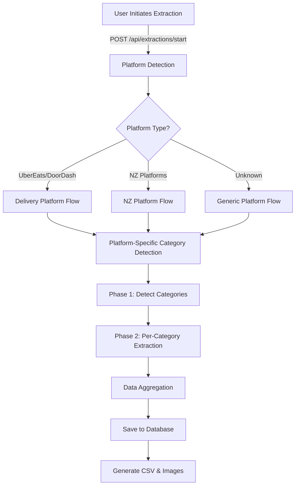

# Multi-Platform Menu Extraction System Architecture

## Executive Summary

### System Status (January 2025)
- **Production Ready**: UberEats, DoorDash
- **Successfully Working**: FoodHub, Mobi2Go
- **Ready to Test**: OrderMeal, NextOrder, DeliverEasy
- **Needs Development**: Menulog, Bopple, ResDiary, Me&u, GloriaFood, Sipo, BookNOrder

### Key Technical Decisions
- **Unified Extraction Method**: All platforms use the same batch extraction process
- **Image Strategy**: Images disabled for NZ platforms to prevent errors
- **Schema Generation**: Dynamic schemas exclude imageURL for non-UberEats/DoorDash platforms
- **Platform-Specific Prompts**: Custom category detection prompts for each platform

## Overview
The UberEats Image Extractor has evolved into a comprehensive multi-platform menu extraction system supporting 15+ delivery and ordering platforms, with a focus on New Zealand platforms including Mobi2Go, DeliverEasy, FoodHub, OrderMeal, and NextOrder.

## System Architecture

### 1. Extraction Flow



### 2. Platform Detection Workflow

#### Entry Point: `/api/extractions/start` (server.js:3229)
1. Receives URL from user
2. Calls `detectPlatform(url)` from platform-detector.js
3. Identifies platform based on hostname patterns
4. Returns platform configuration including:
   - Platform name
   - Type (delivery/ordering/website)
   - Extraction method (firecrawl-structured/firecrawl-generic)
   - Support status

#### Platform Detection Logic (platform-detector.js:117)
```javascript
// Simplified flow
detectPlatform(url) {
  1. Parse URL
  2. Check against PLATFORM_CONFIG patterns
  3. Return platform info or default to 'Website'
}
```

### 3. Prompt Selection Mechanism

#### Two-Phase Extraction Process

**Phase 1: Category Detection** (server.js:3355-3379)
- Platform-specific category detection prompts are selected based on platform name:
  - `UberEats` → UBEREATS_CATEGORY_PROMPT
  - `DoorDash` → DOORDASH_CATEGORY_PROMPT
  - `OrderMeal` → ORDERMEAL_CATEGORY_PROMPT
  - `Mobi2Go` → MOBI2GO_CATEGORY_PROMPT
  - `NextOrder` → NEXTORDER_CATEGORY_PROMPT
  - `DeliverEasy` → DELIVEREASY_CATEGORY_PROMPT
  - `FoodHub` → FOODHUB_CATEGORY_PROMPT
  - `Unknown/Other` → GENERIC_CATEGORY_PROMPT

**Phase 2: Per-Category Item Extraction** (server.js:229-238)
- Dynamic prompts generated for each category found
- Same schema (CATEGORY_DETECTION_SCHEMA) used across all platforms
- Prompts include:
  - Category name
  - Position information
  - Platform-specific navigation instructions

### 4. Supported Platforms

#### Tier 1: Fully Optimized (DO NOT MODIFY)
| Platform | Domain | Category Prompt | Image Extraction | Status |
|----------|---------|-----------------|------------------|---------|
| UberEats | ubereats.com | ✅ Custom Prompt | ✅ Enabled | ✅ Production Ready |
| DoorDash | doordash.com | ✅ Custom Prompt | ✅ Enabled | ✅ Production Ready |

#### Tier 2: Successfully Implemented NZ Platforms
| Platform | Domain | Category Prompt | Image Extraction | Status |
|----------|---------|-----------------|------------------|---------|
| FoodHub | foodhub.co.nz, custom domains | ✅ Custom Prompt | ❌ Disabled | ✅ Working (Jan 2025) |
| Mobi2Go | mobi2go.com, scopa.co.nz, ljs.co.nz | ✅ Custom Prompt | ❌ Disabled | ✅ Working (2+ Extractions) |

#### Tier 3: NZ Platforms with Prompts (Testing Required)
| Platform | Domain | Category Prompt | Image Extraction | Status |
|----------|---------|-----------------|------------------|---------|
| OrderMeal | ordermeal.co.nz | ✅ Defined | ❌ Disabled* | 🔄 Testing Needed |
| NextOrder | nextorder.nz, nextorder.co.nz | ✅ Defined | ❌ Disabled | 🔄 Testing Needed |
| DeliverEasy | delivereasy.co.nz | ✅ Defined | ❌ Disabled | 🔄 Testing Needed |

*See [NZ Platform Image Extraction Plan](extraction-plans/nz-platform-image-extraction-plan.md) for future image enablement strategy

#### Tier 4: Platforms Needing Custom Prompts
| Platform | Domain | Category Prompt | Image Extraction | Status |
|----------|---------|-----------------|------------------|---------|
| Menulog | menulog.co.nz | ❌ Using Generic | ❌ Disabled | 🔴 Prompt Needed |
| Bopple | bopple.app | ❌ Using Generic | ❌ Disabled | 🔴 Prompt Needed |
| ResDiary | resdiary.com | ❌ Using Generic | ❌ Disabled | 🔴 Prompt Needed |
| Me&u | meandu.app | ❌ Using Generic | ❌ Disabled | 🔴 Prompt Needed |
| GloriaFood | gloriafood (embedded) | ❌ Using Generic | ❌ Disabled | 🔴 Prompt Needed |
| Sipo | sipocloudpos.com | ❌ Using Generic | ❌ Disabled | 🔴 Prompt Needed |
| BookNOrder | booknorder.co.nz | ❌ Using Generic | ❌ Disabled | 🔴 Prompt Needed |

### 5. Database Schema

#### Platforms Table
```sql
- id (UUID)
- name (TEXT)
- base_url (TEXT)
- type (TEXT) -- 'delivery', 'ordering', 'website'
- created_at (TIMESTAMP)
- updated_at (TIMESTAMP)
```

#### Extraction Jobs Table
```sql
- id (UUID)
- job_id (TEXT UNIQUE)
- restaurant_id (UUID FK)
- platform_id (UUID FK)
- source_url (TEXT)
- status (TEXT) -- 'pending', 'running', 'completed', 'failed'
- extraction_type (TEXT) -- 'batch', 'single'
- created_at, started_at, completed_at
- menu_id (UUID FK) -- Links to extracted menu
- error (JSONB)
- options (JSONB) -- Stores extraction configuration
```

### 6. Recent Changes (January 2025)

#### FoodHub Platform Fixes
1. **URL Correction Logic**: Automatically appends `/order-now/` to FoodHub URLs for proper navigation
2. **Category Detection Prompt**: Updated to target specific DOM structure with `id="category-section"`
3. **Image Extraction Disabled**: Removed imageURL from schema to prevent incorrect URL construction

#### Dynamic Schema Generation
- **New Function**: `generateCategorySchema()` in firecrawl-service.js
- **Platform-Based Logic**: Only UberEats/DoorDash include imageURL in extraction schemas
- **Benefits**: Prevents Firecrawl from constructing/guessing image URLs for NZ platforms

#### Image Extraction Strategy
- **Decision**: Disable image extraction for all non-UberEats/DoorDash platforms
- **Reason**: NZ platforms have inconsistent image URL structures that cause extraction errors
- **Primary Goal**: Focus on accurate price and menu item data for NZ platforms
- **Future Option**: Can selectively re-enable images for specific platforms if needed

### 7. Key Technical Insights

#### DEFAULT_PROMPT Usage
- **Finding**: DEFAULT_PROMPT definitions exist in two locations but are NOT actively used
  - server.js:54 - Documentation/reference only
  - firecrawl-service.js:20 - Exported but unused
- **Actual Usage**: Platform-specific prompts are dynamically selected

#### Unified Extraction Method (All Platforms)
- **Single Method**: All platforms use the same batch extraction process
- **Firecrawl v2 API**: Structured JSON extraction via `/v2/scrape` endpoint
- **Two-Phase Process**:
  1. Category detection (platform-specific prompts)
  2. Per-category item extraction (platform-specific prompts)
- **Key Differences**:
  - Category detection prompts (customized per platform)
  - Menu item extraction prompts (customized per platform)
  - Schema configuration (imageURL included only for UberEats/DoorDash)
  - Platform-specific URL corrections (e.g., FoodHub `/order-now/`)

#### Category Detection Schema
- Universal schema (CATEGORY_DETECTION_SCHEMA) works across all platforms
- Returns array of categories with:
  - name (string)
  - position (number)
  - itemCount (number)
  - selector (string, optional)

### 8. Platform-Specific Implementation Details

#### FoodHub
- **URL Handling**: Automatically appends `/order-now/` if not present
- **Category Detection**: Targets `id="category-section"` with specific DOM structure
- **Menu Items**: Extracts from category-specific URLs like `/order-now/entrees`
- **Images**: Disabled to prevent incorrect URL construction

#### Mobi2Go
- **URL Patterns**: Multiple domains (mobi2go.com, scopa.co.nz, ljs.co.nz)
- **Category Detection**: Works with card/tile layout
- **Confirmed Working**: 2+ successful extractions

#### OrderMeal (To Test)
- **URL Pattern**: `ordermeal.co.nz/{restaurant-name}/`
- **Expected Structure**: Vertical menu navigation

#### NextOrder (To Test)
- **URL Pattern**: `{restaurant}.nextorder.nz`
- **Expected Structure**: Sticky navigation with clear sections

#### DeliverEasy (To Test)
- **URL Pattern**: `delivereasy.co.nz/{restaurant}-delivery`
- **Expected Structure**: Traditional layout with numbered categories

### 9. Testing Methodology

#### Phase 1: Platform Detection Testing
```javascript
// Test URL patterns for each platform
const testUrls = {
  ordermeal: 'https://ordermeal.co.nz/restaurant-name/menu',
  nextorder: 'https://restaurant.nextorder.nz',
  foodhub: 'https://foodhub.co.nz/restaurant-name',
  mobi2go: 'https://restaurant.mobi2go.com/menu',
  delivereasy: 'https://delivereasy.co.nz/restaurant-name-delivery'
};

// Verify detectPlatform() returns correct platform info
```

#### Phase 2: Category Detection Testing
1. Use existing UI at `/extractions/new`
2. Input test URL for target platform
3. Monitor console logs for:
   - Platform detection result
   - Selected category prompt
   - Firecrawl API response
4. Verify categories are correctly identified

#### Phase 3: Full Extraction Testing
1. Complete category detection
2. Verify per-category extraction
3. Check database for:
   - Extraction job status
   - Menu creation
   - Menu items with correct data
4. Download CSV to verify data quality

### 10. Implementation Plan (Updated January 2025)

#### ✅ Completed Tasks
- [x] **FoodHub** - Custom prompt created, URL correction logic added, image extraction disabled
- [x] **Mobi2Go** - Confirmed working with 2+ successful extractions
- [x] **Dynamic Schema Generation** - Created `generateCategorySchema()` function
- [x] **Image Extraction Strategy** - Disabled for all NZ platforms

#### 🔄 Immediate Next Steps (Priority Order)

##### 1. Test Tier 3 Platforms (Already have prompts)
- [ ] **OrderMeal** - Test with real URL: `https://www.ordermeal.co.nz/konya-kebabs-dunedin/`
- [ ] **NextOrder** - Test with real URL: `https://hambagu.nextorder.nz/`
- [ ] **DeliverEasy** - Test with real URL: `https://www.delivereasy.co.nz/culture-burger-joint-nelson-delivery`

##### 2. Create and Test Prompts for High-Priority Platforms
- [ ] **Menulog** - Analyze structure and create custom prompt
- [ ] **Bopple** - Test URL: `https://empirechicken.bopple.app/empirechicken/menu`
- [ ] **Me&u** - Test URL: `https://www.meandu.app/wb-city/pickup/starters`

##### 3. Handle Embedded/Complex Platforms
- [ ] **GloriaFood** - Develop content-based detection
- [ ] **ResDiary** - Handle query parameter structure
- [ ] **Sipo** - Test with ID-based URLs

##### 4. Final Platforms
- [ ] **BookNOrder** - Test URL: `https://saharaindia.booknorder.co.nz/`

#### 📋 Testing Checklist for Each Platform
- [ ] Platform detection works correctly
- [ ] Category detection returns all menu categories
- [ ] Menu item extraction captures name, price, description
- [ ] No image URL errors (imageURL excluded from schema)
- [ ] CSV generation successful
- [ ] Data saved to database correctly

### 11. Monitoring & Debugging

#### Key Log Points
1. **Platform Detection**: server.js:3280
   ```
   [Extraction] Auto-detected platform: {platformName}
   ```

2. **Category Detection**: server.js:3355-3379
   ```
   [Job {jobId}] Using {platform}-specific category detection
   ```

3. **Per-Category Extraction**: server.js:201
   ```
   [Job {jobId}] Starting extraction for category: {categoryName}
   ```

#### Database Queries for Monitoring
```sql
-- Check platform usage
SELECT p.name, COUNT(ej.id) as extraction_count
FROM platforms p
LEFT JOIN extraction_jobs ej ON p.id = ej.platform_id
GROUP BY p.name
ORDER BY extraction_count DESC;

-- Recent NZ platform extractions
SELECT 
  ej.job_id,
  r.name as restaurant,
  p.name as platform,
  ej.status,
  ej.created_at
FROM extraction_jobs ej
JOIN restaurants r ON ej.restaurant_id = r.id
JOIN platforms p ON ej.platform_id = p.id
WHERE p.name IN ('mobi2go', 'ordermeal', 'nextorder', 'foodhub', 'delivereasy')
ORDER BY ej.created_at DESC
LIMIT 10;
```

### 12. Critical Notes

#### DO NOT MODIFY
- UberEats extraction logic (working perfectly)
- DoorDash extraction logic (working perfectly)
- CATEGORY_DETECTION_SCHEMA (universal, working for all)

#### Areas for Enhancement
- Platform-specific error handling
- Retry logic for failed categories
- Image extraction optimization for NZ platforms
- Menu item deduplication logic

### 13. Success Metrics

- **Category Detection Rate**: >95% of actual categories found
- **Item Extraction Rate**: >90% of menu items captured
- **Data Quality**: All required fields (name, price) present
- **Image Capture**: >80% of available images downloaded
- **Processing Time**: <2 minutes for 100 items

### 14. Platform Detection Analysis & Recommendations

#### Current Detection Issues

Based on testing with real URLs, several issues were identified:

1. **FoodHub Variants Not Detected**: URLs like `konyakebabs.co.nz` are detected as generic "Website" instead of FoodHub
2. **Restaurant Name Extraction Failures**: Some platforms fail to extract restaurant names (marked as "UNKNOWN")
3. **No Platform-Specific Prompts for Several Platforms**: Bopple, ResDiary, Me&u, GloriaFood, Sipo, BookNOrder still use generic prompts

#### Detection Strategy Analysis

**Current Approach: URL Pattern Matching**
- ✅ Works well for platforms with consistent domain patterns (UberEats, DoorDash, OrderMeal)
- ⚠️ Fails for platforms with variable domains (FoodHub restaurants on custom domains)
- ⚠️ Cannot detect embedded platforms (GloriaFood integrated into restaurant sites)

**Recommended Multi-Strategy Approach:**

1. **Primary: Enhanced URL Pattern Detection**
   - Add more domain patterns to PLATFORM_CONFIG
   - Include known restaurant domains for FoodHub
   - Add subdomain pattern matching

2. **Secondary: User Platform Selection**
   - Add optional platform selector in UI
   - Pre-populate based on URL detection
   - Allow manual override when detection fails

3. **Tertiary: Content-Based Detection**
   - Detect platform by page content/structure
   - Look for platform-specific elements (e.g., GloriaFood widgets)
   - Use as fallback when URL detection fails

#### Implementation Recommendations

```javascript
// Enhanced platform detection configuration
const ENHANCED_PLATFORM_CONFIG = {
  // FoodHub with known restaurant domains
  'foodhub': {
    domains: ['foodhub.co.nz'],
    customDomains: [
      'konyakebabs.co.nz',
      'larubythaionline.co.nz',
      'fusionkebab.co.nz',
      'lakepizza.co.nz'
    ],
    detectByContent: ['foodhub-widget', 'foodhub-menu']
  },
  
  // GloriaFood detection by widget presence
  'gloriafood': {
    detectByContent: ['gloriafood-widget', 'gf-ordering-module'],
    commonDomains: ['noi.co.nz', 'luckythai.co.nz']
  }
};
```

### 15. Next Actions

1. ✅ Complete architecture documentation
2. ✅ Add missing platforms to database
3. ✅ Analyze platform detection strategy
4. 🔄 Test extraction with real OrderMeal URL
5. ⏳ Implement enhanced platform detection
6. ⏳ Add user platform selection UI
7. ⏳ Create platform-specific prompts for missing platforms
8. ⏳ Document test results and refine prompts
9. ⏳ Create platform-specific troubleshooting guide

---

## Appendix A: Platform URL Patterns & Real Test URLs

### DeliverEasy
- Pattern: `https://www.delivereasy.co.nz/{restaurant-name}-delivery`
- **Real Test URL**: `https://www.delivereasy.co.nz/culture-burger-joint-nelson-delivery`

### Mobi2Go
- Pattern: Multiple variants - subdomain or direct domain
- **Real Test URLs**:
  - `https://www.scopa.co.nz/order#/menu`
  - `https://ljs.co.nz/order/#/menu`
  - `https://biggiespizza.mobi2go.com/#/menu`

### Bopple
- Pattern: `https://{restaurant}.bopple.app/{restaurant}/menu`
- **Real Test URL**: `https://empirechicken.bopple.app/empirechicken/menu`

### ResDiary
- Pattern: `https://www.resdiary.com/Preorder/Menu?restaurantName={name}&versionId={id}`
- **Real Test URL**: `https://www.resdiary.com/Preorder/Menu?restaurantName=TheFlyingBurritoBrothersAlbany&versionId=1947`

### NextOrder
- Pattern: `https://{restaurant}.nextorder.nz/`
- **Real Test URL**: `https://hambagu.nextorder.nz/`

### Me&u (meandu.app)
- Pattern: `https://www.meandu.app/{restaurant}/pickup/{section}`
- **Real Test URLs**:
  - `https://www.meandu.app/wb-city/pickup/starters`
  - `https://www.meandu.app/loco-bros-cb/pickup/menu`

### GloriaFood (Embedded)
- Pattern: Embedded in restaurant websites
- **Real Test URLs**:
  - `https://www.noi.co.nz/`
  - `https://www.luckythai.co.nz/`

### Sipo
- Pattern: `https://order.sipocloudpos.com/{restaurant-id-or-name}`
- **Real Test URLs**:
  - `https://order.sipocloudpos.com/5609595`
  - `https://order.sipocloudpos.com/currygarden`

### OrderMeal
- Pattern: `https://www.ordermeal.co.nz/{restaurant-name}/`
- **Real Test URLs**:
  - `https://www.ordermeal.co.nz/konya-kebabs-dunedin/`
  - `https://www.ordermeal.co.nz/the-kebab-and-chicken-house/`

### FoodHub
- Pattern: Direct domain or subdomain variants
- **Real Test URLs**:
  - `https://konyakebabs.co.nz/`
  - `https://larubythaionline.co.nz/`
  - `https://fusionkebab.co.nz/order-now/kebabs`
  - `https://lakepizza.co.nz/order-now`

### BookNOrder
- Pattern: `https://{restaurant}.booknorder.co.nz/`
- **Real Test URL**: `https://saharaindia.booknorder.co.nz/`

### Restaurant Websites (Generic)
- Pattern: Various restaurant websites
- **Real Test URLs**:
  - `https://www.soulthai.co.nz/menu/`
  - `https://www.santeriapizzaandpasta.com/`
  - `https://www.gorillakitchen.nz/online-ordering`

---

*Last Updated: January 2025*
*Version: 1.0.0*