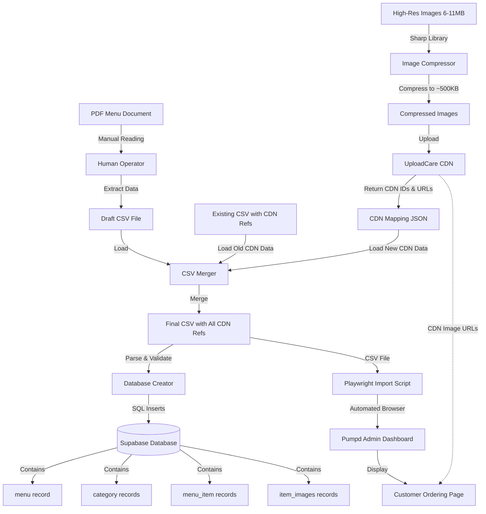

# Architecture: PDF Menu Processing System

**Last Updated:** 2025-10-20

---

## High-Level Overview

The PDF Menu Processing system is a hybrid manual-automated solution that bridges the gap between PDF menu documents and the automated online ordering system. It transforms static PDF menus into structured database records with CDN-hosted images, enabling automated import into the Pumpd ordering platform.

```
┌─────────────────────────────────────────────────────────────────────┐
│                      PDF MENU PROCESSING PIPELINE                    │
├─────────────────────────────────────────────────────────────────────┤
│                                                                      │
│  PDF Document    →    Manual Extraction    →    CSV Structure      │
│       ↓                                              ↓               │
│  High-Res Images →  Image Compression  →  UploadCare CDN           │
│                                                       ↓               │
│                          Database Records ← CSV + CDN Mapping        │
│                                   ↓                                  │
│                      Automated CSV Import (Playwright)               │
│                                   ↓                                  │
│                     Pumpd Online Ordering System                     │
└─────────────────────────────────────────────────────────────────────┘
```

### System Layers

1. **Input Layer**: PDF documents and image files
2. **Processing Layer**: Compression, upload, CSV generation
3. **Data Layer**: Supabase PostgreSQL database
4. **Storage Layer**: UploadCare CDN
5. **Import Layer**: Playwright automation
6. **Presentation Layer**: Pumpd admin dashboard + customer ordering

---

## Directory Structure

```
automation/
├── planning/
│   └── pdf-extraction/
│       ├── README.md                           # Project overview
│       ├── implementation-roadmap.md           # Phase-by-phase plan
│       ├── architecture.md                     # This file
│       ├── database-schema.md                  # DB structure
│       ├── service-layer.md                    # Service components
│       ├── image-processing-pipeline.md        # Image workflow
│       ├── chaat-street-new-menu.pdf          # Source PDF
│       ├── Chaat Street_menu.csv              # Existing menu (reference)
│       ├── chaat-street-photos/               # Original images
│       │   ├── BEDAI KE ALOO-2.jpg           # 9.7MB
│       │   ├── BOMBE KULFI-1.jpg             # 6.3MB
│       │   └── ...                            # 11 more images
│       └── reference-files/
│           └── uploadcare-integration-plan.md  # CDN integration docs
│
├── scripts/
│   └── pdf-menu-processing/                   # NEW DIRECTORY (to create)
│       ├── compress-images.js                 # Image compression
│       ├── upload-to-cdn.js                   # Batch CDN upload
│       ├── merge-csv-references.js            # CSV merging logic
│       ├── create-menu-from-csv.js            # Database operations
│       ├── compressed-images/                 # Compressed output
│       ├── image-mapping.json                 # Compression metadata
│       ├── cdn-mapping.json                   # CDN upload results
│       ├── draft-menu.csv                     # Manual PDF extraction
│       └── final-menu-with-cdn.csv            # Merged final CSV
│
├── UberEats-Image-Extractor/
│   └── src/
│       └── services/
│           ├── uploadcare-service.js          # REUSE: CDN upload logic
│           ├── database-service.js            # REUSE: DB operations
│           └── firecrawl-service.js           # Future: PDF parsing
│
└── scripts/
    └── restaurant-registration/
        └── import-csv-menu.js                 # REUSE: Final import
```

### Key File Locations

| Component | File Path | Purpose |
|-----------|-----------|---------|
| Image Compression | `scripts/pdf-menu-processing/compress-images.js` | Reduce image file sizes |
| CDN Upload | `scripts/pdf-menu-processing/upload-to-cdn.js` | Upload to UploadCare |
| CSV Merging | `scripts/pdf-menu-processing/merge-csv-references.js` | Combine old + new data |
| Database Creation | `scripts/pdf-menu-processing/create-menu-from-csv.js` | Create DB records |
| UploadCare Service | `UberEats-Image-Extractor/src/services/uploadcare-service.js` | CDN API wrapper |
| Database Service | `UberEats-Image-Extractor/src/services/database-service.js` | Supabase queries |
| Final Import | `scripts/restaurant-registration/import-csv-menu.js` | Playwright automation |

---

## Data Flow

### Complete End-to-End Flow



### Phase-Specific Flows

#### Phase 1: Image Compression Flow

```
Input: 13 high-res images (6-11MB each)
    ↓
┌─────────────────────────────────┐
│  compress-images.js             │
│  ┌───────────────────────────┐  │
│  │ 1. Read image file        │  │
│  │ 2. Load with Sharp        │  │
│  │ 3. Resize (max 1920px)    │  │
│  │ 4. Compress (quality 85)  │  │
│  │ 5. Check file size        │  │
│  │    IF > 1MB → reduce      │  │
│  │    quality & retry        │  │
│  │ 6. Save compressed image  │  │
│  │ 7. Log metadata           │  │
│  └───────────────────────────┘  │
└─────────────┬───────────────────┘
              ↓
Output: 13 compressed images (~500KB each)
Output: image-mapping.json (metadata)
```

#### Phase 2: CDN Upload Flow

```
Input: Compressed images + restaurant metadata
    ↓
┌──────────────────────────────────────┐
│  upload-to-cdn.js                    │
│  ┌────────────────────────────────┐  │
│  │ FOR EACH IMAGE:                │  │
│  │                                │  │
│  │ 1. Read compressed file        │  │
│  │ 2. Sanitize filename           │  │
│  │ 3. Call UploadCare API         │  │
│  │    POST /from_url/             │  │
│  │ 4. Poll for completion         │  │
│  │ 5. Receive CDN ID & URL        │  │
│  │ 6. Store in cdn-mapping.json   │  │
│  │ 7. Retry on failure (max 3x)   │  │
│  │                                │  │
│  │ Concurrency: Max 5 parallel    │  │
│  └────────────────────────────────┘  │
└──────────────┬───────────────────────┘
               ↓
Output: cdn-mapping.json
{
  "image-filename.jpg": {
    "cdn_id": "uuid",
    "cdn_url": "https://ucarecdn.com/uuid/",
    "cdn_filename": "sanitized-name.jpg"
  }
}
```

#### Phase 3: CSV Merging Flow

```
Input: Old CSV + Draft CSV + CDN Mapping
    ↓
┌──────────────────────────────────────────┐
│  merge-csv-references.js                 │
│  ┌────────────────────────────────────┐  │
│  │ 1. Load old CSV                    │  │
│  │    Extract: item name → CDN ref    │  │
│  │                                    │  │
│  │ 2. Load draft CSV (new menu)       │  │
│  │                                    │  │
│  │ 3. FOR EACH new menu item:         │  │
│  │    - Try exact name match          │  │
│  │    - If match: use old CDN ref     │  │
│  │    - If no match: fuzzy search     │  │
│  │    - If still no match:            │  │
│  │      assign new CDN ref from       │  │
│  │      cdn-mapping.json              │  │
│  │                                    │  │
│  │ 4. Build final CSV row             │  │
│  │    - All Cloudwaitress columns     │  │
│  │    - isCDNImage = TRUE             │  │
│  │    - imageCDNID = uuid             │  │
│  │    - imageCDNFilename = filename   │  │
│  │                                    │  │
│  │ 5. Validate CSV format             │  │
│  │ 6. Write final CSV file            │  │
│  └────────────────────────────────────┘  │
└──────────────┬───────────────────────────┘
               ↓
Output: final-menu-with-cdn.csv
Output: merge-report.json
```

#### Phase 4: Database Creation Flow

```
Input: final-menu-with-cdn.csv
    ↓
┌──────────────────────────────────────────┐
│  create-menu-from-csv.js                 │
│  ┌────────────────────────────────────┐  │
│  │ 1. Parse CSV                       │  │
│  │    Group by categories             │  │
│  │                                    │  │
│  │ 2. BEGIN TRANSACTION               │  │
│  │                                    │  │
│  │ 3. INSERT INTO menus               │  │
│  │    restaurant_id, version=2        │  │
│  │    Returns: menu_id                │  │
│  │                                    │  │
│  │ 4. FOR EACH category:              │  │
│  │    INSERT INTO categories          │  │
│  │    menu_id, name, position         │  │
│  │    Returns: category_id            │  │
│  │                                    │  │
│  │ 5. FOR EACH menu item:             │  │
│  │    INSERT INTO menu_items          │  │
│  │    category_id, menu_id,           │  │
│  │    name, price, tags, etc.         │  │
│  │    Returns: menu_item_id           │  │
│  │                                    │  │
│  │ 6. FOR EACH item with CDN image:   │  │
│  │    INSERT INTO item_images         │  │
│  │    menu_item_id, cdn_uploaded,     │  │
│  │    cdn_id, cdn_url, cdn_filename   │  │
│  │                                    │  │
│  │ 7. COMMIT TRANSACTION              │  │
│  │                                    │  │
│  │ ON ERROR: ROLLBACK                 │  │
│  └────────────────────────────────────┘  │
└──────────────┬───────────────────────────┘
               ↓
Output: Database records created
Output: creation-report.json
```

#### Phase 5: Import & Verification Flow

```
Input: final-menu-with-cdn.csv
    ↓
┌──────────────────────────────────────────┐
│  import-csv-menu.js (Playwright)         │
│  ┌────────────────────────────────────┐  │
│  │ 1. Launch browser (Chromium)       │  │
│  │ 2. Navigate to admin.pumpd.co.nz   │  │
│  │ 3. Login with restaurant email     │  │
│  │ 4. Bypass email confirmation       │  │
│  │    (admin password)                │  │
│  │ 5. Navigate to Menu section        │  │
│  │ 6. Click "Import CSV"              │  │
│  │ 7. Upload CSV file                 │  │
│  │ 8. Wait for processing             │  │
│  │ 9. Verify success message          │  │
│  │ 10. Screenshot confirmation        │  │
│  └────────────────────────────────────┘  │
└──────────────┬───────────────────────────┘
               ↓
┌──────────────────────────────────────────┐
│  Pumpd Admin Dashboard                   │
│  - Menu visible with all categories      │
│  - Items displayed with CDN images       │
│  - Prices, descriptions, tags correct    │
└──────────────┬───────────────────────────┘
               ↓
┌──────────────────────────────────────────┐
│  Customer Ordering Page                  │
│  - Browse categories                     │
│  - View items with CDN images            │
│  - Add to cart functionality             │
└──────────────────────────────────────────┘
```

---

## Service Layer Architecture

### Core Services

#### 1. Image Compression Service
```javascript
// Location: scripts/pdf-menu-processing/compress-images.js

class ImageCompressionService {
  constructor(options) {
    this.quality = options.quality || 85;
    this.maxWidth = options.maxWidth || 1920;
    this.maxSize = options.maxSize || 1048576; // 1MB
  }

  async compressImage(inputPath, outputPath) {
    // 1. Load image with Sharp
    let image = sharp(inputPath);

    // 2. Get metadata
    const metadata = await image.metadata();

    // 3. Resize if too large
    if (metadata.width > this.maxWidth) {
      image = image.resize(this.maxWidth, null, {
        withoutEnlargement: true
      });
    }

    // 4. Compress with quality setting
    image = image.jpeg({
      quality: this.quality,
      progressive: true
    });

    // 5. Save and check size
    await image.toFile(outputPath);

    // 6. If still too large, reduce quality and retry
    if (fileSize > this.maxSize) {
      return this.compressImage(inputPath, outputPath, {
        quality: this.quality - 10
      });
    }
  }
}
```

**Key Features:**
- Automatic quality adjustment
- Aspect ratio preservation
- Progressive JPEG for web
- Size validation with retry logic

#### 2. UploadCare Service (Existing)
```javascript
// Location: UberEats-Image-Extractor/src/services/uploadcare-service.js

class UploadCareService {
  constructor(publicKey, secretKey) {
    this.publicKey = publicKey;
    this.secretKey = secretKey;
    this.baseUrl = 'https://upload.uploadcare.com';
  }

  async uploadImageFromUrl(imageUrl, filename, metadata) {
    // 1. Prepare upload request
    const formData = {
      pub_key: this.publicKey,
      source_url: imageUrl,
      store: '1',
      filename: filename,
      metadata: JSON.stringify(metadata)
    };

    // 2. POST to UploadCare API
    const response = await axios.post(
      `${this.baseUrl}/from_url/`,
      formData
    );

    // 3. Poll for completion
    if (response.data.token) {
      return await this.waitForUploadCompletion(response.data.token);
    }

    // 4. Return CDN metadata
    return {
      success: true,
      cdnId: response.data.uuid,
      cdnUrl: `https://ucarecdn.com/${response.data.uuid}/`,
      filename: response.data.original_filename
    };
  }
}
```

**Key Features:**
- Retry logic with exponential backoff
- Concurrent upload management (max 5)
- Progress tracking
- Authentication handling

#### 3. Database Service (Existing)
```javascript
// Location: UberEats-Image-Extractor/src/services/database-service.js

class DatabaseService {
  async createMenu(restaurantId, platformId, data) {
    const { data: menu, error } = await supabase
      .from('menus')
      .insert({
        restaurant_id: restaurantId,
        platform_id: platformId,
        version: data.version,
        is_active: true
      })
      .select()
      .single();

    return menu;
  }

  async createCategory(menuId, categoryData) {
    const { data: category, error } = await supabase
      .from('categories')
      .insert({
        menu_id: menuId,
        name: categoryData.name,
        position: categoryData.position
      })
      .select()
      .single();

    return category;
  }

  async createMenuItem(categoryId, menuId, itemData) {
    const { data: item, error } = await supabase
      .from('menu_items')
      .insert({
        category_id: categoryId,
        menu_id: menuId,
        name: itemData.name,
        description: itemData.description,
        price: itemData.price,
        tags: itemData.tags
      })
      .select()
      .single();

    return item;
  }

  async createItemImage(menuItemId, imageData) {
    const { data: image, error } = await supabase
      .from('item_images')
      .insert({
        menu_item_id: menuItemId,
        url: imageData.url,
        cdn_uploaded: true,
        cdn_id: imageData.cdnId,
        cdn_url: imageData.cdnUrl,
        cdn_filename: imageData.cdnFilename,
        type: 'primary'
      })
      .select()
      .single();

    return image;
  }
}
```

**Key Features:**
- Supabase client integration
- Transaction support
- Error handling
- Type validation

#### 4. CSV Merging Service (New)
```javascript
// Location: scripts/pdf-menu-processing/merge-csv-references.js

class CSVMergingService {
  async mergeCSVs(oldCSVPath, newCSVPath, cdnMappingPath) {
    // 1. Load and parse old CSV
    const oldItems = await this.parseCSV(oldCSVPath);
    const cdnLookup = this.buildCDNLookup(oldItems);

    // 2. Load new CSV
    const newItems = await this.parseCSV(newCSVPath);

    // 3. Load CDN mapping from uploads
    const cdnMapping = await this.loadJSON(cdnMappingPath);

    // 4. Merge data
    const mergedItems = newItems.map(item => {
      // Try exact match first
      if (cdnLookup[item.dishName]) {
        return {
          ...item,
          isCDNImage: 'TRUE',
          imageCDNID: cdnLookup[item.dishName].cdnId,
          imageCDNFilename: cdnLookup[item.dishName].cdnFilename
        };
      }

      // Try fuzzy match
      const fuzzyMatch = this.fuzzySearch(item.dishName, cdnLookup);
      if (fuzzyMatch) {
        return {
          ...item,
          isCDNImage: 'TRUE',
          imageCDNID: fuzzyMatch.cdnId,
          imageCDNFilename: fuzzyMatch.cdnFilename
        };
      }

      // Assign new CDN ref
      const newCDN = this.findNewCDNRef(item, cdnMapping);
      return {
        ...item,
        isCDNImage: newCDN ? 'TRUE' : 'FALSE',
        imageCDNID: newCDN?.cdnId || '',
        imageCDNFilename: newCDN?.cdnFilename || ''
      };
    });

    // 5. Generate final CSV
    return this.generateCSV(mergedItems);
  }
}
```

**Key Features:**
- Fuzzy name matching (Levenshtein distance)
- CDN reference reuse
- Validation and reporting
- CSV format compliance

---

## Error Handling

### Error Categories

#### 1. Image Processing Errors
```javascript
try {
  await compressImage(inputPath, outputPath);
} catch (error) {
  if (error.code === 'ENOENT') {
    // File not found
    logger.error(`Image file not found: ${inputPath}`);
    continue; // Skip this image
  } else if (error.message.includes('unsupported')) {
    // Invalid image format
    logger.error(`Unsupported image format: ${inputPath}`);
    continue;
  } else {
    // Unknown error
    logger.error(`Failed to compress ${inputPath}:`, error);
    throw error; // Stop processing
  }
}
```

**Handling Strategy:**
- Skip corrupt/invalid images
- Log warnings for non-critical errors
- Stop on critical failures

#### 2. CDN Upload Errors
```javascript
async uploadWithRetry(image, maxRetries = 3) {
  for (let attempt = 1; attempt <= maxRetries; attempt++) {
    try {
      return await uploadcare.uploadImageFromUrl(image.url, image.filename);
    } catch (error) {
      if (error.response?.status === 429) {
        // Rate limited - wait and retry
        const delay = Math.pow(2, attempt) * 1000; // Exponential backoff
        await sleep(delay);
        continue;
      } else if (error.response?.status >= 500) {
        // Server error - retry
        await sleep(2000);
        continue;
      } else if (attempt === maxRetries) {
        // Max retries reached
        logger.error(`Failed to upload after ${maxRetries} attempts:`, error);
        return { success: false, error: error.message };
      }
    }
  }
}
```

**Handling Strategy:**
- Retry on rate limits (429)
- Retry on server errors (5xx)
- Exponential backoff
- Track failed uploads for manual review

#### 3. Database Errors
```javascript
try {
  await db.transaction(async (tx) => {
    const menu = await tx.createMenu(restaurantId, data);
    const categories = await tx.createCategories(menu.id, categoryData);
    const items = await tx.createMenuItems(menu.id, itemData);
    const images = await tx.createItemImages(itemData);
  });
} catch (error) {
  // Transaction automatically rolled back
  if (error.code === '23503') {
    // Foreign key violation
    logger.error('Invalid foreign key reference:', error.detail);
  } else if (error.code === '23505') {
    // Unique constraint violation
    logger.error('Duplicate record:', error.detail);
  } else {
    logger.error('Database error:', error);
  }
  throw error; // Re-throw to stop import
}
```

**Handling Strategy:**
- Use transactions for atomicity
- Rollback on any error
- Log detailed error information
- Validate data before insert

---

## Security Considerations

### 1. API Key Management
```bash
# Store in environment variables (never commit)
# Location: scripts/.env

UPLOADCARE_PUBLIC_KEY=f4394631faa29564fd1d
UPLOADCARE_SECRET_KEY=<secret>

# Access in code:
const publicKey = process.env.UPLOADCARE_PUBLIC_KEY;
```

### 2. Database Access
- Use Supabase RLS (Row Level Security)
- Service role key for backend operations
- Validate restaurant_id ownership

### 3. File System Access
- Validate file paths before reading/writing
- Sanitize filenames to prevent directory traversal
- Check file sizes before processing

### 4. CDN URLs
- Validate CDN URLs before storing
- Use HTTPS only
- Verify image accessibility after upload

---

## Performance Considerations

### 1. Image Compression
**Optimization:**
- Process images in parallel (max 5 concurrent)
- Use streaming for large files
- Cache compression settings

**Benchmarks:**
- Average compression time: 1-2 seconds per image
- Target compression ratio: 90-95%
- Total time for 13 images: ~15 seconds

### 2. CDN Uploads
**Optimization:**
- Concurrent uploads (max 5)
- Upload compressed images, not originals
- Reuse existing CDN refs when possible

**Benchmarks:**
- Average upload time: 2-3 seconds per image
- Total time for 13 images: ~30 seconds

### 3. Database Operations
**Optimization:**
- Use batch inserts where possible
- Single transaction for all operations
- Prepare statements for repeated queries

**Benchmarks:**
- Menu creation: <1 second
- Category creation: <1 second per category
- Item creation: <1 second per 10 items
- Total for 35-item menu: ~5 seconds

### 4. CSV Processing
**Optimization:**
- Stream large CSV files
- Build lookups with hash maps
- Validate incrementally

**Benchmarks:**
- CSV parsing: <1 second for 100 rows
- Merging: <2 seconds for 100 rows
- Generation: <1 second for 100 rows

---

## Integration Points

### 1. UploadCare CDN
**Integration Type:** REST API
**Authentication:** Public + Secret Key
**Endpoint:** `https://upload.uploadcare.com/from_url/`

**Request Format:**
```javascript
POST /from_url/
Content-Type: application/x-www-form-urlencoded

pub_key=<public-key>
&source_url=<image-url>
&store=1
&filename=<sanitized-filename>
&metadata=<json-metadata>
```

**Response Format:**
```json
{
  "uuid": "550e8400-e29b-41d4-a716-446655440000",
  "original_filename": "image.jpg",
  "size": 487234,
  "mime_type": "image/jpeg"
}
```

### 2. Supabase Database
**Integration Type:** PostgreSQL via Supabase Client
**Authentication:** Service Role Key
**Connection:** `https://qgabsyggzlkcstjzugdh.supabase.co`

**Tables Used:**
- `menus` - Menu records
- `categories` - Category records
- `menu_items` - Item records
- `item_images` - Image references with CDN data

**RLS Policies:**
- Service role bypasses RLS
- User-level access controlled by organisation_id

### 3. Playwright Import
**Integration Type:** Browser Automation
**Target:** `https://admin.pumpd.co.nz`
**Script:** `scripts/restaurant-registration/import-csv-menu.js`

**Process:**
1. Launch Chromium browser
2. Navigate to admin login
3. Enter restaurant credentials
4. Navigate to menu section
5. Upload CSV file
6. Wait for processing confirmation

---

## Testing Strategy

### 1. Unit Tests
```javascript
// compress-images.test.js
describe('ImageCompressionService', () => {
  it('should compress image to target size', async () => {
    const result = await service.compressImage(inputPath, outputPath);
    expect(result.size).toBeLessThan(1048576); // 1MB
  });

  it('should preserve aspect ratio', async () => {
    const result = await service.compressImage(inputPath, outputPath);
    const ratio = result.width / result.height;
    expect(ratio).toBeCloseTo(originalRatio, 1);
  });
});

// upload-to-cdn.test.js
describe('CDNUploadService', () => {
  it('should upload image and return CDN URL', async () => {
    const result = await service.uploadImage(imageUrl, filename);
    expect(result.success).toBe(true);
    expect(result.cdnUrl).toMatch(/^https:\/\/ucarecdn\.com\//);
  });
});
```

### 2. Integration Tests
```javascript
// e2e-flow.test.js
describe('PDF Menu Processing Flow', () => {
  it('should complete full pipeline', async () => {
    // 1. Compress images
    const compressed = await compressImages(testImages);
    expect(compressed.length).toBe(3);

    // 2. Upload to CDN
    const uploaded = await uploadToCDN(compressed);
    expect(uploaded.successful.length).toBe(3);

    // 3. Merge CSVs
    const merged = await mergeCSVs(oldCSV, newCSV, uploaded);
    expect(merged.rows.length).toBeGreaterThan(0);

    // 4. Create database records
    const created = await createDatabaseRecords(merged);
    expect(created.success).toBe(true);
  });
});
```

### 3. Manual Testing Checklist
- [ ] Compress sample images and verify quality
- [ ] Upload test image to CDN and access URL
- [ ] Parse test CSV and validate format
- [ ] Create test database records (dry-run)
- [ ] Import test CSV to staging environment
- [ ] Verify images load in admin dashboard
- [ ] Test customer ordering page

---

## Deployment and Rollback

### Deployment Steps
1. Create `scripts/pdf-menu-processing/` directory
2. Copy scripts to directory
3. Install dependencies: `npm install sharp axios uuid csv-parse csv-stringify`
4. Set environment variables in `scripts/.env`
5. Test with sample data
6. Run production processing

### Rollback Plan
If import fails:
1. **Database:** Delete menu record (cascades to all child records)
2. **CDN:** Images remain on CDN (no cost to keep)
3. **CSV:** Regenerate from backup

```sql
-- Rollback database changes
DELETE FROM menus WHERE id = '<menu-id>';
-- This cascades to categories, menu_items, item_images
```

---

## Future Enhancements

### 1. Automated PDF Parsing
**Technology:** Firecrawl PDF Parser
**Benefit:** Eliminate manual data extraction

```javascript
// Future implementation
const result = await firecrawl.scrape(pdfUrl, {
  parsers: [{
    type: 'pdf',
    maxPages: 10
  }],
  formats: [{
    type: 'json',
    schema: menuSchema
  }]
});
```

### 2. OCR for Menu Images
**Technology:** Google Cloud Vision / Tesseract
**Benefit:** Extract text from image-based menus

### 3. UI for PDF Upload
**Technology:** React component
**Benefit:** Self-service menu import for users

### 4. Automated CSV Validation
**Technology:** JSON Schema validation
**Benefit:** Catch errors before import

---

## Monitoring and Logging

### Log Levels
- **DEBUG:** Detailed processing information
- **INFO:** Progress updates, successful operations
- **WARN:** Non-critical errors (skipped images)
- **ERROR:** Critical failures

### Key Metrics to Track
- Image compression time per image
- CDN upload success rate
- CSV merge accuracy (matches found)
- Database insert duration
- Overall pipeline completion time

### Example Logging
```javascript
logger.info('Starting image compression for 13 images');
logger.debug(`Compressing ${filename}: ${originalSize}MB → ${compressedSize}KB`);
logger.warn(`Skipping corrupt image: ${filename}`);
logger.error(`CDN upload failed: ${error.message}`);
logger.info('Pipeline completed successfully in 2m 15s');
```

---

## Summary

This architecture provides a robust, maintainable solution for processing PDF menus into structured database records with CDN-hosted images. The hybrid manual-automated approach balances time constraints with future automation potential, enabling immediate customer onboarding while laying groundwork for scalable PDF processing capabilities.
