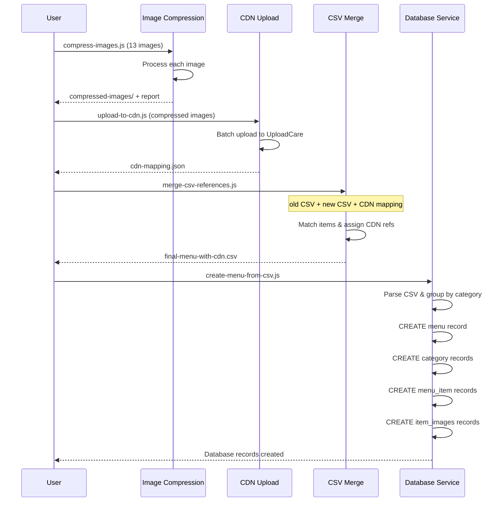

# Service Layer: PDF Menu Processing

**Last Updated:** 2025-10-20

---

## Overview

This document describes the service layer components responsible for processing PDF menus, compressing images, uploading to CDN, and creating database records. Each service is designed to be independent, reusable, and testable.

---

## Service Architecture

```
┌─────────────────────────────────────────────────────────┐
│                    Service Layer                         │
├─────────────────────────────────────────────────────────┤
│                                                          │
│  ┌──────────────────┐     ┌──────────────────┐         │
│  │ Image            │     │ UploadCare       │         │
│  │ Compression      │────▶│ Service          │         │
│  │ Service          │     │ (Existing)       │         │
│  └──────────────────┘     └──────────────────┘         │
│           │                         │                    │
│           ▼                         ▼                    │
│  ┌──────────────────────────────────────────┐          │
│  │        CSV Merging Service               │          │
│  └──────────────────┬───────────────────────┘          │
│                     │                                    │
│                     ▼                                    │
│  ┌──────────────────────────────────────────┐          │
│  │     Database Service (Existing)          │          │
│  └──────────────────────────────────────────┘          │
│                                                          │
└─────────────────────────────────────────────────────────┘
```

---

## 1. Image Compression Service

**File:** `scripts/pdf-menu-processing/compress-images.js`
**Purpose:** Compress high-resolution images to CDN-acceptable sizes
**Status:** To be created

### Interface

```javascript
class ImageCompressionService {
  constructor(options = {}) {
    this.quality = options.quality || 85;
    this.maxWidth = options.maxWidth || 1920;
    this.maxHeight = options.maxHeight || null; // Maintain aspect ratio
    this.maxSize = options.maxSize || 1048576; // 1MB in bytes
    this.format = options.format || 'jpeg';
    this.progressive = options.progressive !== false; // Default true
  }

  /**
   * Compress a single image
   * @param {string} inputPath - Path to original image
   * @param {string} outputPath - Path for compressed image
   * @returns {Promise<CompressionResult>}
   */
  async compressImage(inputPath, outputPath) {}

  /**
   * Compress multiple images in batch
   * @param {string[]} inputPaths - Array of input paths
   * @param {string} outputDir - Output directory
   * @param {Function} progressCallback - Progress updates
   * @returns {Promise<CompressionReport>}
   */
  async compressBatch(inputPaths, outputDir, progressCallback) {}

  /**
   * Calculate optimal quality for target size
   * @param {string} inputPath - Path to original image
   * @param {number} targetSize - Target size in bytes
   * @returns {Promise<number>} Optimal quality (1-100)
   */
  async calculateOptimalQuality(inputPath, targetSize) {}
}
```

### Data Structures

#### CompressionResult
```typescript
interface CompressionResult {
  success: boolean;
  inputPath: string;
  outputPath: string;
  originalSize: number;      // bytes
  compressedSize: number;    // bytes
  compressionRatio: number;  // percentage (0-100)
  width: number;
  height: number;
  quality: number;           // quality used (1-100)
  format: string;            // 'jpeg', 'png', etc.
  duration: number;          // ms
  error?: string;
}
```

#### CompressionReport
```typescript
interface CompressionReport {
  total: number;
  successful: number;
  failed: number;
  totalOriginalSize: number;
  totalCompressedSize: number;
  averageCompressionRatio: number;
  totalDuration: number;
  results: CompressionResult[];
  errors: Array<{
    inputPath: string;
    error: string;
  }>;
}
```

### Implementation

```javascript
const sharp = require('sharp');
const fs = require('fs').promises;
const path = require('path');

class ImageCompressionService {
  constructor(options = {}) {
    this.quality = options.quality || 85;
    this.maxWidth = options.maxWidth || 1920;
    this.maxSize = options.maxSize || 1048576; // 1MB
    this.format = options.format || 'jpeg';
    this.progressive = options.progressive !== false;
  }

  async compressImage(inputPath, outputPath) {
    const startTime = Date.now();

    try {
      // Get original file size
      const stats = await fs.stat(inputPath);
      const originalSize = stats.size;

      // Load image
      let image = sharp(inputPath);
      const metadata = await image.metadata();

      // Resize if needed
      if (metadata.width > this.maxWidth) {
        image = image.resize(this.maxWidth, null, {
          withoutEnlargement: true,
          fit: 'inside'
        });
      }

      // Apply format and quality
      if (this.format === 'jpeg') {
        image = image.jpeg({
          quality: this.quality,
          progressive: this.progressive,
          mozjpeg: true // Better compression
        });
      }

      // Save compressed image
      await image.toFile(outputPath);

      // Get compressed file size
      const compressedStats = await fs.stat(outputPath);
      const compressedSize = compressedStats.size;

      // If still too large, reduce quality and retry
      if (compressedSize > this.maxSize && this.quality > 50) {
        console.log(`Image too large (${compressedSize} bytes), reducing quality...`);
        return this.compressImage(inputPath, outputPath, {
          quality: this.quality - 10
        });
      }

      // Get final dimensions
      const finalMetadata = await sharp(outputPath).metadata();

      const duration = Date.now() - startTime;
      const compressionRatio = ((originalSize - compressedSize) / originalSize) * 100;

      return {
        success: true,
        inputPath,
        outputPath,
        originalSize,
        compressedSize,
        compressionRatio,
        width: finalMetadata.width,
        height: finalMetadata.height,
        quality: this.quality,
        format: this.format,
        duration
      };
    } catch (error) {
      return {
        success: false,
        inputPath,
        outputPath,
        error: error.message,
        duration: Date.now() - startTime
      };
    }
  }

  async compressBatch(inputPaths, outputDir, progressCallback) {
    const startTime = Date.now();
    const results = [];
    const errors = [];

    // Ensure output directory exists
    await fs.mkdir(outputDir, { recursive: true });

    for (let i = 0; i < inputPaths.length; i++) {
      const inputPath = inputPaths[i];
      const filename = path.basename(inputPath);
      const outputPath = path.join(outputDir, filename);

      // Progress callback
      if (progressCallback) {
        progressCallback({
          current: i + 1,
          total: inputPaths.length,
          filename,
          percentage: Math.round(((i + 1) / inputPaths.length) * 100)
        });
      }

      const result = await this.compressImage(inputPath, outputPath);
      results.push(result);

      if (!result.success) {
        errors.push({
          inputPath,
          error: result.error
        });
      }
    }

    const totalDuration = Date.now() - startTime;
    const successful = results.filter(r => r.success);

    const totalOriginalSize = successful.reduce((sum, r) => sum + r.originalSize, 0);
    const totalCompressedSize = successful.reduce((sum, r) => sum + r.compressedSize, 0);
    const averageCompressionRatio = successful.length > 0
      ? ((totalOriginalSize - totalCompressedSize) / totalOriginalSize) * 100
      : 0;

    return {
      total: inputPaths.length,
      successful: successful.length,
      failed: errors.length,
      totalOriginalSize,
      totalCompressedSize,
      averageCompressionRatio,
      totalDuration,
      results,
      errors
    };
  }
}

module.exports = ImageCompressionService;
```

### Command-Line Interface

```javascript
#!/usr/bin/env node

const { program } = require('commander');
const ImageCompressionService = require('./image-compression-service');
const glob = require('glob');
const path = require('path');
const fs = require('fs').promises;

program
  .name('compress-images')
  .description('Compress images for CDN upload')
  .requiredOption('-i, --input <directory>', 'Input directory containing images')
  .requiredOption('-o, --output <directory>', 'Output directory for compressed images')
  .option('-q, --quality <number>', 'JPEG quality (1-100)', '85')
  .option('-w, --max-width <number>', 'Maximum width in pixels', '1920')
  .option('-s, --max-size <bytes>', 'Maximum file size in bytes', '1048576')
  .option('-f, --format <format>', 'Output format (jpeg, png)', 'jpeg')
  .parse(process.argv);

const options = program.opts();

async function main() {
  console.log('🗜️  Image Compression Tool\n');
  console.log(`Input:  ${options.input}`);
  console.log(`Output: ${options.output}`);
  console.log(`Quality: ${options.quality}`);
  console.log(`Max Width: ${options.maxWidth}px`);
  console.log(`Max Size: ${options.maxSize} bytes (${(options.maxSize / 1024 / 1024).toFixed(2)}MB)\n`);

  // Find all images in input directory
  const pattern = path.join(options.input, '*.{jpg,jpeg,png,JPG,JPEG,PNG}');
  const inputPaths = glob.sync(pattern);

  console.log(`Found ${inputPaths.length} images\n`);

  if (inputPaths.length === 0) {
    console.error('❌ No images found in input directory');
    process.exit(1);
  }

  // Create compression service
  const service = new ImageCompressionService({
    quality: parseInt(options.quality),
    maxWidth: parseInt(options.maxWidth),
    maxSize: parseInt(options.maxSize),
    format: options.format
  });

  // Compress with progress tracking
  const report = await service.compressBatch(inputPaths, options.output, (progress) => {
    process.stdout.write(`\r📦 Processing: ${progress.current}/${progress.total} (${progress.percentage}%) - ${progress.filename}`);
  });

  console.log('\n\n✅ Compression Complete!\n');
  console.log(`Total:       ${report.total} images`);
  console.log(`Successful:  ${report.successful}`);
  console.log(`Failed:      ${report.failed}`);
  console.log(`Original:    ${(report.totalOriginalSize / 1024 / 1024).toFixed(2)}MB`);
  console.log(`Compressed:  ${(report.totalCompressedSize / 1024 / 1024).toFixed(2)}MB`);
  console.log(`Saved:       ${report.averageCompressionRatio.toFixed(1)}%`);
  console.log(`Duration:    ${(report.totalDuration / 1000).toFixed(1)}s`);

  if (report.errors.length > 0) {
    console.log('\n❌ Errors:');
    report.errors.forEach(err => {
      console.log(`  - ${path.basename(err.inputPath)}: ${err.error}`);
    });
  }

  // Save report
  const reportPath = path.join(options.output, 'compression-report.json');
  await fs.writeFile(reportPath, JSON.stringify(report, null, 2));
  console.log(`\n📄 Report saved: ${reportPath}`);
}

main().catch(console.error);
```

### Usage Examples

```bash
# Basic usage
node compress-images.js \
  --input ../../planning/pdf-extraction/chaat-street-photos \
  --output ./compressed-images

# Custom quality and size
node compress-images.js \
  --input ./high-res-images \
  --output ./compressed \
  --quality 90 \
  --max-width 2400 \
  --max-size 2097152  # 2MB

# PNG format
node compress-images.js \
  --input ./logos \
  --output ./compressed-logos \
  --format png
```

---

## 2. CDN Upload Service (Existing)

**File:** `UberEats-Image-Extractor/src/services/uploadcare-service.js`
**Purpose:** Upload images to UploadCare CDN
**Status:** Already implemented, will be reused

### Interface

```javascript
class UploadCareService {
  constructor(publicKey, secretKey)

  async uploadImageFromUrl(imageUrl, filename, metadata)
  async uploadBatch(images, progressCallback, batchId)
  async uploadImageWithRetry(imageUrl, filename, metadata, maxRetries = 3)
  sanitizeFilename(originalUrl, itemName, categoryName)
}
```

### Key Methods

#### uploadImageFromUrl
```javascript
/**
 * Upload a single image from URL to UploadCare
 * @param {string} imageUrl - URL or local path to image
 * @param {string} filename - Desired filename
 * @param {Object} metadata - Additional metadata
 * @returns {Promise<UploadResult>}
 */
async uploadImageFromUrl(imageUrl, filename, metadata = {}) {
  const response = await axios.post(
    `${this.baseUrl}/from_url/`,
    {
      pub_key: this.publicKey,
      source_url: imageUrl,
      store: '1',
      filename: filename,
      metadata: JSON.stringify(metadata)
    }
  );

  return {
    success: true,
    cdnId: response.data.uuid,
    cdnUrl: `https://ucarecdn.com/${response.data.uuid}/`,
    filename: response.data.original_filename,
    size: response.data.size,
    mimeType: response.data.mime_type
  };
}
```

#### sanitizeFilename
```javascript
/**
 * Sanitize filename for CDN storage
 * @param {string} originalUrl - Original image URL
 * @param {string} itemName - Menu item name
 * @param {string} categoryName - Category name
 * @returns {string} Sanitized filename
 */
sanitizeFilename(originalUrl, itemName, categoryName) {
  let filename = 'image.jpg';

  if (itemName) {
    filename = `${itemName.toLowerCase().replace(/[^a-z0-9]+/g, '-')}.jpg`;
  }

  if (categoryName) {
    const categorySlug = categoryName.toLowerCase().replace(/[^a-z0-9]+/g, '-');
    filename = `${categorySlug}-${filename}`;
  }

  return filename;
}
```

### Integration Example

```javascript
const UploadCareService = require('./uploadcare-service');
const uploadcare = new UploadCareService(
  process.env.UPLOADCARE_PUBLIC_KEY,
  process.env.UPLOADCARE_SECRET_KEY
);

// Upload single image
const result = await uploadcare.uploadImageFromUrl(
  '/path/to/compressed/image.jpg',
  'short-bites-jhol-momo.jpg',
  {
    restaurantId: 'f2995098-3a86-481e-9cf0-0faf73dcf799',
    menuItem: 'Jhol Momo',
    category: 'Short Bites'
  }
);

console.log(`Uploaded: ${result.cdnUrl}`);
```

---

## 3. CSV Merging Service

**File:** `scripts/pdf-menu-processing/merge-csv-references.js`
**Purpose:** Merge old CDN references with new menu items
**Status:** To be created

### Interface

```javascript
class CSVMergingService {
  constructor()

  async mergeCSVs(oldCSVPath, newCSVPath, cdnMappingPath, outputPath)
  async parseCSV(filePath)
  buildCDNLookup(items)
  fuzzyMatch(query, candidates, threshold = 0.8)
  findNewCDNRef(item, cdnMapping)
  async generateCSV(items, outputPath)
}
```

### Implementation

```javascript
const fs = require('fs').promises;
const { parse } = require('csv-parse/sync');
const { stringify } = require('csv-stringify/sync');

class CSVMergingService {
  /**
   * Merge old CSV (with CDN refs) with new CSV (from PDF)
   */
  async mergeCSVs(oldCSVPath, newCSVPath, cdnMappingPath, outputPath) {
    console.log('📋 Merging CSVs...\n');

    // 1. Load old CSV and build CDN lookup
    const oldItems = await this.parseCSV(oldCSVPath);
    const cdnLookup = this.buildCDNLookup(oldItems);
    console.log(`Loaded ${Object.keys(cdnLookup).length} CDN references from old CSV`);

    // 2. Load new CSV (manual PDF extraction)
    const newItems = await this.parseCSV(newCSVPath);
    console.log(`Loaded ${newItems.length} items from new CSV`);

    // 3. Load CDN mapping from uploads
    const cdnMapping = JSON.parse(await fs.readFile(cdnMappingPath, 'utf8'));
    console.log(`Loaded ${Object.keys(cdnMapping).length} new CDN uploads\n`);

    // 4. Merge logic
    const stats = {
      exactMatches: 0,
      fuzzyMatches: 0,
      newCDNAssigned: 0,
      noImage: 0
    };

    const mergedItems = newItems.map(item => {
      // Try exact match first
      if (cdnLookup[item.dishName]) {
        stats.exactMatches++;
        return {
          ...item,
          isCDNImage: 'TRUE',
          imageCDNID: cdnLookup[item.dishName].imageCDNID,
          imageCDNFilename: cdnLookup[item.dishName].imageCDNFilename,
          imageExternalURL: ''
        };
      }

      // Try fuzzy match
      const fuzzyMatch = this.fuzzyMatch(item.dishName, Object.keys(cdnLookup));
      if (fuzzyMatch) {
        stats.fuzzyMatches++;
        console.log(`Fuzzy match: "${item.dishName}" → "${fuzzyMatch}"`);
        return {
          ...item,
          isCDNImage: 'TRUE',
          imageCDNID: cdnLookup[fuzzyMatch].imageCDNID,
          imageCDNFilename: cdnLookup[fuzzyMatch].imageCDNFilename,
          imageExternalURL: ''
        };
      }

      // Assign new CDN reference
      const newCDN = this.findNewCDNRef(item, cdnMapping);
      if (newCDN) {
        stats.newCDNAssigned++;
        return {
          ...item,
          isCDNImage: 'TRUE',
          imageCDNID: newCDN.cdn_id,
          imageCDNFilename: newCDN.cdn_filename,
          imageExternalURL: ''
        };
      }

      // No image
      stats.noImage++;
      return {
        ...item,
        isCDNImage: 'FALSE',
        imageCDNID: '',
        imageCDNFilename: '',
        imageExternalURL: ''
      };
    });

    // 5. Generate final CSV
    await this.generateCSV(mergedItems, outputPath);

    // 6. Report
    console.log('\n✅ Merge Complete!\n');
    console.log(`Total items:      ${mergedItems.length}`);
    console.log(`Exact matches:    ${stats.exactMatches}`);
    console.log(`Fuzzy matches:    ${stats.fuzzyMatches}`);
    console.log(`New CDN assigned: ${stats.newCDNAssigned}`);
    console.log(`No image:         ${stats.noImage}\n`);

    return {
      total: mergedItems.length,
      stats,
      items: mergedItems
    };
  }

  /**
   * Parse CSV file
   */
  async parseCSV(filePath) {
    const content = await fs.readFile(filePath, 'utf8');
    return parse(content, {
      columns: true,
      skip_empty_lines: true
    });
  }

  /**
   * Build lookup table: item name → CDN reference
   */
  buildCDNLookup(items) {
    const lookup = {};
    items.forEach(item => {
      if (item.isCDNImage === 'TRUE' && item.imageCDNID) {
        lookup[item.dishName] = {
          imageCDNID: item.imageCDNID,
          imageCDNFilename: item.imageCDNFilename
        };
      }
    });
    return lookup;
  }

  /**
   * Fuzzy string matching using Levenshtein distance
   */
  fuzzyMatch(query, candidates, threshold = 0.8) {
    let bestMatch = null;
    let bestScore = 0;

    for (const candidate of candidates) {
      const score = this.similarity(query.toLowerCase(), candidate.toLowerCase());
      if (score > bestScore && score >= threshold) {
        bestScore = score;
        bestMatch = candidate;
      }
    }

    return bestMatch;
  }

  /**
   * Calculate similarity between two strings (Levenshtein distance)
   */
  similarity(s1, s2) {
    const longer = s1.length > s2.length ? s1 : s2;
    const shorter = s1.length > s2.length ? s2 : s1;

    if (longer.length === 0) return 1.0;

    const editDistance = this.levenshteinDistance(longer, shorter);
    return (longer.length - editDistance) / longer.length;
  }

  /**
   * Levenshtein distance algorithm
   */
  levenshteinDistance(s1, s2) {
    const costs = [];
    for (let i = 0; i <= s1.length; i++) {
      let lastValue = i;
      for (let j = 0; j <= s2.length; j++) {
        if (i === 0) {
          costs[j] = j;
        } else if (j > 0) {
          let newValue = costs[j - 1];
          if (s1.charAt(i - 1) !== s2.charAt(j - 1)) {
            newValue = Math.min(Math.min(newValue, lastValue), costs[j]) + 1;
          }
          costs[j - 1] = lastValue;
          lastValue = newValue;
        }
      }
      if (i > 0) costs[s2.length] = lastValue;
    }
    return costs[s2.length];
  }

  /**
   * Find CDN reference for item from new uploads
   */
  findNewCDNRef(item, cdnMapping) {
    // Try to match by item name in filename
    const itemSlug = item.dishName.toLowerCase().replace(/[^a-z0-9]+/g, '-');

    for (const [filename, cdnData] of Object.entries(cdnMapping)) {
      const filenameSlug = filename.toLowerCase().replace(/\.[^.]+$/, ''); // Remove extension
      if (filenameSlug.includes(itemSlug) || itemSlug.includes(filenameSlug)) {
        return cdnData;
      }
    }

    return null;
  }

  /**
   * Generate CSV from items
   */
  async generateCSV(items, outputPath) {
    const csv = stringify(items, {
      header: true,
      columns: [
        'menuID', 'menuName', 'menuDisplayName', 'menuDescription',
        'categoryID', 'categoryName', 'categoryDisplayName', 'categoryDescription',
        'dishID', 'dishName', 'dishPrice', 'dishType', 'dishDescription',
        'displayName', 'printName', 'tags',
        'isCDNImage', 'imageCDNID', 'imageCDNFilename', 'imageExternalURL'
      ]
    });

    await fs.writeFile(outputPath, csv);
    console.log(`✅ CSV written: ${outputPath}`);
  }
}

module.exports = CSVMergingService;
```

---

## 4. Database Service (Existing)

**File:** `UberEats-Image-Extractor/src/services/database-service.js`
**Purpose:** Supabase database operations
**Status:** Already implemented, will be reused

### Relevant Methods

```javascript
// Create menu record
await db.createMenu(restaurantId, platformId, menuData);

// Create category
await db.createCategory(menuId, categoryData);

// Create menu item
await db.createMenuItem(categoryId, menuId, itemData);

// Create item image with CDN data
await db.createItemImage(menuItemId, {
  url: localPath,
  cdn_uploaded: true,
  cdn_id: cdnId,
  cdn_url: cdnUrl,
  cdn_filename: filename,
  upload_status: 'success'
});
```

---

## Service Interaction Flow



---

## Summary

The service layer provides modular, reusable components for PDF menu processing:

1. **Image Compression Service** - Reduces file sizes for CDN upload
2. **UploadCare Service** (Existing) - Handles CDN uploads with retry logic
3. **CSV Merging Service** - Intelligently merges old and new menu data
4. **Database Service** (Existing) - Manages Supabase operations

Each service is independent, testable, and follows single-responsibility principles, making the system maintainable and extensible.
