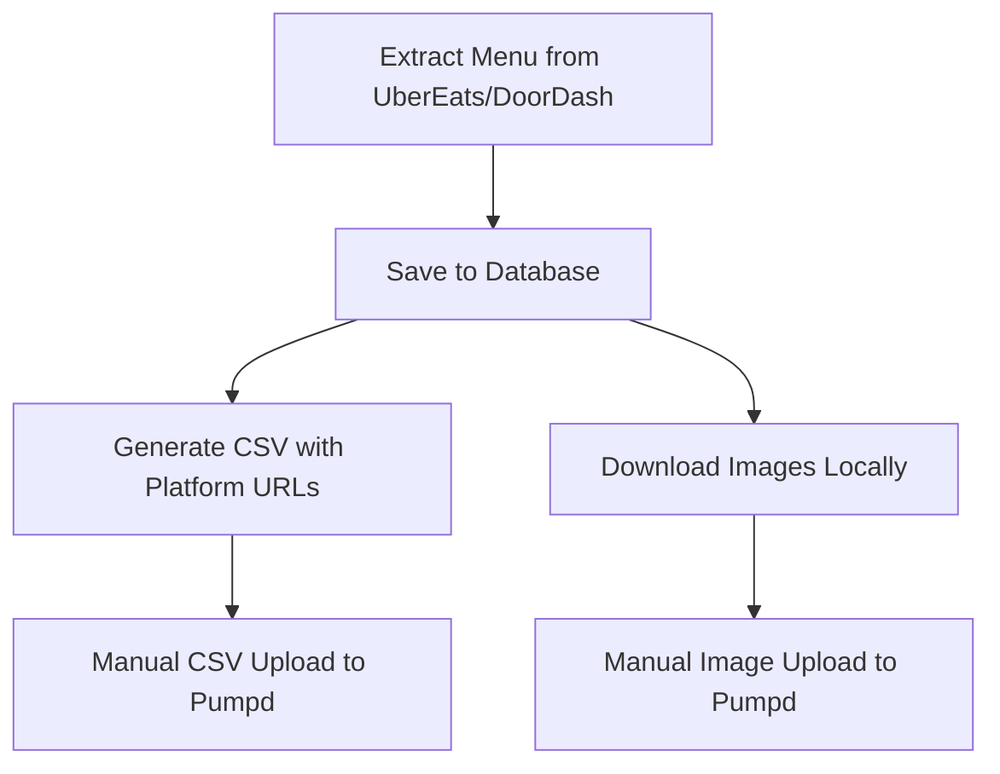
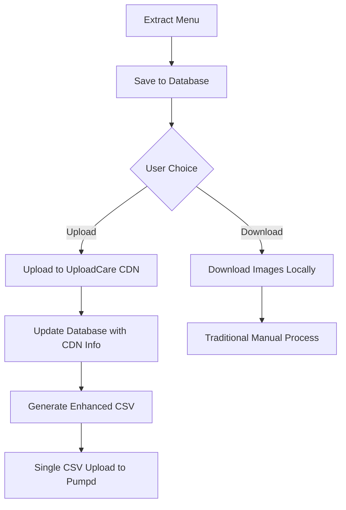

# UploadCare CDN Integration Plan
## Menu Image Upload Automation

### Executive Summary
This document outlines the integration of UploadCare CDN for automated image uploading during menu extraction, eliminating the need for manual image uploads in the Pumpd dashboard. The integration will allow direct image uploads to CDN during extraction and include CDN metadata in the CSV export.

---

## 1. Current System Architecture

### 1.1 Database Structure

#### Current Tables
```sql
-- Stores image URLs from delivery platforms
item_images {
  id: UUID,
  menu_item_id: UUID (FK),
  url: TEXT,              -- UberEats/DoorDash image URL
  type: VARCHAR(50),      -- 'primary', 'thumbnail', etc.
  metadata: JSONB,        -- Additional image metadata
  created_at: TIMESTAMP
}
```

### 1.2 Current Workflow



### 1.3 Current CSV Format
```csv
menuID,menuName,menuDisplayName,menuDescription,categoryID,categoryName,categoryDisplayName,categoryDescription,dishID,dishName,dishPrice,dishType,dishDescription,displayName,printName,tags,imageURL
,Menu,,,,Mains,,,,Burger,15.00,standard,Beef burger,,,,https://ubereats.com/image.jpg
```

### 1.4 Current API Endpoints

#### Image Services
- `POST /api/download-images` - Downloads images to server filesystem
- `POST /api/menus/:id/download-images` - Database-aware image download
- `GET /api/menus/:id/download-images-zip` - ZIP download for browser

#### CSV Services
- `POST /api/generate-csv` - Generate CSV from extraction data
- `POST /api/generate-clean-csv` - Generate clean CSV without unwanted phrases
- `GET /api/menus/:id/csv` - Direct CSV download from database
- `POST /api/menus/:id/export` - Export menu to CSV with options

---

## 2. UploadCare Integration Requirements

### 2.1 API Credentials
- **API Key**: `f4394631faa29564fd1d`
- **API Endpoint**: `https://uploadcare.com/api-refs/upload-api/#tag/Upload/operation/baseUpload`

### 2.2 New CSV Format
```csv
menuID,menuName,menuDisplayName,menuDescription,categoryID,categoryName,categoryDisplayName,categoryDescription,dishID,dishName,dishPrice,dishType,dishDescription,displayName,printName,tags,imageURL,isCDNImage,imageCDNID,imageCDNFilename,imageExternalURL
,Menu,,,,Mains,,,,Burger,15.00,standard,Beef burger,,,,,true,550e8400-e29b-41d4,burger_main.jpg,
,Menu,,,,Mains,,,,Pizza,20.00,standard,Cheese pizza,,,,,false,,,https://external.com/pizza.jpg
```

### 2.3 New Fields
- **isCDNImage**: Boolean - `true` if image is in UploadCare CDN, `false` for external URLs
- **imageCDNID**: UUID from UploadCare after successful upload
- **imageCDNFilename**: Original or sanitized filename
- **imageExternalURL**: Fallback URL if CDN upload fails or for external images

---

## 3. Proposed System Architecture

### 3.1 Enhanced Database Schema

```sql
-- Enhanced item_images table
item_images {
  id: UUID,
  menu_item_id: UUID (FK),
  url: TEXT,                    -- Original platform URL
  type: VARCHAR(50),
  metadata: JSONB,
  -- New CDN fields
  cdn_uploaded: BOOLEAN DEFAULT false,
  cdn_id: UUID,                 -- UploadCare file ID
  cdn_url: TEXT,                -- Full CDN URL
  cdn_filename: VARCHAR(255),   -- Sanitized filename
  cdn_metadata: JSONB,          -- UploadCare response data
  upload_status: VARCHAR(50),   -- 'pending', 'uploading', 'success', 'failed'
  upload_error: TEXT,
  uploaded_at: TIMESTAMP,
  created_at: TIMESTAMP,
  updated_at: TIMESTAMP
}

-- New table for tracking upload batches
upload_batches {
  id: UUID,
  menu_id: UUID (FK),
  total_images: INTEGER,
  uploaded_count: INTEGER,
  failed_count: INTEGER,
  status: VARCHAR(50),
  started_at: TIMESTAMP,
  completed_at: TIMESTAMP,
  metadata: JSONB
}
```

### 3.2 New Workflow



---

## 4. Implementation Plan

### 4.1 Backend Services

#### 4.1.1 New UploadCare Service (`/src/services/uploadcare-service.js`)
```javascript
class UploadCareService {
  constructor(apiKey) {
    this.apiKey = apiKey;
    this.baseUrl = 'https://upload.uploadcare.com';
  }

  async uploadImage(imageUrl, filename) {
    // 1. Download image from platform URL
    // 2. Upload to UploadCare
    // 3. Return CDN metadata
    return {
      success: true,
      cdnId: 'uuid-from-uploadcare',
      cdnUrl: 'https://ucarecdn.com/uuid/',
      filename: filename,
      size: 12345,
      mimeType: 'image/jpeg'
    };
  }

  async uploadBatch(images, progressCallback) {
    // Parallel upload with rate limiting
    // Progress reporting via WebSocket
  }

  async deleteImage(cdnId) {
    // Delete from CDN if needed
  }
}
```

#### 4.1.2 Enhanced Database Service Methods
```javascript
// Add to database-service.js
async updateImageCDNInfo(imageId, cdnData) {
  const query = `
    UPDATE item_images 
    SET 
      cdn_uploaded = true,
      cdn_id = $2,
      cdn_url = $3,
      cdn_filename = $4,
      cdn_metadata = $5,
      upload_status = 'success',
      uploaded_at = NOW(),
      updated_at = NOW()
    WHERE id = $1
    RETURNING *
  `;
  return await db.query(query, [imageId, cdnData.cdnId, cdnData.cdnUrl, cdnData.filename, cdnData]);
}

async getMenuImagesForUpload(menuId) {
  // Get all images that haven't been uploaded to CDN
  const query = `
    SELECT 
      ii.*,
      mi.name as item_name,
      c.name as category_name
    FROM item_images ii
    JOIN menu_items mi ON ii.menu_item_id = mi.id
    JOIN categories c ON mi.category_id = c.id
    WHERE c.menu_id = $1 
      AND (ii.cdn_uploaded = false OR ii.cdn_uploaded IS NULL)
  `;
  return await db.query(query, [menuId]);
}
```

### 4.2 New API Endpoints

#### 4.2.1 Upload Images Endpoint
```javascript
// POST /api/menus/:id/upload-images
app.post('/api/menus/:id/upload-images', async (req, res) => {
  const { id } = req.params;
  const { options } = req.body;
  
  // 1. Get menu with images from database
  const images = await db.getMenuImagesForUpload(id);
  
  // 2. Create upload batch record
  const batchId = await db.createUploadBatch(id, images.length);
  
  // 3. Start async upload process
  uploadQueue.add({
    batchId,
    menuId: id,
    images,
    options
  });
  
  // 4. Return batch ID for progress tracking
  return res.json({
    success: true,
    batchId,
    totalImages: images.length,
    message: 'Upload started. Track progress via WebSocket or polling.'
  });
});
```

#### 4.2.2 Upload Progress Endpoint
```javascript
// GET /api/upload-batches/:batchId
app.get('/api/upload-batches/:batchId', async (req, res) => {
  const batch = await db.getUploadBatch(req.params.batchId);
  return res.json({
    success: true,
    batch: {
      id: batch.id,
      status: batch.status,
      progress: {
        total: batch.total_images,
        uploaded: batch.uploaded_count,
        failed: batch.failed_count,
        percentage: Math.round((batch.uploaded_count / batch.total_images) * 100)
      }
    }
  });
});
```

#### 4.2.3 Enhanced CSV Export with CDN Data
```javascript
// GET /api/menus/:id/csv-with-cdn
app.get('/api/menus/:id/csv-with-cdn', async (req, res) => {
  const menu = await db.getMenuWithItems(id);
  
  // Generate CSV with additional CDN columns
  const headers = [
    ...existingHeaders,
    'isCDNImage',
    'imageCDNID',
    'imageCDNFilename',
    'imageExternalURL'
  ];
  
  const rows = menu.items.map(item => {
    const image = item.images[0];
    return [
      ...existingFields,
      image?.cdn_uploaded ? 'true' : 'false',
      image?.cdn_id || '',
      image?.cdn_filename || '',
      !image?.cdn_uploaded ? image?.url : ''
    ];
  });
  
  // Return CSV
});
```

### 4.3 Frontend Components

#### 4.3.1 Enhanced Extraction Detail Component
```jsx
// Add to ExtractionDetail.jsx
const [uploadProgress, setUploadProgress] = useState(null);
const [isUploading, setIsUploading] = useState(false);

const handleUploadImages = async () => {
  try {
    setIsUploading(true);
    
    // Start upload batch
    const response = await api.post(`/menus/${job.menuId}/upload-images`, {
      options: {
        preserveFilenames: true,
        generateThumbnails: false
      }
    });
    
    if (response.data.success) {
      const batchId = response.data.batchId;
      
      // Poll for progress
      const progressInterval = setInterval(async () => {
        const progress = await api.get(`/upload-batches/${batchId}`);
        setUploadProgress(progress.data.batch.progress);
        
        if (progress.data.batch.status === 'completed') {
          clearInterval(progressInterval);
          setIsUploading(false);
          alert('Images uploaded successfully!');
        }
      }, 2000);
    }
  } catch (error) {
    console.error('Upload failed:', error);
    setIsUploading(false);
  }
};

// Add new button in UI
<button
  onClick={handleUploadImages}
  disabled={isUploading}
  className="inline-flex items-center px-4 py-2 border border-transparent text-sm font-medium rounded-md shadow-sm text-white bg-purple-600 hover:bg-purple-700"
>
  <CloudArrowUpIcon className="h-4 w-4 mr-2" />
  {isUploading ? `Uploading... ${uploadProgress?.percentage}%` : 'Upload to CDN'}
</button>
```

#### 4.3.2 New Upload Progress Modal
```jsx
const UploadProgressModal = ({ progress, isOpen, onClose }) => {
  return (
    <Modal isOpen={isOpen} onClose={onClose}>
      <div className="p-6">
        <h3 className="text-lg font-medium mb-4">Uploading Images to CDN</h3>
        
        <div className="space-y-4">
          <div>
            <div className="flex justify-between mb-2">
              <span>Progress</span>
              <span>{progress.percentage}%</span>
            </div>
            <div className="w-full bg-gray-200 rounded-full h-2">
              <div 
                className="bg-purple-600 h-2 rounded-full transition-all"
                style={{ width: `${progress.percentage}%` }}
              />
            </div>
          </div>
          
          <div className="grid grid-cols-3 gap-4 text-sm">
            <div>
              <span className="text-gray-500">Total</span>
              <p className="font-medium">{progress.total}</p>
            </div>
            <div>
              <span className="text-gray-500">Uploaded</span>
              <p className="font-medium text-green-600">{progress.uploaded}</p>
            </div>
            <div>
              <span className="text-gray-500">Failed</span>
              <p className="font-medium text-red-600">{progress.failed}</p>
            </div>
          </div>
        </div>
      </div>
    </Modal>
  );
};
```

---

## 5. Migration Strategy

### 5.1 Database Migrations
```sql
-- Migration 001: Add CDN fields to item_images
ALTER TABLE item_images 
ADD COLUMN cdn_uploaded BOOLEAN DEFAULT false,
ADD COLUMN cdn_id UUID,
ADD COLUMN cdn_url TEXT,
ADD COLUMN cdn_filename VARCHAR(255),
ADD COLUMN cdn_metadata JSONB,
ADD COLUMN upload_status VARCHAR(50),
ADD COLUMN upload_error TEXT,
ADD COLUMN uploaded_at TIMESTAMP;

-- Migration 002: Create upload_batches table
CREATE TABLE upload_batches (
  id UUID PRIMARY KEY DEFAULT gen_random_uuid(),
  menu_id UUID REFERENCES menus(id),
  total_images INTEGER NOT NULL,
  uploaded_count INTEGER DEFAULT 0,
  failed_count INTEGER DEFAULT 0,
  status VARCHAR(50) DEFAULT 'pending',
  started_at TIMESTAMP DEFAULT NOW(),
  completed_at TIMESTAMP,
  metadata JSONB,
  created_at TIMESTAMP DEFAULT NOW(),
  updated_at TIMESTAMP DEFAULT NOW()
);

-- Add indexes for performance
CREATE INDEX idx_item_images_cdn_uploaded ON item_images(cdn_uploaded);
CREATE INDEX idx_item_images_menu_item_id ON item_images(menu_item_id);
CREATE INDEX idx_upload_batches_menu_id ON upload_batches(menu_id);
CREATE INDEX idx_upload_batches_status ON upload_batches(status);
```

### 5.2 Backward Compatibility

#### Maintain Existing Functionality
1. **Keep all existing endpoints operational**
2. **Add new endpoints alongside existing ones**
3. **Use feature flags for gradual rollout**

```javascript
// Feature flag in config
const FEATURES = {
  UPLOADCARE_ENABLED: process.env.UPLOADCARE_ENABLED === 'true',
  UPLOADCARE_API_KEY: process.env.UPLOADCARE_API_KEY
};

// Conditional UI rendering
{FEATURES.UPLOADCARE_ENABLED && (
  <UploadToCDNButton />
)}
```

#### CSV Format Compatibility
- Old format: 17 columns (ends with imageURL)
- New format: 21 columns (adds CDN fields)
- Pumpd dashboard should ignore extra columns if not ready

---

## 6. Error Handling & Recovery

### 6.1 Upload Failure Scenarios

#### Network Failures
```javascript
async function uploadWithRetry(image, maxRetries = 3) {
  let lastError;
  
  for (let attempt = 1; attempt <= maxRetries; attempt++) {
    try {
      const result = await uploadcare.uploadImage(image);
      return result;
    } catch (error) {
      lastError = error;
      
      // Log attempt
      await db.logUploadAttempt(image.id, attempt, error);
      
      // Exponential backoff
      if (attempt < maxRetries) {
        await sleep(Math.pow(2, attempt) * 1000);
      }
    }
  }
  
  // Mark as failed after all retries
  await db.markImageUploadFailed(image.id, lastError);
  throw lastError;
}
```

#### Partial Upload Recovery
```javascript
// Resume interrupted batch upload
async function resumeBatchUpload(batchId) {
  const batch = await db.getUploadBatch(batchId);
  
  // Get only images that haven't been uploaded
  const pendingImages = await db.getPendingImagesForBatch(batchId);
  
  // Resume upload
  await uploadQueue.add({
    batchId,
    images: pendingImages,
    isResume: true
  });
}
```

### 6.2 Rollback Mechanism
```javascript
// Rollback CDN uploads if CSV generation fails
async function rollbackCDNUpload(menuId) {
  const images = await db.getMenuCDNImages(menuId);
  
  for (const image of images) {
    try {
      await uploadcare.deleteImage(image.cdn_id);
      await db.clearImageCDNInfo(image.id);
    } catch (error) {
      console.error(`Failed to rollback image ${image.id}:`, error);
    }
  }
}
```

---

## 7. Performance Considerations

### 7.1 Parallel Upload Strategy
```javascript
const UPLOAD_CONCURRENCY = 5; // Simultaneous uploads
const CHUNK_SIZE = 20; // Images per batch

async function uploadImagesInParallel(images) {
  const chunks = chunkArray(images, CHUNK_SIZE);
  
  for (const chunk of chunks) {
    await Promise.all(
      chunk.map(image => 
        limit(() => uploadWithRetry(image))
      )
    );
    
    // Update progress after each chunk
    await updateBatchProgress(batchId, completed, total);
  }
}
```

### 7.2 Caching Strategy
```javascript
// Cache CDN URLs to avoid re-uploading
const cdnCache = new Map();

async function getOrUploadImage(imageUrl) {
  // Check cache first
  if (cdnCache.has(imageUrl)) {
    return cdnCache.get(imageUrl);
  }
  
  // Check database for existing CDN upload
  const existing = await db.findCDNImageByUrl(imageUrl);
  if (existing) {
    cdnCache.set(imageUrl, existing);
    return existing;
  }
  
  // Upload new image
  const result = await uploadcare.uploadImage(imageUrl);
  cdnCache.set(imageUrl, result);
  return result;
}
```

---

## 8. Security Considerations

### 8.1 API Key Management
```javascript
// Never expose API key to frontend
// Use environment variables
process.env.UPLOADCARE_SECRET_KEY = 'f4394631faa29564fd1d';

// Validate uploads server-side
app.post('/api/validate-upload', async (req, res) => {
  const { cdnId } = req.body;
  
  // Verify with UploadCare that file exists
  const isValid = await uploadcare.verifyFile(cdnId);
  
  if (!isValid) {
    return res.status(400).json({ error: 'Invalid CDN file' });
  }
});
```

### 8.2 Rate Limiting
```javascript
const rateLimit = require('express-rate-limit');

const uploadLimiter = rateLimit({
  windowMs: 15 * 60 * 1000, // 15 minutes
  max: 100, // Limit each IP to 100 uploads per window
  message: 'Too many upload requests, please try again later.'
});

app.post('/api/menus/:id/upload-images', uploadLimiter, async (req, res) => {
  // Upload logic
});
```

---

## 9. Monitoring & Analytics

### 9.1 Metrics to Track
```javascript
const metrics = {
  // Upload performance
  totalUploads: 0,
  successfulUploads: 0,
  failedUploads: 0,
  averageUploadTime: 0,
  
  // CDN usage
  totalCDNStorage: 0, // MB
  monthlyBandwidth: 0, // GB
  
  // Cost tracking
  estimatedMonthlyCost: 0,
  costPerRestaurant: 0
};

// Log each upload
async function logUploadMetrics(result) {
  await db.insertMetric({
    type: 'image_upload',
    menu_id: result.menuId,
    size_bytes: result.size,
    duration_ms: result.duration,
    success: result.success,
    cdn_id: result.cdnId,
    timestamp: new Date()
  });
}
```

### 9.2 Dashboard Integration
```jsx
// Add CDN stats to admin dashboard
const CDNStats = () => {
  const [stats, setStats] = useState(null);
  
  useEffect(() => {
    api.get('/api/cdn/stats').then(res => setStats(res.data));
  }, []);
  
  return (
    <div className="grid grid-cols-4 gap-4">
      <StatCard 
        title="Total CDN Images" 
        value={stats?.totalImages} 
        icon={PhotoIcon}
      />
      <StatCard 
        title="Storage Used" 
        value={`${stats?.storageGB} GB`} 
        icon={ServerIcon}
      />
      <StatCard 
        title="This Month's Uploads" 
        value={stats?.monthlyUploads} 
        icon={ArrowUpIcon}
      />
      <StatCard 
        title="Failed Uploads" 
        value={stats?.failedUploads} 
        icon={ExclamationIcon}
        color="red"
      />
    </div>
  );
};
```

---

## 10. Testing Strategy

### 10.1 Unit Tests
```javascript
// Test UploadCare service
describe('UploadCareService', () => {
  it('should upload image successfully', async () => {
    const result = await uploadcare.uploadImage(testImageUrl);
    expect(result.cdnId).toBeDefined();
    expect(result.cdnUrl).toMatch(/ucarecdn.com/);
  });
  
  it('should handle upload failure', async () => {
    const badUrl = 'http://invalid-image.com/404.jpg';
    await expect(uploadcare.uploadImage(badUrl)).rejects.toThrow();
  });
  
  it('should retry on network failure', async () => {
    // Mock network failure then success
    const result = await uploadWithRetry(testImage);
    expect(result.success).toBe(true);
  });
});
```

### 10.2 Integration Tests
```javascript
// Test full upload workflow
describe('Menu Image Upload Workflow', () => {
  it('should upload all menu images to CDN', async () => {
    // 1. Create test menu
    const menu = await createTestMenu();
    
    // 2. Start upload batch
    const response = await request(app)
      .post(`/api/menus/${menu.id}/upload-images`)
      .expect(200);
    
    const batchId = response.body.batchId;
    
    // 3. Wait for completion
    await waitForBatchCompletion(batchId);
    
    // 4. Verify all images uploaded
    const images = await db.getMenuImages(menu.id);
    expect(images.every(img => img.cdn_uploaded)).toBe(true);
  });
});
```

### 10.3 Load Testing
```javascript
// Test concurrent uploads
const loadTest = async () => {
  const menus = await createTestMenus(10); // 10 restaurants
  const uploadPromises = menus.map(menu => 
    api.post(`/api/menus/${menu.id}/upload-images`)
  );
  
  const results = await Promise.allSettled(uploadPromises);
  
  // Analyze results
  const successful = results.filter(r => r.status === 'fulfilled');
  const failed = results.filter(r => r.status === 'rejected');
  
  console.log(`Success rate: ${(successful.length / results.length) * 100}%`);
};
```

---

## 11. Deployment Checklist

### Pre-Deployment
- [ ] Database migrations tested on staging
- [ ] UploadCare API key secured in environment variables
- [ ] Feature flag configured
- [ ] Rate limiting configured
- [ ] Error tracking setup (Sentry/LogRocket)
- [ ] CDN upload metrics dashboard ready

### Deployment Steps
1. Deploy database migrations
2. Deploy backend with feature flag OFF
3. Test with single restaurant
4. Enable feature flag for beta users
5. Monitor metrics and errors
6. Gradual rollout to all users

### Post-Deployment
- [ ] Monitor CDN usage and costs
- [ ] Check upload success rates
- [ ] Review error logs
- [ ] Gather user feedback
- [ ] Optimize based on metrics

---

## 12. Cost Estimation

### UploadCare Pricing Model
- Storage: $0.01 per GB per month
- Bandwidth: $0.08 per GB
- Operations: First 10,000 free, then $0.01 per 1,000

### Estimated Monthly Costs
```
Assumptions:
- 100 restaurants
- 50 items per restaurant
- 500KB per image average
- 2 uploads per restaurant per month

Storage: 100 * 50 * 0.5MB = 2.5GB = $0.025
Bandwidth: 100 * 50 * 0.5MB * 2 = 5GB = $0.40
Operations: 10,000 free
Total: ~$0.43/month

Scale to 1000 restaurants: ~$4.30/month
```

---

## 13. Future Enhancements

### Phase 2 Features
1. **Smart Image Optimization**
   - Auto-resize based on display requirements
   - WebP conversion for better performance
   - Thumbnail generation

2. **Duplicate Detection**
   - Hash-based duplicate detection
   - Reuse existing CDN images for identical items

3. **Bulk Operations**
   - Upload multiple menus simultaneously
   - Batch CDN management interface

4. **Advanced Analytics**
   - Image performance metrics
   - CDN cost per restaurant reporting
   - Upload failure analysis

### Phase 3 Features
1. **AI Enhancement**
   - Auto-crop to focus on food
   - Background removal/replacement
   - Quality enhancement

2. **Multi-CDN Support**
   - Cloudinary integration
   - AWS S3 integration
   - Automatic CDN selection based on region

---

## Appendix A: API Reference

### UploadCare Upload API
```bash
# Upload from URL
curl -X POST https://upload.uploadcare.com/from_url/ \
  -H "Authorization: Uploadcare.Simple f4394631faa29564fd1d:secret_key" \
  -d "source_url=https://ubereats.com/image.jpg" \
  -d "store=1"

# Response
{
  "token": "upload_token",
  "uuid": "550e8400-e29b-41d4-a716",
  "file_id": "550e8400-e29b-41d4-a716",
  "original_filename": "image.jpg",
  "mime_type": "image/jpeg",
  "size": 123456,
  "done": true
}
```

### Internal API Endpoints
```javascript
// Upload images to CDN
POST /api/menus/:id/upload-images
Body: {
  options: {
    preserveFilenames: boolean,
    generateThumbnails: boolean,
    skipExisting: boolean
  }
}

// Get upload batch status
GET /api/upload-batches/:batchId

// Generate CSV with CDN data
GET /api/menus/:id/csv-with-cdn?format=pumpd

// Retry failed uploads
POST /api/upload-batches/:batchId/retry

// Get CDN statistics
GET /api/cdn/stats
```

---

## Appendix B: Error Codes

| Code | Description | Resolution |
|------|-------------|------------|
| UPLOAD_001 | Network timeout | Retry with exponential backoff |
| UPLOAD_002 | Invalid image format | Skip or convert image |
| UPLOAD_003 | CDN quota exceeded | Check UploadCare limits |
| UPLOAD_004 | Authentication failed | Verify API key |
| UPLOAD_005 | Duplicate upload | Use existing CDN ID |
| UPLOAD_006 | Image too large | Compress before upload |
| UPLOAD_007 | Rate limit exceeded | Implement throttling |

---

## Contact & Support

- **UploadCare Support**: support@uploadcare.com
- **Internal Team**: dev-team@pumpd.co.nz
- **Documentation**: Internal Wiki / Confluence

---

*Document Version: 1.0*  
*Last Updated: 2025-08-22*  
*Author: AI-Assisted Documentation*